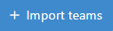

Team exercises
==============

.. contents:: Content of this document
    :local:
    :depth: 2

Overview
--------

Team exercises are supported for:

* :doc:`Programming exercises <programming>`
* :doc:`Modeling exercises <modeling>`
* :doc:`Textual exercises <textual>`
* :doc:`File upload exercises <file-upload>`

Setup
-----

When creating an exercise, the instructor first needs to select the mode **Team**. This is only available during the creation of the exercise, as it **can not be changed later on**.
The team size can also be configured, but it is just a recommendation that can be overridden when creating the actual teams.

.. figure:: team-exercises/set_team_mode.png
    :align: center
    :alt: Set Team Mode

    Set Team Mode

Instructors can click on the |teams_button| button in the course exercises page to navigate to the team management page.

.. figure:: team-exercises/manage_teams.png
    :align: center
    :alt: Manage teams

    Manage teams

Clicking |create_team_button| opens the dialog shown below. To manually create a team instructors must define the name, short name and students for the team. Optionally, a
tutor can also be assigned to the team.

    Create team dialog

Instructors can also |edit_button| and |delete_button| already existing teams.

To facilitate the process of creating teams, instructors can use the |export_teams_button| button to export the teams in an exercise to a file, which can then be imported in other exercises.

To import teams into an exercise, instructors can use the |import_teams_button| button. This allows them to choose between importing from a file, or importing directly from
another exercise in the course. In both cases, instructors must choose if they want to delete all the existing teams, or only create new teams, as shown below:

.. figure:: team-exercises/import_strategy.png
    :align: center
    :alt: Import strategy

    Import strategy

Collaboration
-------------

When working on a team exercise, students can work collaboratively using the live editors. This is available for
:doc:`Modeling exercises <modeling>` and :doc:`Textual exercises <textual>`.

The live editors show the status of all the team members, and allow students to simultaneously edit the same exercise:

.. figure:: team-exercises/live_modeling_editor.png
    :align: center
    :alt: Live modeling editor

    Live modeling editor

Team overview
--------------

The same team can be shared for multiple exercises. Viewing the page for a single team allows students, tutors and instructors to get an overview of all the
exercises for that team along with their current status. To access the team overview page, users can click on |team_button| or on the team's short name.

.. figure:: team-exercises/team_overview_page.png
    :align: center
    :alt: Team overview

    Team overview

.. |teams_button| image:: team-exercises/teams_button.png

.. |edit_button| image:: team-exercises/edit_button.png

