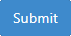

.. _textual:

Textual exercise
================
.. contents:: Content of this document
    :local:
    :depth: 2

Overview
--------

Conducting a text exercise consists of 3 steps:

1. **Instructor prepares exercise:** Instructor creates and configures the text exercise in Artemis.
2. **Student solves exercise:** Student works on the exercise and submits the solution.
3. **Tutor assesses submissions:** Tutor reviews the submitted exercises and creates results for the students.

Setup
-----

The following sections describe the supported features and the process of creating a new text exercise.

- Open |course-management|.
- Navigate into **Exercises** of your preferred course.

    .. figure:: general/course-management-course-dashboard-exercises.png
              :align: center

Create Text Exercise
^^^^^^^^^^^^^^^^^^^^^^^^

- Click on **Create new text exercise**.

    .. figure:: text/create-new-text-exercise.png
              :align: center

The following screenshot illustrates the first section of the form. It consists of:

- **Title**: Title of an exercise.
- **Categories**: Category of an exercise.
- **Difficulty**: Difficulty of an exercise. (No Level, Easy, Medium or Hard).
- **Mode**: Solving mode of an exercise. *This cannot be changed afterward* (Individual or Team).
- **Release Date**: Date after which the exercise is released to the students.
- **Start Date**: Date after which students can start the exercise.
- **Due Date**: Date till when students can work on the exercise.
- **Assessment Due Date**: Date after which students can view the feedback of the assessments from the instructors.
- **Inclusion in course score calculation**: Option that determines whether or not to include exercise in course score calculation.
- **Points**: Total points of an exercise.
- **Bonus Points**: Bonus points for an exercise.
- **Automatic assessment suggestions enabled**: When enabled, Artemis tries to automatically suggest assessments for text blocks based on previously graded submissions for this exercise using the `Athena <https://github.com/ls1intum/edutelligence/tree/main/athena>`_ service.

    .. figure:: text/create-text-exercise-form-1.png
              :align: center

.. note::
   Fields marked with red are mandatory to be filled.

The following screenshot illustrates the second section of the form. It consists of:

- **Problem Statement**: The task description of the exercise as seen by students.
- **Example Solution**: Example solution of an exercise.
- **Example Solution Publication Date**: Date after which the example solution is accessible for students. If you leave this field empty, the solution will only be published to tutors.

    .. figure:: text/create-text-exercise-form-2.png
              :align: center

.. note::
    If you are not clear about any of the fields, you can access additional hints by hovering over the |hint| icon for many of them.

    .. figure:: general/create-exercise-form-hint.png
              :align: center
              :scale: 70

The following screenshot illustrates the last section of the form:

- **Linked Competencies**: In case instructors created competencies, they can link them to the exercise here. See :ref:`Adaptive Learning <adaptive-learning>` for more information.
- **Assessment Instructions**: Assessment instructions (comparable to grading rubrics) simplify the grading process. They include predefined feedback and points. Reviewers can drag and drop a suitable instruction to the text element to apply it during the assessment. The **Credits** specify the score of the instruction. The **Scale** describes the performance level of the instruction (e.g., excellent, good, average, poor). The **Description** may include additional notes about when to apply this instruction. **Feedback** is an explanatory text for the students to understand their performance level better. The **Limit** specifies how many times the score of this instruction may be included in the final score.

    .. figure:: text/create-text-exercise-form-3.png
              :align: center

Once you are done defining the schema of an exercise, you can now create an exercise by clicking on the |create| button.

Import Text Exercise
^^^^^^^^^^^^^^^^^^^^

- Alternatively, you can also import text exercise from the existing one by clicking on **Import Text Exercise**.

    .. figure:: text/import-text-exercise.png
              :align: center

- An import modal will prompt up, where you will have the option to select and import previous text exercises from the list by clicking on the **Import** button.

    .. figure:: text/import-text-exercise-modal.png
              :align: center
              :scale: 50

- Once you import one of the exercises, you will then be redirected to a form that is similar to *Create text exercise* form with all the fields filled from the imported exercise. You can now modify the fields as necessary to create a text exercise.

Result
^^^^^^

    .. figure:: text/course-dashboard-exercise-text.png
              :align: center

- Click the |edit| button of the text exercise and adapt the interactive problem statement. There you can also set release and due dates.
- Click the |scores| button to see the scores achieved by the students.
- Click the |participation| button to see the list of students who participated in the exercise.
- Click the |example-submission| button to modify/add an example submission of the exercise.
- Click the |delete| button to delete the exercise.
- You can get an overview of the exercise by clicking on the title.

Student Submission
------------------
- When the exercise is released students can work on the exercise.

    .. figure:: text/text-exercise-card-student-view.png
              :align: center

- They can start the exercise by clicking the |start| button.

- Once they start the exercise, they will now have the option to work on it in an online text editor by clicking on the |open-text-editor| button.

- The screenshot below depicts the exercise interface for students. They can read the problem statement on the right and fill in their solution in the textbox on the left. To submit, you need to click on the |submit| button on the top right.

    .. figure:: text/text-exercise-students-interface.png
              :align: center

Assessment
----------
When the due date is over you can assess the submissions. Text exercise

- To assess the submissions, first click on **Assessment Dashboard**.

    .. figure:: general/assessment-dashboard.png
              :align: center

- Then click on **Exercise Dashboard** of the text exercise.

    .. figure:: text/exercise-dashboard.png
              :align: center

- You will then be redirected to *Exercise Assessment Dashboard*.

    .. figure:: text/exercise-assessment-dashboard.png
              :align: center

- In case you have not assessed a submission of this exercise before, you will get shown the problem statement and a summary of assessment instructions. To learn more about this feature, take a look at Artemis' :ref:`Integrated Training Process <assessment>`.  Once you know what the exercise is about, you can click on the |participate-in-exercise| button.

- In case unassessed submissions are available, you can click on the |start-new-assessment| button. You will then be redirected to the assessment page where you will be able to assess the submission of a random student.

    .. figure:: text/exercise-assessment-dashboard-2.png
              :align: center

- You can now start assessing text blocks by clicking on them. This opens an assessment dialog where you can assign points and provide feedback. To assess custom text blocks, hold `alt/option` while clicking in any order on the first and last word of a text segment.

    .. figure:: text/assessment-modal.png
              :align: center

- Alternatively, you can also assess the text blocks by dragging and dropping assessment instructions from the *Assessment Instructions* section.

- Feedback to the entire submission can also be added by clicking on the |add-new-feedback| button. The following form will open allowing you to input your feedback:

    .. figure:: general/feedback-modal.png
              :align: center

- If automatic assessment suggestions were enabled for the exercise, you would get available suggestions from the service `Athena <https://github.com/ls1intum/edutelligence/tree/main/athena>`_. More details about this service can be found in the following research papers:

  .. note::
    .. bibliography::
       :list: bullet

       bernius2022machine
       bernius2021machine
       bernius2021computer
       bernius2020towards
       bernius2020segmenting
       bernius2019automatic

Once you're done assessing the solution, you can either:

- Click on |save| to save the incomplete assessment so that you can continue it afterward.

- Click on |submit-assessment| to submit the assessment.

- Click on |cancel| to cancel and release the lock of the assessment.

- Click on |exercise-dashboard-button| to navigate to the **Exercise Dashboard**.

Automatic Student Feedback
--------------------------

.. admonition:: Why Automatic Student Feedback
   :class: tip

   In large courses, providing timely and personalized feedback on text-based exercises is 
   challenging. Automated student feedback helps learners identify misunderstandings early, 
   iterate on their drafts, and refine their writing skills—all without waiting for an 
   instructor or tutor to be available.

**Overview:**

When a text exercise is configured with the ``Allow automatic AI preliminary feedback requests`` 
option, students can request preliminary AI feedback on their written submissions. 
The feedback is generated through the :ref:`Athena Service <athena_service>`, 
which analyzes the **content**, **structure**, and **style** of the text and produces 
comments based on the provided **Grading Instructions**, **Problem Statement**, and **Sample Solution**.

.. admonition:: Note
   :class: note

   For best results, include detailed **Grading Instructions** as **Structured Grading Instructions**, and provide a Sample Solution (optional but recommended). This ensures that AI-generated feedback aligns with the intended evaluation criteria and offers focused, actionable suggestions.

**How to Request Automatic Feedback:**

1. **Requesting Feedback**

   .. container::

      - 1.1. Navigate to a **Text Exercise** with the **Automatic Student Feedback** feature enabled.
      - 1.2. Enter your response in the text editor and submit it.
      - 1.3. You can request AI feedback either from the exercise overview page or directly within the text editor.

    .. figure:: text/automatic-feedback-request-overview.png
       :align: center
       :alt: Screenshot showing the request feedback button in the exercise overview
       :scale: 80%

    .. figure:: text/automatic-feedback-request-editor.png
       :align: center
       :alt: Screenshot showing the request feedback button in the text editor
       :scale: 80%

2. **Viewing Feedback**

   .. container::

      - 2.1. After submitting a feedback request, the system processes the text and generates preliminary comments.
      - 2.2. An alert appears at the top of the page indicating that feedback is ready.

      .. figure:: text/automatic-feedback-request-alert.png
         :align: center
         :alt: Screenshot showing the notification alert when AI feedback is ready

      - 2.3. A preliminary score is displayed in the top-right corner of the screen.

      .. figure:: text/automatic-feedback-request-score.png
         :align: center
         :alt: Screenshot showing the preliminary score in the text editor

      - 2.4. Clicking on the score reveals inline feedback that highlights specific issues and offers suggestions directly under the text.

      .. figure:: text/automatic-feedback-view-detailed.png
         :align: center
         :alt: Screenshot showing detailed AI feedback
         :scale: 50%

3. **Submission History**

   .. container::

      - You may request feedback multiple times before the submission deadline. All feedback requests are recorded in the submission history.
      - To review past feedback, open the submission history section and click an entry to view its detailed comments.

      .. figure:: text/automatic-feedback-history.png
         :align: center
         :alt: Screenshot showing the submission history section in the text editor
         :scale: 50%

**Demo:**

Watch this screencast for a demonstration of automated AI feedback on a text exercise:

.. raw:: html

    <iframe src="https://live.rbg.tum.de/w/artemisintro/59983?video_only=1&t=0" allowfullscreen="1" frameborder="0" width="600" height="350">
        Video tutorial of the automated assessment of text exercises on TUM-Live.
    </iframe>

.. |course-management| image:: general/course-management.png

.. |edit| image:: general/edit-button.png

.. |save| image:: general/save-button.png

.. |submit-assessment| image:: general/submit-assessment-button.png
    :scale: 50
.. |request-overview| image:: text/automatic-feedback-request-overview.png
    :scale: 50
.. |request-editor| image:: text/automatic-feedback-request-editor.png
    :scale: 50
.. |request-alert| image:: text/automatic-feedback-request-alert.png
    :scale: 50
.. |request-score| image:: text/automatic-feedback-request-score.png
    :scale: 50
.. |detailed-feedback| image:: text/automatic-feedback-view-detailed.png
    :scale: 50
.. |feedback-history| image:: text/automatic-feedback-history.png
    :scale: 50
