.. _exports:

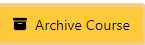
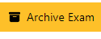
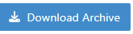
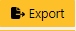

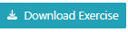

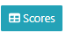
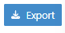
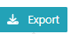
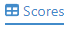
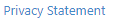
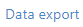

Exports
=======

.. contents:: Table of Contents
    :local:
    :depth: 2

Overview
--------
Artemis offers several options to export or archive different data. The following table gives an overview of the available export options.

.. list-table:: Export options
   :widths: 100
   :header-rows: 1

   * - Export/Archive option
   * - Archive course/exam
   * - Export programming exercise material
   * - Export programming exercise student repositories
   * - Export exercise results
   * - Export quiz questions
   * - Export exercise submissions
   * - Export user data

Archive course/exam
-------------------
Export all course/exam data, including all exercises and student submissions.
To archive a course or an exam the end date of the entity needs to be in the past.
You can archive a course by clicking |archive_course| on the course management overview page or an exam by clicking |archive_exam| on the exam checklist page. This will create a zip file containing all exercises of the exam or course and all student submissions. For a course all exams are exported as well.
For each exercise the problem statement and a JSON file with exercise details such as points are exported. For programming exercises, the template, solution, test, and auxiliary (if existing) repository is exported as well.
The creation is done asynchronously. You will receive a notification once the archive is ready to download. You can then download the archive by clicking |download_archive| on the course management overview page or the exam checklist page.

Export programming exercise material
------------------------------------
Export the exercise material (template, solution, test, and auxiliary repositories as well as the problem statement and other general exercise information) of a programming exercise.
To export the material click the |download_exercise| button on the exercise details page.

Export quiz exercise
--------------------
Exports the questions and the sample solution of a quiz in JSON format.
You can export a a quiz exercise by clicking the |export_quiz| button on the exercises overview page.

Export programming exercise student repositories
------------------------------------------------
Export the student repositories (this can include the repositories for both graded and practice participations) of a programming exercise.
To export the repositories click the |export| button and then the |download_repos| button on the |download_scores| page.

Export exercise submissions
---------------------------
Export the submissions of all students that participated in a specific exercise. This is supported for text, modeling and file upload exercises.
Text submissions are exported as a zip file containing all submissions as text files.
Modeling submissions are exported as a zip file containing all submissions as json files.
File upload submissions are exported as a zip file containing all submitted files.
To export the submissions click the |export_scores| button and then the |export_submissions| button on the |download_scores| page.

Export exercise results
-----------------------------------
Export the results of students for a specific exercise as CSV file. This is supported for all exercise types.
To export the results click the |export| button and then the |export_results| button on the |download_scores| page.

Export course/exam scores
-------------------------
Export the scores of all students that participated in a specific course or exam. This is supported for all exercise types.
The scores are exported in CSV format.
To export the scores of a course click on the |scores_navigation_bar| tab in the course management navigation bar and then the |export_scores| button.
For exams you can export the scores by clicking the |download_scores| button on the exam checklist page and then |export_scores| button.

Export user data
----------------
Export all data Artemis stores about a specific user. This includes information such as name or email, exercise submissions, results, feedbacks the user received, messages they've sent.
You can request a data export by clicking |privacy_statement| and |data_export|. Once the export has been created you will receive an email with a download link.

