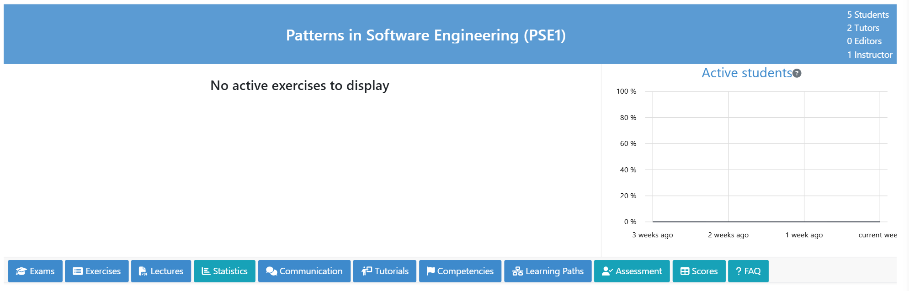
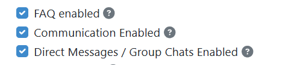
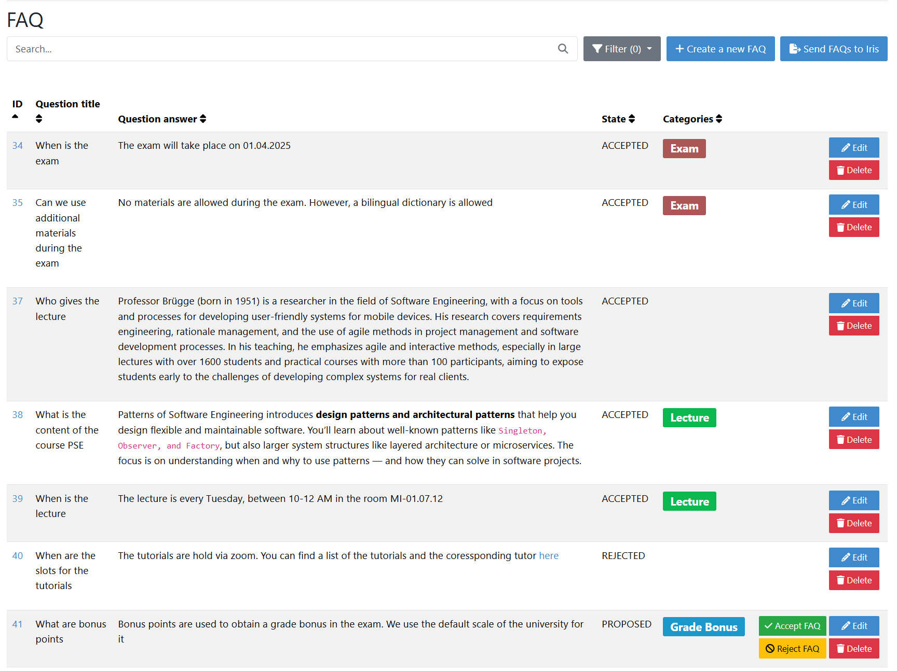
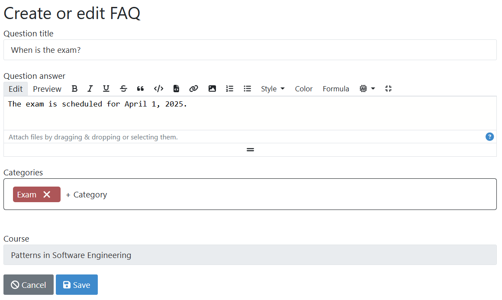
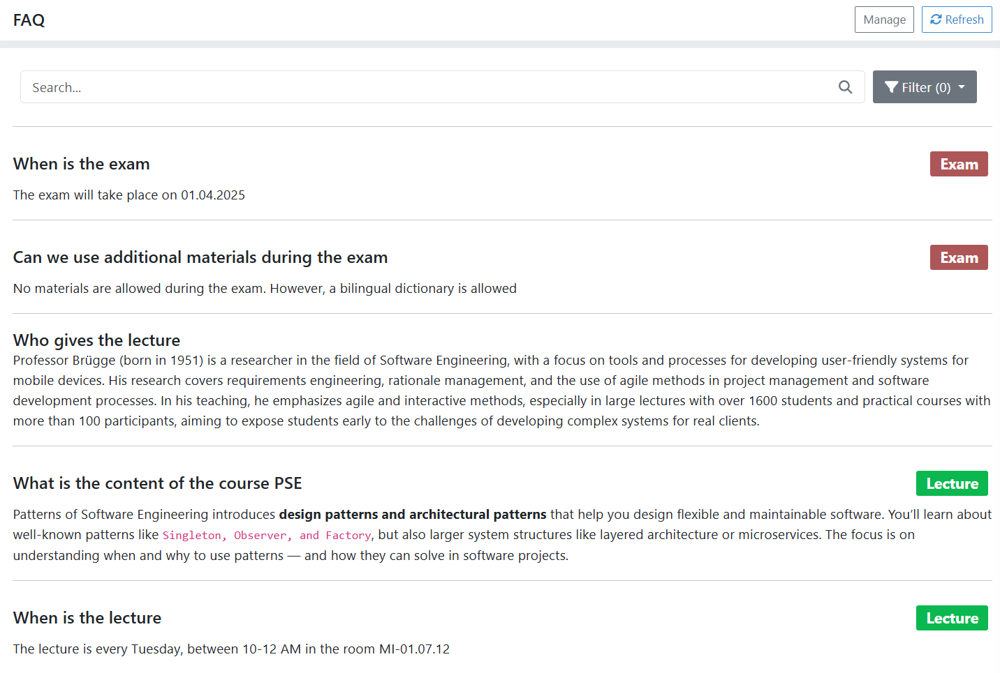

.. _faqs:

FAQs
===============

.. contents:: Content of this document
    :local:
    :depth: 2

Overview
--------
Artemis facilitates the coordination of FAQs in a course. FAQs are frequently asked questions. FAQs help to streamline information retrieval by providing quick answers to common questions.

Setting up FAQs an Instructor
-----------------------------------------------

FAQs can be managed by instructors by navigating to the course's  ``FAQ`` page in the course administration section.

Before the faq feature can be used, one configurations need to be set up:

|faq-course-card|

* **Enable FAQs:** Instructor must enable the FAQs feature in the course settings.

|enable-screen|

FAQ Management
-----------------------------------------------
FAQ overview
^^^^^^^^^^^^^^^^^^^^^^^^
The overview screen consists of a search and filter bar, a table with all FAQs, and a button to create a new FAQ. If the IRIS Feature is enabled, there is also a button to ingest all FAQs into IRIS. This allows the virtual tutor to use the FAQ content in responses.

|overview-screen|

Each FAQ in the table consists of five columns. The first two contain the FAQ's title and corresponding answer. The third column displays the current status of the FAQ, while the last column provides users with buttons to interact with the FAQs. Depending on their role, users may see up to four buttons.

Instructors can edit or delete any FAQ. Additionally, they can approve or reject FAQs with the status PROPOSED.
Tutors can only propose new FAQs and update FAQs that are in the PROPOSED status.

Creating FAQs
^^^^^^^^^^^^^^^^^^^^^^^^
FAQs can be created manually. Each FAQ consists of a question and an answer. The question is displayed as a heading and the answer is displayed as a paragraph. The title is a plain text box, while the answer supports the entire markdown editor feature of Artemis.
|creation-screen|

Additional IRIS features.

If Iris is enabled, users can automatically refine FAQs using an additional Markdown action. This feature scans FAQs for grammatical errors and suggests improvements, allowing users to review the changes. It automatically inserts the improved text into the answer field. The action is in the AI section of the previous image.

FAQ Overview
-----------------------------------------------
Student Overview of FAQs
^^^^^^^^^^^^^^^^^^^^^^^^
In the student overview, only ACCEPTED FAQ are shown. Students can search for FAQs and filter them by status. They can also view the details of each FAQ by clicking on the title. The details page displays the question and answer of the FAQ.
|student-screen|

