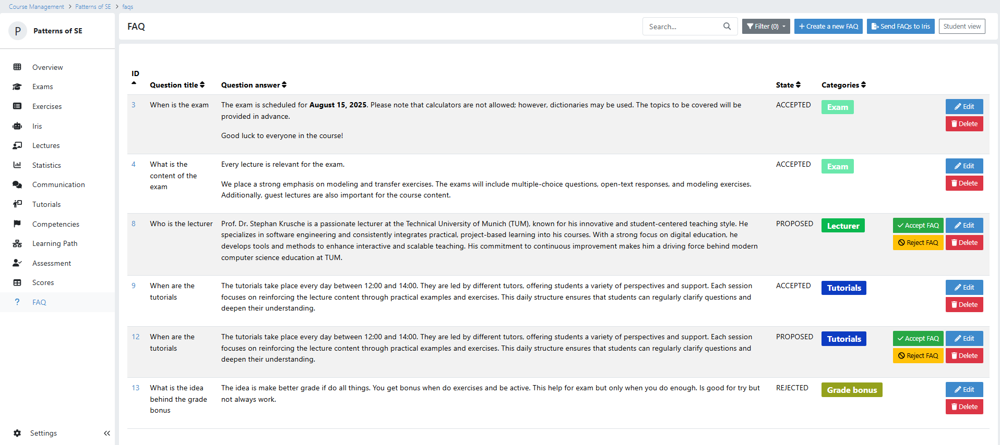
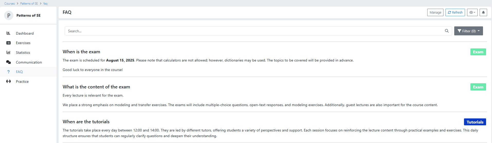

.. _faqs:

FAQs
====

.. contents:: Table of Contents
   :local:
   :depth: 2

What Are FAQs in Artemis?
-------------------------

Artemis supports the coordination and management of FAQs (Frequently Asked Questions) within a course. These FAQs offer quick and clear answers to common questions from students, helping to streamline communication and make important information easily accessible.

To set up and manage FAQs, instructors can navigate to the **FAQ** page in the course administration section.
Before using the FAQ feature, a configuration step is required. Please ensure that the FAQ functionality is enabled in the course settings.

.. raw:: html

   <iframe src="https://live.rbg.tum.de/w/artemisintro/61395?video_only=1&t=0" allowfullscreen="1" frameborder="0" width="600" height="350">
       Watch this video on TUM-Live.
   </iframe>

FAQ Management
-------------------------

The FAQ overview provides a user-friendly interface for managing questions.

At the top of the page, instructors can search for specific FAQs or filter them by topic. Below that, a list of all existing FAQs is shown in a table, making it easy to view and edit entries.

There is also a button to create new FAQs.
If the **IRIS** feature is enabled, an additional button allows all FAQs to be added to IRIS. This enables the virtual tutor to include FAQ content when answering student questions.

|instructor-view.png|

FAQ Table Details
-------------------------

Each FAQ is displayed in a table row with five main columns:

1. **Title** – the question itself.
2. **Answer** – the corresponding response.
3. **Status** – shows whether the FAQ is published, proposed, etc.
4. **Categories** – the topic or category to which the FAQ belongs, helping to organize and filter questions.
5. **Actions** – contains buttons to interact with the FAQ (e.g., edit or delete).

The number of visible action buttons depends on the user’s role:

Tutors can propose new FAQs and edit those that are still in the Proposed state, but they cannot approve or delete any FAQs.

.. raw:: html

   <iframe src="https://live.rbg.tum.de/w/artemisintro/61396?video_only=1&t=0" allowfullscreen="1" frameborder="0" width="600" height="350">
       Watch this video on TUM-Live.
   </iframe>

Instructors can edit or delete any FAQ. They can approve FAQs that are in the *Proposed* state, changing their status to *Accepted*.

  .. raw:: html

     <iframe src="https://live.rbg.tum.de/w/artemisintro/61397?video_only=1&t=0" allowfullscreen="1" frameborder="0" width="600" height="350">
         Watch this video on TUM-Live.
     </iframe>

Creating FAQs
^^^^^^^^^^^^^

FAQs can be created manually. Each FAQ consists of a question and an answer.
The question is shown as a heading, and the answer is presented as a formatted paragraph.

- The **title** is entered in a plain text field.
- The **answer** supports the full Markdown editor used in Artemis.
- The **categories** field allows instructors to assign the FAQ to one or two topics, which helps students find relevant questions more easily.

Additional IRIS Features: Automatic FAQ Rewriting
^^^^^^^^^^^^^^^^^^^^^^^^^^^^^^^^^^^^^^^^^^^^^^^^^

**Prerequisite:** You need to set up a working **IRIS** instance in your Artemis application.
You can find a guide on how to do this in the :doc:`IRIS setup guide <../admin/setup/pyris>`.
The following video shows how to enable IRIS in your course:

  .. raw:: html

     <iframe src="https://live.rbg.tum.de/w/artemisintro/61403?video_only=1&t=0" allowfullscreen="1" frameborder="0" width="600" height="350">
         Watch this video on TUM-Live.
     </iframe>

When IRIS is enabled, you can use an integrated feature to automatically refine your FAQs.
With just one click, IRIS checks your FAQ answers for grammar issues and unclear phrasing.
It analyzes the text, suggests improvements, and automatically updates the answer field with a more polished version to save you time and ensure high-quality responses.
In addition, a **consistency check** is performed to ensure that the answer aligns with existing FAQs.

  .. raw:: html

     <iframe src="https://live.rbg.tum.de/w/artemisintro/61398?video_only=1&t=0" allowfullscreen="1" frameborder="0" width="600" height="350">
         Watch this video on TUM-Live.
     </iframe>

FAQ Overview
------------

Student Overview of FAQs
^^^^^^^^^^^^^^^^^^^^^^^^

In the student view, only **ACCEPTED** FAQs are shown.
Students can search for FAQs and filter them by topic.
By clicking on a title, they can open a detail view showing the full question and answer.

|student-view|

