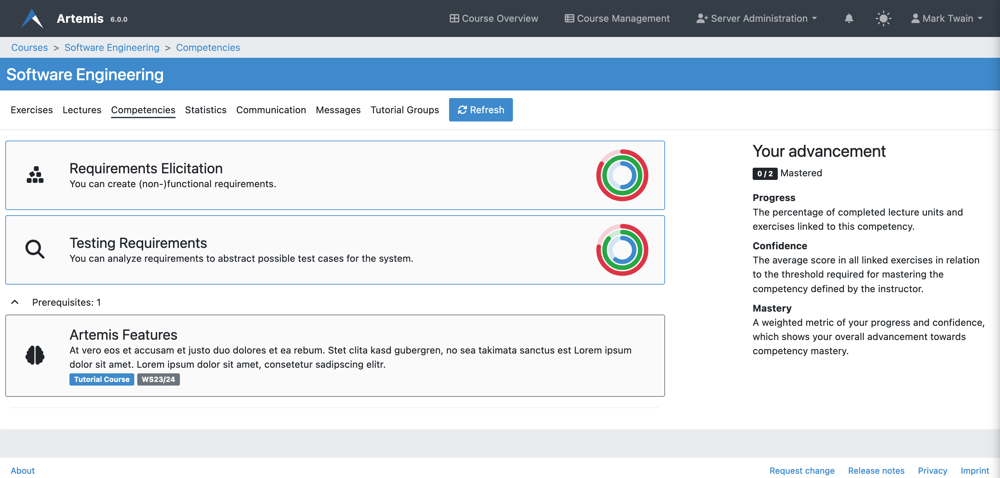
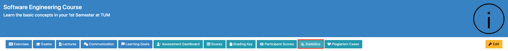

.. _learning-analytics:

Learning Analytics
==================

.. contents:: Content of this document
    :local:
    :depth: 2

Overview
--------
Artemis integrates different statistics for students to compare themselves to the course average.
It allows instructors to evaluate the average student performance based on exercises and competencies.

.. note::
    To preserve the individual's data privacy, Artemis calculates the data on the fly and only shows aggregated data to instructors so that it's not possible to track an individual student within the learning analytics modules.

Learning Analytics for Students
-------------------------------
Students can access their individual learning analytics for a specific course by navigating to the course's ``Statistics`` page.

|students-statistics|

Overall Points
^^^^^^^^^^^^^^
A donut diagram shows students their overall achieved points in the course.

|students-overall-points|

Performance in Exercises
^^^^^^^^^^^^^^^^^^^^^^^^
Students can compare their scores to the best overall score as well as the average score for each individual exercise with the help of a line chart.

|students-performance-in-exercises|

Points per Exercise
^^^^^^^^^^^^^^^^^^^
To get a quick overview about the achieved points per exercise, a bar chart shows the achieved points of the student for every exercise grouped by the exercise type.

|students-points-per-exercise|

Competencies
^^^^^^^^^^^^
Competencies are overarching learning objectives that tie together various lectures and exercises.
In case competencies are defined, students can get an overview of their individual progress and confidence on the competencies tab.
The page lists all competencies with their title, description, and `taxonomy <https://en.wikipedia.org/wiki/Bloom%27s_taxonomy>`_.

Expanding the prerequisites section shows the student all competencies from previous courses the instructor has selected as a prerequisite for this course.

|students-learning-goals-statistics|

When clicking on a competency, a page opens and displays detailed statistics about the competency together with all linked lecture units and exercises.
The tripartite rings show the student's advancement:
The **blue ring describes the progress**, the percentage of completed lecture units and exercises.
The **green ring visualizes the confidence**, the average score in all linked exercises in relation to the threshold required for mastering the competency (set by the instructor).
The **red ring is a weighted metric of the student's progress and confidence**, which shows the overall advancement towards competency mastery.
A competency is considered mastered by a student when they completed all linked learning objects (progress equals 100%) and have an adequate confidence level (average score greater or equal to mastery threshold).

|students-learning-goals-statistics-detail|

Learning Analytics for Instructors
----------------------------------
Artemis provides instructors with several different learning analytics, which are detailed in this section.
Key statistics such as the number of total assessments or the average student score are already displayed on the course's main page.

|instructors-basic-statistics|

.. _course_statistics:

Course Statistics
^^^^^^^^^^^^^^^^^
More detailed as well as additional course statistics can be inspected by instructors when navigating to the course's ``Statistics`` page.

|instructors-course-statistics-button|

On this page instructors can explore and evaluate all available course statistics such as the average points, number of submissions, number of active users, and much more.
All the statistics can be generated for different time frames.

|instructors-course-statistics|

Exercise Statistics
^^^^^^^^^^^^^^^^^^^
Similar to course statistics instructors can have an overview of different learning metrics such as the average score or the participation rate for a specific exercise.
To get to this view, instructors can either click on one of the average score bars of the :ref:`Course Statistics <course_statistics>` or click on the ``Statistics`` button that is displayed on each exercise overview page.

|instructors-exercise-statistics|

Competencies
^^^^^^^^^^^^
Competencies are overarching learning objectives that link together different course materials.

.. raw:: html

    <iframe src="https://live.rbg.tum.de/w/artemisintro/26313?video_only=1&t=0" allowfullscreen="1" frameborder="0" width="600" height="350">
        Watch this video on TUM-Live.
    </iframe>

An instructor can view and edit all competencies of a course on the competency management page.
The table shows the title, description, and percentage of students that mastered the respective competency.

On a side note, instructors can also select competencies from previous courses they thaught as a prerequisite for this course.
Students can see these on the competencies page and during the course self-registration.

|instructors-learning-goals-manage|

An instructor can create or edit competencies using the following form.
Besides a title and description, they can optionally set a `taxonomy <https://en.wikipedia.org/wiki/Bloom%27s_taxonomy>`_.
The mastery threshold describes the minimum average score required for a student to reach 100% confidence in this competency.
The current average score of all linked exercises shown on this page can be used as a basis for defining a reasonable threshold value.
Instructors can link competencies to lecture units on this page by first choosing a lecture and then selecting desired lecture units.

|instructors-learning-goal-edit|

Alternatively, instructors can also link competencies to an exercise or lecture unit on the respective management page using the selection box shown below.

|instructors-learning-goals-link|

.. |students-statistics| image:: learning-analytics/students-statistics.png
    :width: 1000
.. |students-overall-points| image:: learning-analytics/students-overall-points.png
    :width: 1000
.. |students-performance-in-exercises| image:: learning-analytics/students-performance-in-exercises.png
    :width: 1000
.. |students-points-per-exercise| image:: learning-analytics/students-points-per-exercise.png
    :width: 1000

.. |instructors-basic-statistics| image:: learning-analytics/instructors-basic-statistics.png
    :width: 1000

.. |instructors-course-statistics| image:: learning-analytics/instructors-course-statistics.png
    :width: 1000
.. |instructors-exercise-statistics| image:: learning-analytics/instructors-exercise-statistics.png
    :width: 1000

.. |instructors-learning-goals-link| image:: learning-analytics/instructors-learning-goals-link.png
    :width: 600
