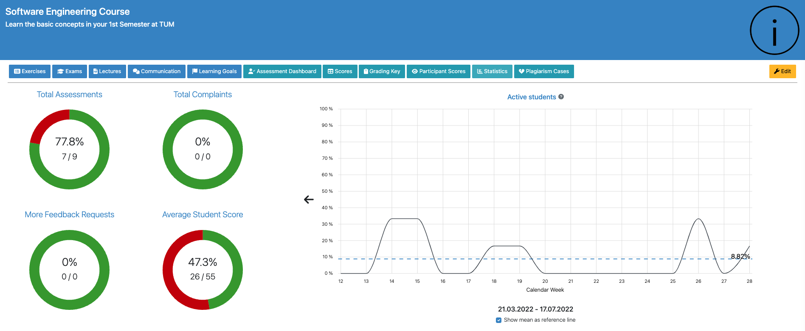
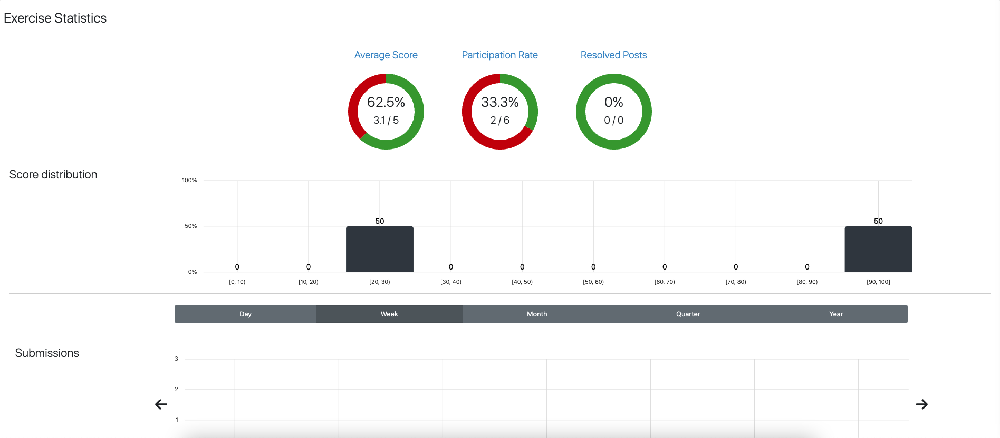

.. _learning-analytics:

Learning Analytics
=====

.. contents:: Content of this document
    :local:
    :depth: 2

Overview
--------
Artemis integrates different statistics for students to compare themselves to the course average.
It allows instructors to evaluate the average student performance based on exercises and learning goals.

Learning Analytics for Students
------------------
Students can access their individual learning analytics for a specific course by navigating to the course's ``Statistics`` page.

|students-statistics|

Overall Points
^^^^^^^^^^^^^^
A donut diagram shows students their overall achieved points in the course.

|students-overall-points|

Performance in Exercises
^^^^^^^^^^^^^^^^^^^^^^^^
Students can compare their scores to the best overall score as well as the average score for each individual exercise with the help of a line chart.

|students-performance-in-exercises|

Points per Exercise
^^^^^^^^^^^^^^^^^^^
To get a quick overview about the achieved points per exercise, a bar chart shows the achieved points of the student for every exercise grouped by the exercise type.

|students-points-per-exercise|

Learning Analytics for Instructors
------------------
Artemis provides instructors with several different learning analytics, which are detailed in this section.
Key statistics such as the number of total assessments or the average student score are already displayed on the course's main page.

|instructors-basic-statistics|

.. _course_statistics:

Course Statistics
^^^^^^^^^^^^^^^^^
More detailed as well as additional course statistics can be inspected by instructors when navigating to the course's ``Statistics`` page.

|instructors-course-statistics-button|

On this page instructors can explore and evaluate all available course statistics such as the average points, number of submissions, number of active users, and much more.
All the statistics can be generated for different time frames.

|instructors-course-statistics|

Exercise Statistics
^^^^^^^^^^^^^^^^^^^
Similar to course statistics instructors can have an overview of different learning metrics such as the average score or the participation rate for a specific exercise.
To get to this view, instructors can either click on one of the average score bars of the :ref:`Course Statistics <course_statistics>` or click on the ``Statistics`` button that is displayed on each exercise overview page.

|instructors-exercise-statistics|

Learning Goal Statistics
^^^^^^^^^^^^^^^^^^^^^^^^
In case learning goals are defined and connected to different lecture units, the progress of the learning goals is shown on the learning goals management page.

|instructors-learning-goals-statistics|

When clicking on a learning goal, a modal opens and shows detailed statistics about the learning goal and its associated lecture unit(s).

|instructors-learning-goals-statistics-detail|

.. |students-statistics| image:: learning-analytics/students-statistics.png
    :width: 1000
.. |students-overall-points| image:: learning-analytics/students-overall-points.png
    :width: 1000
.. |students-performance-in-exercises| image:: learning-analytics/students-performance-in-exercises.png
    :width: 1000

.. |instructors-course-statistics-button| image:: learning-analytics/instructors-course-statistics-button.png
    :width: 1000
.. |instructors-course-statistics| image:: learning-analytics/instructors-course-statistics.png
    :width: 1000

.. |instructors-learning-goals-statistics| image:: learning-analytics/instructors-learning-goals-statistics.png
    :width: 1000
.. |instructors-learning-goals-statistics-detail| image:: learning-analytics/instructors-learning-goals-statistics-detail.png
    :width: 600
