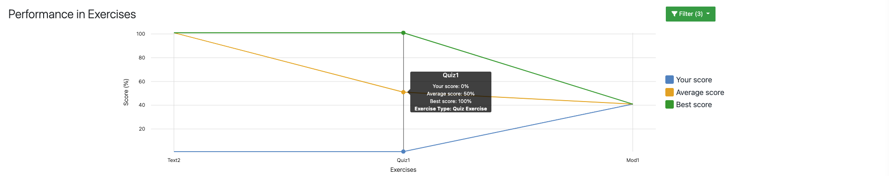

.. _learning-analytics:

Learning Analytics
=====

.. contents:: Content of this document
    :local:
    :depth: 2

Overview
--------
Artemis integrates different statistics for students to compare themselves to the course average.
It allows instructors to evaluate the average student performance based on exercises and learning goals.

Learning Analytics for Students
------------------
Students can access their individual learning analytics for a specific course by navigating to the course's ``Statistics`` page.

|students-statistics|

Overall Points
^^^^^^^^^^^^^^
A donut diagram shows students their overall achieved points in the course.
|students-overall-points|

Performance in Exercises
^^^^^^^^^^^^^^^^^^^^^^^^
Students can compare their scores to the best, overall score as well as the average score for each individual exercise with the help of a line chart.
|students-performance-in-exercises|

Points per Exercise
^^^^^^^^^^^^^^^^^^^
To get a quick overview about the achieved points per exercise, a bar chart shows the achieved points of the student for every exercise grouped by the exercise type.
|students-points-per-exercise|

Learning Analytics for Instructors
------------------

.. |students-points-per-exercise| image:: learning-analytics/students-points-per-exercise.png
    :width: 1000
