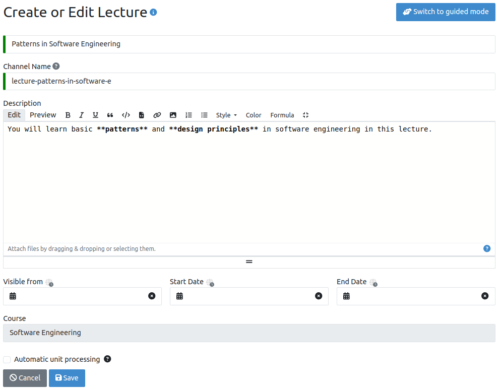

.. _learning-goals:

Learning Goals
==============

.. contents:: Content of this document
    :local:
    :depth: 2

Overview
--------
Artemis integrates different statistics for students to compare themselves to the course average.
It allows instructors to evaluate the average student performance based on exercises and learning goals.

.. |lectures-overview| image:: lectures/lectures-overview.png
    :width: 1000

.. |units-overview| image:: lectures/units-overview.png
    :width: 1000
.. |units-overview| image:: lectures/units-overview.png
    :width: 1000
