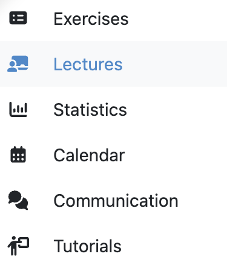
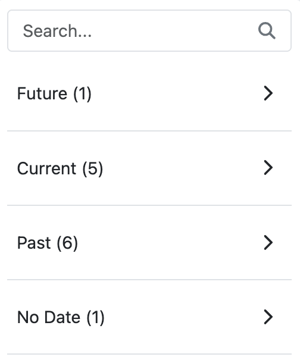
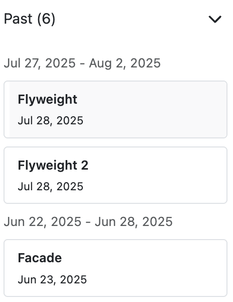
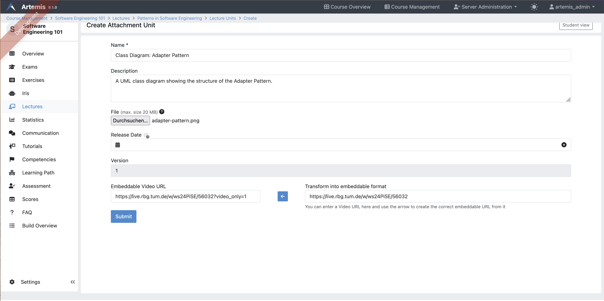
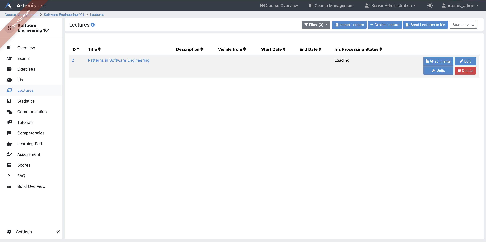
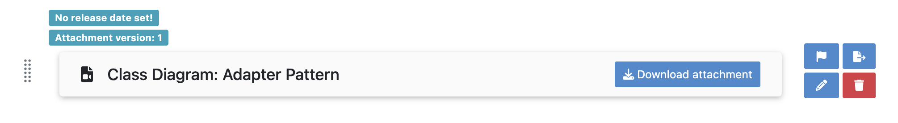
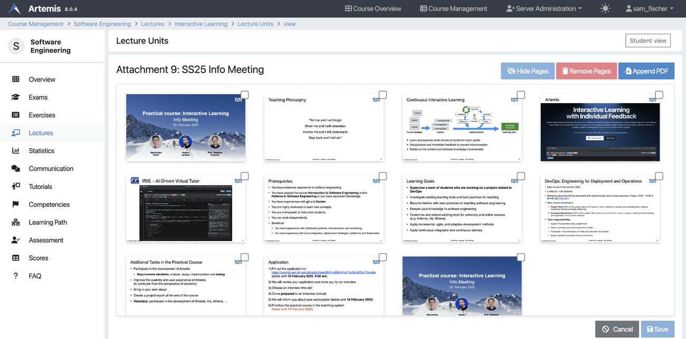
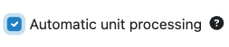
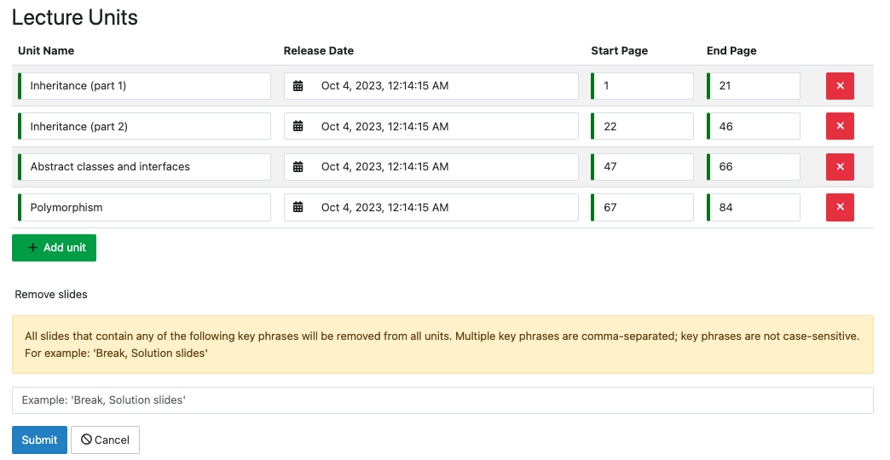
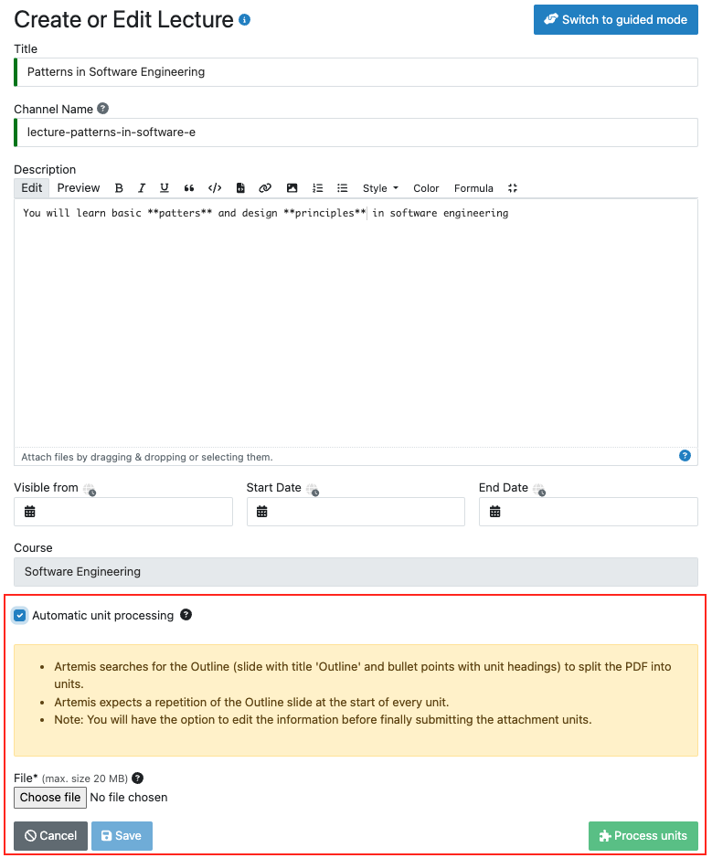

.. _lectures:

Lectures
========

.. contents:: Content of this document
    :local:
    :depth: 2

Overview
--------
Apart from :ref:`Exercises <exercises>` and :ref:`Exams <exams>`, Artemis can also host the **Lectures** of a course.

Students
^^^^^^^^

Students can see all published lectures of a course by clicking on the tab labeled *Lectures*.

|general-menu|

Lecture Organization and Navigation
""""""""""""""""""""""""""""""""""""

The lecture overview provides an organized view of all course lectures. The sidebar displays lectures categorized by time periods to help students navigate course content efficiently:

- **Future:** Upcoming lectures that haven't started yet
- **Current:** Lectures active in the current week
- **Past:** Lectures whose end date has passed
- **No Date:** Lectures without specific dates assigned

|lecture-overview-collapse|

When a section(e.g No date) contains more than 5 lectures, Artemis may create weekly subsections to improve navigation, though the exact grouping depends on lecture dates and distribution across weeks.

|lecture-overview-current| |lecture-overview-past|

Clicking on a lecture leads to the following page, where students can see the title, description, lecture units, and attachments.

|lecture-details|

Instructors
^^^^^^^^^^^
Instructors can upload files, such as lecture slides, and partition the lecture's content into individual lecture units.
Lecture units can consist of files, text, external links, videos or livestreams (e.g., lecture recordings).
To directly link the necessary knowledge to its application, regular course exercises can be added to the lecture as a unit, too.
Instructors can also define learning goals so that students can keep track of the knowledge they should have after working with those lecture materials.

On the course management site, clicking on |lectures-management-btn| opens the following page for managing lectures.

|lectures-management|

Managing Lectures
-----------------

Instructors have three options for creating a lecture.

    1. Create a new lecture from scratch by clicking on |create-lecture-btn|.
    Lectures consist of a title, a description, optionally a start and end date, and the selection of automatic unit processing.

        |create-lecture|

    If instructors decide to process units automatically by clicking on the |process-units-checkbox| checkbox, additional information will be displayed
    and they can click on |process-units-btn| to process the lecture PDF into multiple units.

       |automatic-unit-processing|

    Once the units are processed, instructors can view how the units are split, beginning from a start page to an end page. A name is automatically generated for each lecture unit.
    Instructors can also customize the table entries by removing or adding new units. Additionally, they can enter keywords if they want particular slides
    to be removed. Slides containing one of the comma-separated keywords will be removed.

       |processed-lecture-units|

    The following video shows how to split a lecture PDF into multiple units.

    .. raw:: html

        <iframe src="https://live.rbg.tum.de/w/artemisintro/40577?video_only=1&t=0" allowfullscreen="1" frameborder="0" width="600" height="350">
            Watch this video on TUM-Live.
        </iframe>

    2. In addition to creating a new lecture from the default mode, instructors can switch to the guided lecture creation by clicking on |switch-to-guided-mode-btn|.
    This guided mode helps creating a new lecture and adding its contents through a multi-step process. The following video shows an exemplary use of the guided mode.

    .. raw:: html

        <iframe src="https://live.rbg.tum.de/w/artemisintro/26853?video_only=1&t=0" allowfullscreen="1" frameborder="0" width="600" height="400">
            Watch this video on TUM-Live.
        </iframe>

    3. Alternatively, instructors can also import a lecture from any other course where they at least have *editor* access.
    Clicking on |import-lecture-btn| opens the import modal, where instructors can search for an existing lecture and import it.

        |import-lecture|

Once a lecture is created, instructors can add attachments to it.
An attachment is a file (e.g., document, image) with a title and an optional release date.

|create-attachment|

Lecture Units
-------------

Lectures can be divided into lecture units, which can be of the following types:

    * **Text unit:** A text with markup.
    * **Exercise unit:** An exercise from the same course.
    * **Attachment Video unit:** A file that the student may download and an embedded video stream or video from an external source.
    * **Online unit:** A link to an external website.

Students see all released lecture units on the lecture details page.
Clicking on a unit opens its contents.
Artemis shows a flag icon with a popover next to the unit if it is associated with a learning goal.
Students complete lecture units automatically (e.g., when they are opened) or manually by clicking the checkbox.

|lecture-details|

Instructors can create lecture units on the lecture unit management page.

|units-management-empty|

After adding lecture units, instructors may edit or delete each one with the buttons to the right of the unit.
Using the arrow buttons, the order of the lecture units can be changed.

|units-management|

Attachment Video Unit
^^^^^^^^^^^^^^^^^^^^^
An attachment video unit consists of a name, file, an embedded video link, and optionally a description, a release date and a transcription.
Artemis can convert the website link from common video sources to an embeddable URL using the arrow button.
Students complete this unit when they watch the video for at least five minutes and download the attachment.

If your Artemis instance is connected to Nebula (see the :doc:`Nebula setup guide <../admin/setup/nebula>`), you can generate transcriptions directly in the editor:

1. Create or edit the attachment video unit and paste the public TUM-Live link into the **Transform into embeddable format** helper.
2. Click the arrow button. When Artemis resolves the playlist successfully, the **Generate transcript after saving** checkbox appears.
3. Enable the checkbox and save the lecture unit. Artemis sends the job to Nebula and shows a toast confirming that processing started.
4. Nebula processes the lecture asynchronously. Once finished, the transcription is attached to the unit and becomes visible the next time you open the editor.

If the recording cannot be processed automatically (for example due to missing credentials), you can still paste an existing transcription JSON into the **Video Transcription**
field before saving.

|create-attachment-video-unit|

Either all Attachment Video Units of a lecture or specific Attachment Video Units can be sent to Iris, over the ingestion button in the lecture unit overview.
Those transcriptions can be used to answer students' questions in the Iris chat.

|send-all-lectures-to-iris|
|send-one-unit-iris|

Attachment Unit Management
""""""""""""""""""""""""""
Instructors can preview the Attachment Unit by clicking the |view-attachment-unit-btn| button.

|view-attachment-unit|

In the preview, instructors can enlarge pages, delete them, reorder them, merge new files, or hide pages. This feature enables instructors to easily edit lecture materials within the platform, without relying on external tools.

The following video shows how to use all of the mentioned features effectively.

.. raw:: html

    <iframe src="https://live.rbg.tum.de/w/artemisintro/59823?video_only=1&t=0" allowfullscreen="1" frameborder="0" width="600" height="350">
        Watch this video on TUM-Live.
    </iframe>

Pages can be hidden indefinitely, until a specific date, or until an exercise's due date. Hidden pages are invisible to students and cannot be referenced in the Communication section.

The following video shows how to observe the effects of hidden pages on the Student Version and slide references.

.. raw:: html

    <iframe src="https://live.rbg.tum.de/w/artemisintro/59826?video_only=1&t=0" allowfullscreen="1" frameborder="0" width="600" height="350">
        Watch this video on TUM-Live.
    </iframe>

Exercise Unit
^^^^^^^^^^^^^
An exercise can be added as a unit to a lecture.
For the exercise unit, Artemis uses the title, release date, etc. of the exercise itself.
Students complete this unit when they participate in the exercise.

|create-exercise-unit|

Online Unit
^^^^^^^^^^^
An online unit consists of a link to an external website, a name, and optionally a description and release date.
Artemis automatically pre-fills the title and description from the website's metadata once the URL is set.
Students complete this unit once they navigate to the external website.

|create-online-unit|

Text Unit
^^^^^^^^^
A text unit consists of a name, some rich-text content and optionally a release date.
Students complete this unit as soon as they open it.

|create-text-unit|

Competencies
--------------

Instructors can create competencies, which are desired learning objectives, and link lecture units to them.
See :ref:`Adaptive Learning <adaptive-learning>` for more information.

.. |lecture-overview-current| image:: lectures/lecture-overview-current.png
    :width: 250
.. |lecture-details| image:: lectures/lecture-details.png
    :width: 1000
.. |lectures-management| image:: lectures/lectures-management.png
    :width: 1000
.. |lectures-management-btn| image:: lectures/lectures-management-button.png
    :width: 80
.. |create-lecture| image:: lectures/create-lecture.png
    :width: 1000
.. |create-lecture-btn| image:: lectures/create-lecture-button.png
    :width: 120

.. |create-attachment| image:: lectures/create-attachment.png
    :width: 1000
.. |import-lecture| image:: lectures/import-lecture.png
    :width: 1000
.. |import-lecture-btn| image:: lectures/import-lecture-button.png
    :width: 120
.. |units-management-empty| image:: lectures/units-management-empty.png
    :width: 1000
.. |units-management| image:: lectures/units-management.png
    :width: 1000
.. |create-online-unit| image:: lectures/create-online-unit.png
    :width: 1000
.. |create-text-unit| image:: lectures/create-text-unit.png
    :width: 1000
.. |create-video-unit| image:: lectures/create-video-unit.png
    :width: 1000

.. |create-exercise-unit| image:: lectures/create-exercise-unit.png
    :width: 1000

.. |process-units-btn| image:: lectures/process-units-btn.png
   :width: 120

