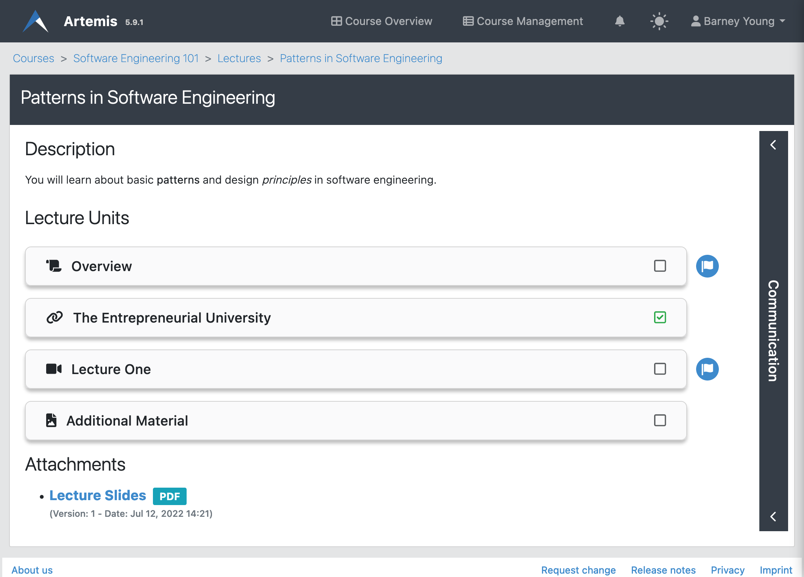
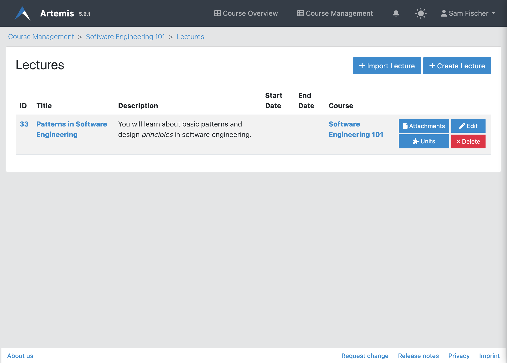
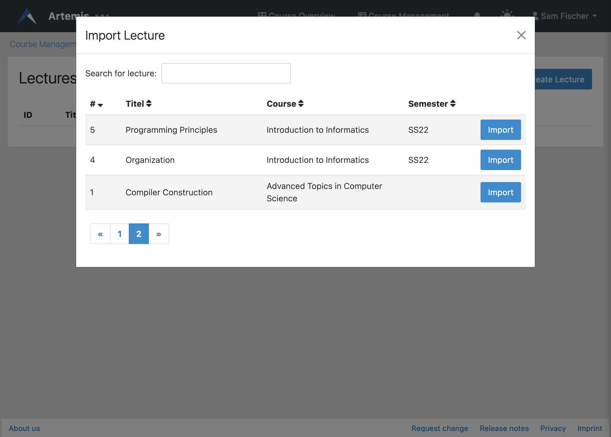
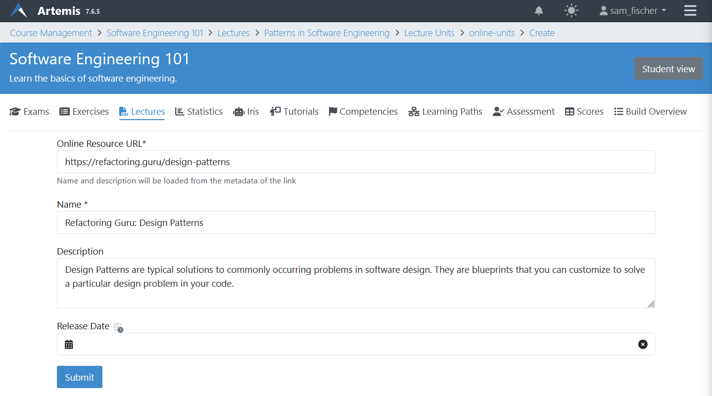
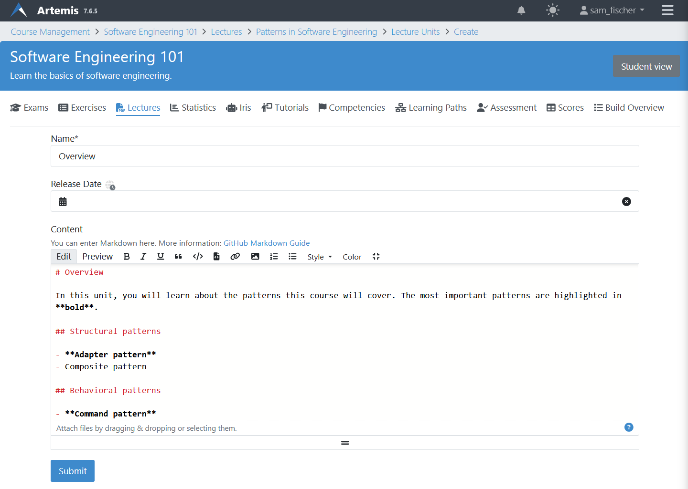
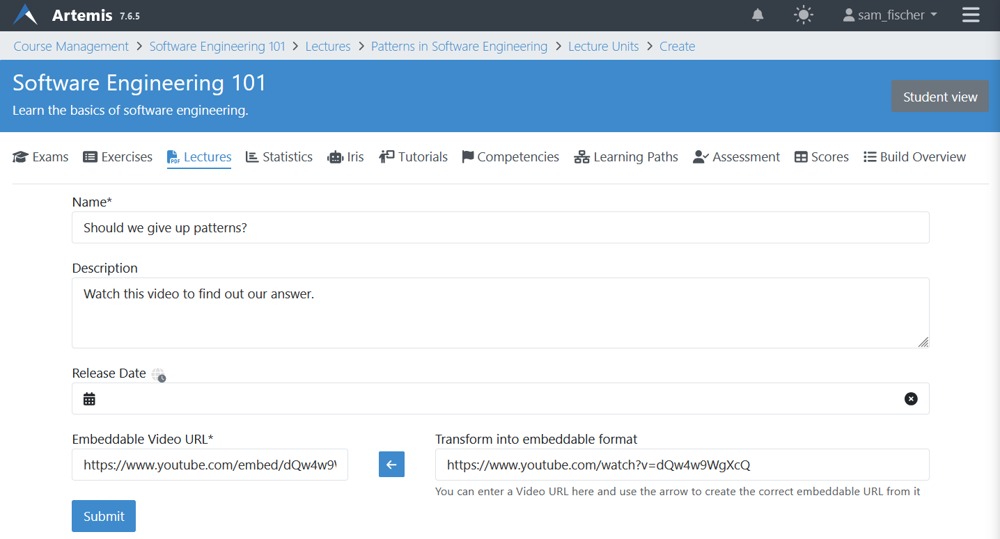
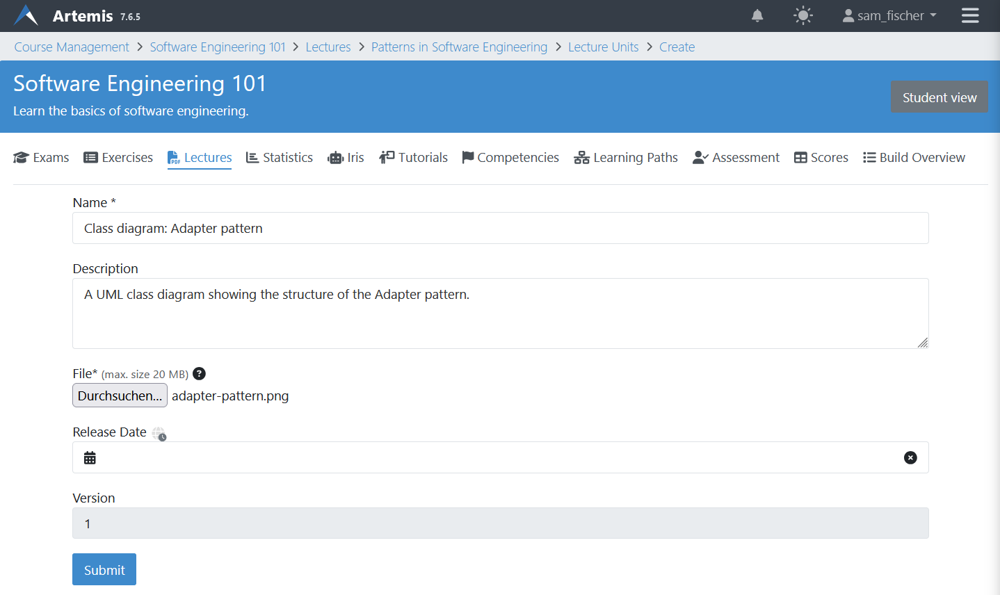
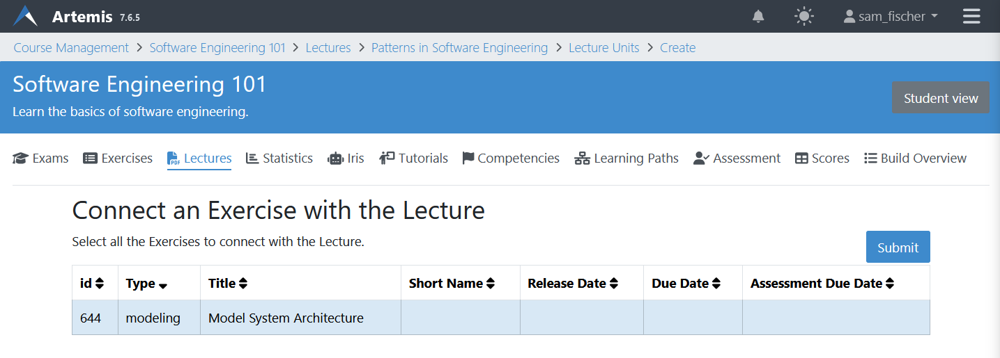

.. _lectures:

Lectures
========

.. contents:: Content of this document
    :local:
    :depth: 2

Overview
--------
Apart from :ref:`Exercises` and :ref:`Exams`, Artemis can also host the **Lectures** of a course.

Students
^^^^^^^^

Students can see all published lectures of a course, grouped by date, when clicking on the tab labeled *Lectures*.

|lectures-overview|

Clicking on a lecture leads to the following page, where students can see the title, description, lecture units, and attachments.

|lecture-details|

Instructors
^^^^^^^^^^^
Instructors can upload files, such as lecture slides, and partition the lecture's content into individual lecture units.
Lecture units can consist of files, text, external links, videos or livestreams (e.g., lecture recordings).
To directly link the necessary knowledge to its application, regular course exercises can be added to the lecture as a unit, too.
Instructors can also define learning goals so that students can keep track of the knowledge they should have after working with those lecture materials.

On the course management site, clicking on |lectures-management-btn| opens the following page for managing lectures.

|lectures-management|

Managing Lectures
-----------------

Instructors have two options for creating a lecture.

    1. Create a new lecture from scratch by clicking on |create-lecture-btn|.
    Lectures consist of a title, a description, and optionally a start and end date.

        |create-lecture|

    2. Alternatively, instructors can also import a lecture from any other course where they at least have *editor* access.
    Clicking on |import-lecture-btn| opens the import modal, where instructors can search for an existing lecture and import it.

        |import-lecture|

Once a lecture is created, instructors can add attachments to it.
An attachment is a file (e.g., document, image) with a title and an optional release date.

|create-attachment|

Lecture Units
-------------

Lectures can be divided into lecture units, which can be of the following types:

    * **Text unit:** A text with markup.
    * **Exercise unit:** An exercise from the same course.
    * **Video unit:** An embedded video stream or video from an external source.
    * **Online unit:** A link to an external website.
    * **Attachment unit:** A file that the student may download.

Students see all released lecture units on the lecture details page.
Clicking on a unit opens its contents.
Artemis shows a flag icon with a popover next to the unit if it is associated with a learning goal.
Students complete lecture units automatically (e.g., when they are opened) or manually by clicking the checkbox.

|lecture-details|

Instructors can create lecture units on the lecture unit management page.

|units-management-empty|

After adding lecture units, instructors may edit or delete each one with the buttons to the right of the unit.
Using the arrow buttons, the order of the lecture units can be changed.

|units-management|

Attachment Unit
^^^^^^^^^^^^^^^
An attachment unit consists of a name, file, and optionally a description and release date.
Students complete this unit once they download the file.

|create-attachment-unit|

Exercise Unit
^^^^^^^^^^^^
An exercise can be added as a unit to a lecture.
For the exercise unit, Artemis uses the title, release date, etc. of the exercise itself.
Students complete this unit when they participate in the exercise.

|create-exercise-unit|

Online Unit
^^^^^^^^^^^
An online unit consists of a link to an external website, a name, and optionally a description and release date.
Artemis automatically pre-fills the title and description from the website's metadata once the URL is set.
Students complete this unit once they navigate to the external website.

|create-online-unit|

Text Unit
^^^^^^^^^
A text unit consists of a name, some rich-text content and optionally a release date.
Students complete this unit as soon as they open it.

|create-text-unit|

Video Unit
^^^^^^^^^^^
A video unit consists of a name, an embeddable video link, and optionally a description and release date.
Artemis can convert the website link from common video sources to an embeddable URL using the arrow button.
Students complete this unit when they watch the video for at least five minutes.

|create-video-unit|

Learning Goals
--------------

Instructors can define learning goals to group course content and associate units from different lectures with the same learning goal.

|learning-goals-management|

To create a learning goal, as an instructor click on the plus button and enter a name and description.
Then select a lecture from the dropdown and mark some of its units to associate them with this learning goal.

|create-learning-goal|

.. |lectures-management-btn| image:: lectures/lectures-management-button.png
    :width: 80
.. |create-lecture| image:: lectures/create-lecture.png
    :width: 800
.. |create-lecture-btn| image:: lectures/create-lecture-button.png
    :width: 120
.. |create-attachment| image:: lectures/create-attachment.png
    :width: 800

.. |import-lecture-btn| image:: lectures/import-lecture-button.png
    :width: 120

.. |units-management| image:: lectures/units-management.png
    :width: 800

