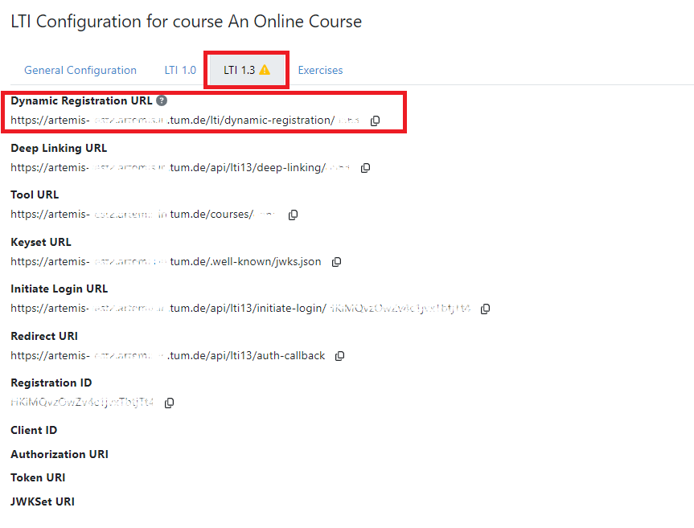
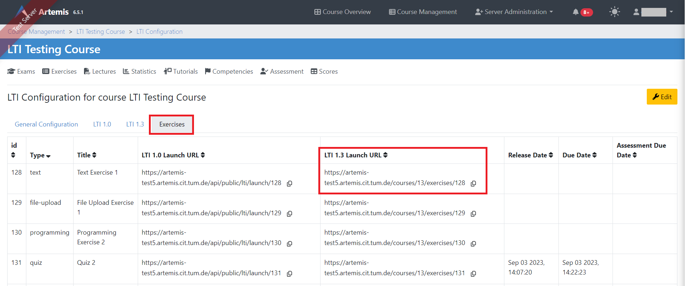
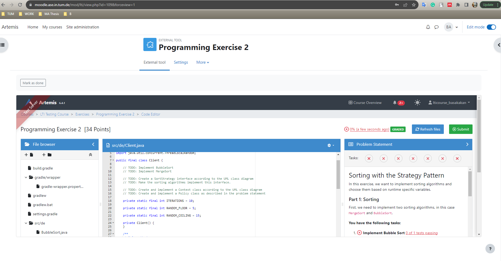

.. _lti:

LTI Integration
=====================================

.. contents:: Content of this document
    :local:
    :depth: 2

Overview
--------

LTI (Learning Tools Interoperability) is a standard developed by `IMS Global <https://www.1edtech.org/>`_ that allows different learning platforms and tools to work together seamlessly.
It enables tools to integrate smoothly with a learning management system (like Moodle or edX). Artemis supports `LTI 1.1 (deprecated) <https://www.imsglobal.org/specs/ltiv1p1/implementation-guide>`_ and `LTI 1.3. <https://www.imsglobal.org/spec/lti/v1p3>`_
The table below showcases the types of exercises supported by Artemis and their respective functionalities.
For each exercise, students can start the exercise, check their results and get feedback on their work. Assessment results provide a quantitative measure of a student's performance on the exercise, which is represented as a grade or score. Assessment Feedback offers qualitative insights through comments and suggestions.

.. list-table:: Supported Exercise Interactions
   :widths: 25 15 15 15
   :header-rows: 1

   * - Exercise Type
     - Start Exercise
     - View Assessment Result
     - View Assessment Feedback
   * - Programming exercise
     - ✔
     - ✔
     - ✔
   * - Quiz exercise
     - ✔
     - ✔
     - ✔
   * - Modeling exercise
     - ✔
     - ✔
     - ✔
   * - Text exercise
     - ✔
     - ✔
     - ✔
   * - File Upload exercise
     - ✔
     - ✔
     - ✔

Prerequisite for Server Admins
-------------------------------
Before instructors integrate Artemis or students access and start Artemis exercises through Moodle or any other LMS via LTI, server administrators must ensure that LTI is active with the necessary profile on the server. If you are a server admin, please make sure to configure this setting to allow instructors and students to utilize the LTI integration.

LTI 1.3 Instructor Guide
---------------------------
Instructors have the capability to seamlessly integrate the Artemis platform with other Learning Management Systems (LMS) like Moodle using the LTI 1.3 standard. The process is straightforward and involves a few key steps:

#. Connecting Artemis to Other Platforms: Begin by enabling the Online Course setting in Artemis, which activates the LTI features.
#. Retrieve Dynamic Registration URL: Once the Online Course setting is enabled, you can obtain the Dynamic Registration URL from Artemis, which is essential for the integration process.
#. Establish Configuration in Moodle: With the Dynamic Registration URL in hand, proceed to your Moodle platform and input this URL to establish a connection between Artemis and Moodle.
#. Link Specific Exercises: Instructors can also link individual exercises from Artemis directly to their Moodle courses, ensuring students have direct access to specific assignments.

By following these steps, instructors can effortlessly bridge the gap between Artemis and Moodle, providing students with a unified learning experience.

1. Connecting Artemis to Other Platforms (e.g., Moodle)
^^^^^^^^^^^^^^^^^^^^^^^^^^^^^^^^^^^^^^^^^^^^^^^^^^^^^^^^
Instructors can connect Artemis online courses via LTI to other Learning Management Systems (e.g., Moodle, edX).
Below given steps for how to configure Artemis over LTI with Moodle.

1.1 Enable the Online Course Setting in Artemis:
"""""""""""""""""""""""""""""""""""""""""""""""""
Before diving into the LTI configuration, it is crucial to ensure that the Online Course setting is enabled in Artemis. This setting activates the LTI configurability, allowing instructors to link Artemis with Moodle or other LMS platforms.
To enable the Online Course setting in Artemis, follow the steps below:\

#. Access Course Management: Start by logging into your Artemis account. Locate and click on the |course-management| option.
#. Select the Desired Course: From the list of available courses, navigate to the course you wish to configure for LTI integration.
#. Edit Course Settings: On the course overview page, you will find an |course_edit| button, located at the top right corner. Clicking this will allow you to modify various course settings.
#. Locate the Online Course Checkbox: As you scroll through the course settings, you will come across a checkbox labeled Online Course. This particular setting is essential for enabling LTI configurability.
#. Activate LTI Configuration: To finalize the process, simply check the Online Course checkbox. By doing so, you are activating the LTI configuration settings for that specific course. Make sure to save any changes made.

.. figure:: lti/enable_onlinecourse.png
    :align: center
    :width: 700
    :alt: Enable Online Course

With the Online Course setting enabled, you can now proceed to integrate Artemis with Moodle using the LTI 1.3 standard. The subsequent sections of this guide will provide detailed steps on achieving this integration.

1.2. Copy Dynamic Registration URL from Artemis
"""""""""""""""""""""""""""""""""""""""""""""""
Once the above setting is enabled, you can now set up a bridge between Artemis and Moodle.
To retrieve Dynamic Registration URL from Artemis, follow the steps outlined below:

#. Access Course Management: Begin by logging into your Artemis account. Click on the  |course-management| option.
#. Choose the Relevant Course: From the list of courses, select the one you wish to configure for LTI integration. This will lead you to the course's settings and details.
#. Navigate to Course Details: Once inside the course settings, scroll down until you find the Course Details section.
#. Access LTI Configuration: Within the Course Details section, you will find an option labeled LTI Configuration. Click on it to access the LTI settings for the course.

    .. figure:: lti/lticonfiguration_link.png
        :align: center
        :width: 700
        :alt: Locate LTI Configuration

#. Switch to LTI 1.3 Tab: Inside the LTI Configuration, there will be multiple tabs related to different LTI versions. Click on the LTI 1.3 tab to access the settings specific to this version.
#. Retrieve Dynamic Registration URL: In the LTI 1.3 settings, locate the Dynamic Registration URL. This URL is essential for integrating Artemis with Moodle. Copy this URL for use in the subsequent Moodle configuration steps.

1.3. Establish Artemis configuration from Moodle
""""""""""""""""""""""""""""""""""""""""""""""""

With the Dynamic Registration URL copied, you can now configure the LTI 1.3 integration in Moodle:

#. Access Site Administration: Log into your Moodle account. From the main dashboard, navigate to the Site Administration section. This section contains various administrative settings for the Moodle platform.
#. Navigate to External Tool Settings: Inside the Site Administration, go to Plugins. From there, select External tool followed by Manage Tools. This will lead you to the LTI configurations in Moodle.

    .. figure:: lti/moodle_site_administration.png
        :align: center
        :width: 700
        :alt: Moodle - Site Administration

#. Enter Dynamic Registration URL: In the Manage Tools section, you will find a field labeled Tool URL. Paste the previously copied Dynamic Registration URL from Artemis into this field.
#. Initiate LTI Advantage Integration: After entering the URL, click on the Add LTI Advantage button. This action will begin the process of integrating Artemis with Moodle using the LTI 1.3 standard.

    .. figure:: lti/moodle_add_tool_url.png
        :align: center
        :width: 700
        :alt: Moodle - Site Administration

#. Locate the Artemis Course: Once the integration process starts, scroll down the list until you find the Artemis course identified by its shortname.
#. Activate the Integration: To finalize the integration, click on the Activate button next to the Artemis course name. This action will complete the LTI 1.3 integration between Artemis and Moodle.

.. figure:: lti/moodle_activate_lti.png
    :align: center
    :alt: Moodle - Site Administration

2. Linking Specific Exercises from Artemis to Moodle
^^^^^^^^^^^^^^^^^^^^^^^^^^^^^^^^^^^^^^^^^^^^^^^^^^^^^
Once the LTI configuration between Artemis and Moodle is successfully completed, instructors have the capability to link specific Artemis exercises directly to their Moodle courses. This integration provides students with direct access to Artemis exercises from their Moodle courses. The process involves two primary steps:
#. Retrieving the LTI 1.3 Launch URL for the desired Artemis exercise.
#. Linking this URL to the Moodle course.
By following the detailed steps below, instructors can integrate individual Artemis exercises into their Moodle courses, enhancing the learning experience for students.

2.1. Retrieve LTI 1.3 Launch URL from Artemis
"""""""""""""""""""""""""""""""""""""""""""""

#. Access Course Management: Select the |course-management| to view all your courses.
#. Choose the Desired Course: From the list of available courses, select the one online course that containing the exercise you would like to link to Moodle.
#. Navigate to Course Details: Once you are inside the course settings, scroll down to the Course Details section.
#. Access LTI Configuration: Within the Course Details section, you will find an link labeled LTI Configuration. Click on this to access the LTI settings specific to the course.
#. Switch to the Exercises Tab: Inside the LTI Configuration, locate and click on the Exercises tab. This tab lists all the exercises available for the course.
#. Retrieve the LTI 1.3 Launch URL: For each exercise listed, there is an associated LTI 1.3 Launch URL. This URL is crucial for linking the exercise to Moodle. Find the exercise you wish to link and copy its LTI 1.3 Launch URL.

2.2. Link exercise to Moodle
""""""""""""""""""""""""""""

With the LTI 1.3 Launch URL copied, you can now link the exercise in Moodle:

#. Access the Desired Course: Log into your Moodle account and navigate to the course where you want to link the Artemis exercise.
#. Enable Edit Mode: Once inside the course, turn on the Edit Mode. This mode allows you to make changes and add resources to the course.

    .. figure:: lti/moodle_editmode.png
        :align: center
        :width: 700
        :alt: Moodle - Edit Course

#. Add an External Tool: Click on the Add an activity or resource button, which brings up a list of available activities and resources. From this list, select the External tool option.

    .. figure:: lti/moodle_add_external_tool.png
        :align: center
        :width: 700
        :alt: Moodle - Add External Tool

#. Enter the LTI 1.3 Launch URL: In the settings for the external tool, you will find a field labeled Resource URL. Paste the previously copied LTI 1.3 Launch URL from Artemis into this field.
#. Save and Finalize: After entering the URL, click on the Save and return to course button to finalize the addition. The linked Artemis exercise should now be accessible directly from the Moodle course.

.. figure:: lti/moodle_add_external_tool_page.png
    :align: center
    :width: 700
    :alt: Moodle - Add External Tool Page

LTI 1.3 Student Guide
---------------------------
For students, the integration of Artemis with Moodle via LTI 1.3 offers a streamlined experience to access and participate in Artemis exercises directly from the Moodle platform. The key steps involved are:

#. Starting an Artemis Exercise: Students can easily access their Moodle courses and find the linked Artemis exercises. Clicking on these links will open the Artemis exercise page right within Moodle, providing a smooth transition.
#. First-Time Users: If you are accessing an Artemis exercise for the first time, you will receive a unique password. It is essential to note this password down as it will be required for future Artemis sessions.
#. Viewing Grades and Feedback: Beyond just participating, students can also view their grades and feedback for any evaluated Artemis exercises, all within the Moodle environment. This ensures that students have a one-stop platform to engage with exercises and track their performance.

By following this guide, students can make the most of the integrated learning experience offered by Artemis and Moodle.

1. Start Artemis Exercise through Moodle
^^^^^^^^^^^^^^^^^^^^^^^^^^^^^^^^^^^^^^^^

Here is a step-by-step guide on how students can start an Artemis exercise through Moodle:

How to Start an Exercise
""""""""""""""""""""""""

#. Access the Moodle Course: Log into your Moodle account and navigate to the specific course containing the linked Artemis exercise.
#. Select the Artemis Exercise: Within the course content, locate and click on the external Artemis exercise you wish to participate in.
#. Launch Artemis from Moodle: Upon selecting the exercise, the Artemis exercise page will open in a frame within Moodle, ensuring a seamless transition between the two platforms.
#. Participate Artemis Exercise: Students can now participate in the Artemis exercise, submit their responses, and receive real-time feedback.

2. First Time Users
^^^^^^^^^^^^^^^^^^^
If a student is participating in an Artemis exercise for the first time, a pop-up will appear. The pop-up will display a uniquely generated password for the student. This password will be required for future sign-ins to Artemis. It is crucial to copy this password and store it in a safe and accessible location.

.. figure:: lti/moodle_password_popup.png
    :align: center
    :width: 700
    :alt: Moodle - Password Pop-up

3. Viewing Grades and Feedback
^^^^^^^^^^^^^^^^^^^^^^^^^^^^^^
In addition to participating in exercises, students can also view their grades and feedback for evaluated Artemis exercises directly within Moodle.
This integration ensures that students have a centralized location to track their performance and receive constructive feedback.

.. |course-management| image:: exercises/general/course-management.png
.. |course_edit| image:: courses/customizable/buttons/course_edit.png
