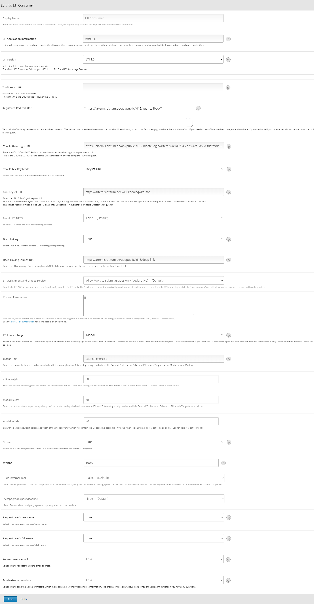

.. _lti:

LTI Configuration
=====================================

.. contents:: Content of this document
    :local:
    :depth: 2

Overview
--------

LTI (Learning Tools Interoperability) is a standard developed by `1EdTech <https://www.1edtech.org/>`_, allowing different learning platforms and tools to work together seamlessly.
It establishes a standard way of integrating learning applications, called tools (delivered by tool providers, e.g., Artemis), with platforms such as Learning Management Systems (e.g., Moodle, edX), called tool consumers.
Artemis is up-to-date with the latest in this standard, supporting `LTI 1.3. <https://www.imsglobal.org/spec/lti/v1p3>`_, ensuring a smooth and efficient connection between Artemis and educational platforms.

LTI 1.3 sets the foundation for securely launching and using educational tools within any LMS. It specifies the technical protocol for how tools like Artemis can seamlessly integrate into platforms like Moodle or edX.
When LTI 1.3 is combined with three critical services—Assignment and Grade Services, Names and Role Provisioning Services, and Deep Linking, it is collectively known as LTI Advantage.
This package provides a more comprehensive integration, allowing smoother communication between the educational tool and the LMS. For more detailed information about LTI Advantage and its features, visit `1EdTech LTI Advantage <https://www.imsglobal.org/lti-advantage-overview>`_.
In the context of LTI Advantage, the term *Tool* refers to any external service or application that adds functionality to the learning environment, such as a tool for submitting exercises. On the other hand, *Platform* refers to the learning management system itself, which wants to incorporate these external tools.
In addition to supporting the core functionalities of LTI 1.3, Artemis integrates specific services under the LTI Advantage framework, including the Score Service from the LTI Advantage Assignment and Grade Services and the Deep Linking Service.

This is a comprehensive guide for instructors and administrators on setting up LTI integration between Artemis and their preferred LMS platforms.
We provide a general overview of the steps required to configure Artemis and specific guidance for popular platforms like Moodle and edX.
Additionally, we outline the capabilities available to different user roles within Artemis about LTI:

* **Administrators** can manage and configure LTI settings across the platform.
* **Instructors** can create and link Artemis content within their LMS courses.
* **Students** benefit from seamless access to Artemis features and course materials.

.. list-table::
   :widths: 30 10 10 10
   :align: center
   :header-rows: 1

   * - Action
     - Administrator
     - Instructor
     - Student
   * - `Enabling Online Course`_
     - ✔
     - ✔
     -
   * - `Dynamic Registration`_
     - ✔
     -
     -
   * - `Manual Registration`_
     - ✔
     - ✔
     -
   * - `Sharing access to a course`_
     - ✔
     -
     -
   * - `Artemis user account provisioning`_
     - ✔
     -
     -
   * - `Link creation via Deep Linking`_
     - ✔
     - ✔
     -
   * - `Manual Link Creation`_
     - ✔
     -
     -
   * - Launch content
     - ✔
     - ✔
     - ✔

The following types of content can be linked to the LMS via LTI:

.. list-table::
   :widths: 40 60
   :align: center
   :header-rows: 1

   * - Content Type
     - Description
   * - Exercises
     - Standard exercise types (e.g., programming, quizzes) can be linked.
   * - Lectures
     - Single lecture units are linkable.
   * - Iris Dashboard
     - Provides contextual AI assistance for students.
   * - Competencies
     - Tracks student progress and mastery of learning goals with visual stats.
   * - Learning Paths
     - Personalized content recommendations based on student performance.
   * - Exercise Groups
     - Custom exercise groups created by instructor during the content linking process.
   * - Lecture Groups
     - Custom lecture groups created by instructor during the content linking process.

.. note::
    To link the Iris dashboard to the LMS, instructors must first activate the course dashboard for their Artemis course.

This guide is structured as follows:

#. Overview: Begin this section by understanding the importance of LTI and role in enhancing the interoperability between Artemis and LMS platforms.
#. Preparation Steps: Before proceeding with LTI integration, ensure your Artemis platform is prepared by following the `Enabling Online Course`_ section.
#. Registration Process: If your LMS supports `Dynamic Registration`_ or requires `Manual Registration`_, follow the steps outlined in the `Register Artemis with the platform`_ section.
#. Linking Courses and their content: The `Sharing access to a course`_ and `Link creation via Deep Linking`_ sections provide detailed instructions for linking Artemis exercises, lectures, competencies, learning-paths and the Iris dashboard with your LMS, ensuring a seamless experience for students.
#. Platform-Specific Instructions: For detailed instructions tailored to Moodle or edX, refer to the respective sections that guide you through each step of the configuration process.
#. Common Issues: Should you encounter any challenges, the `Common Issues`_ section addresses typical problems and their solutions.

.. note::
    This guide assumes sequential progression for ease of understanding and implementation. However, based on your specific needs and the LMS platform, you may focus on the sections most relevant to your setup.
    Whether you're an administrator setting up the integration or an instructor looking to link Artemis content to your courses, this guide aims to provide you with all the necessary information to achieve a successful LTI integration.

.. warning::
    Before instructors integrate Artemis or students access and start Artemis content through LMS via LTI, server administrators must ensure that LTI is active with the necessary profile on the Artemis server. If you are a server admin, please configure this setting to allow instructors and students to utilize the LTI integration.

Enabling Online Course
---------------------------

.. note::
    The steps provided in this section assume the existence of an Artemis course and relevant content.
    For detailed information on the types of exercises Artemis supports and guidance on creating these exercises, please refer to the :ref:`exercises-general-information`.
    This resource will help you understand the exercises Artemis can support and provide step-by-step instructions for creating and managing them within your course.

Before diving into the LTI configuration, ensuring that the Online Course setting is enabled in Artemis is crucial. This setting activates the LTI configurability, allowing instructors to link Artemis content with the LMS platforms.
As an instructor to enable the Online Course setting in Artemis, follow the steps below:\

#. As an instructor, locate and click on the |course-management| option.
#. From the list of available courses, navigate to the course you wish to configure for LTI integration.
#. You will find an |course_settings_button| button at the bottom of the sidebar to the left of the course overview page. Clicking this will allow you to modify various course settings.
#. As you scroll through the course settings, you will find an *Online Course* checkbox. This particular setting is essential for enabling LTI configurability.
#. To finalize the process, check the *Online Course* checkbox. You are activating the LTI configuration settings for that specific course. Make sure to save any changes made.

.. figure:: lti/enable_onlinecourse.png
    :align: center
    :width: 1000
    :alt: Enable Online Course

With the Online Course setting enabled, you can now integrate Artemis with LMSs using the LTI 1.3 standard. The subsequent sections of this guide will provide detailed steps for achieving this integration.

Register Artemis with the platform
----------------------------------

LTI 1.3 and LTI Advantage services use OAuth 2.0 and OpenID Connect as security models. The Tool and the Platform need to register with each other ahead of time so that the platform can access Artemis course content.
Based on the platform-side implementation, registration may only need to happen once when the tool and platform are linked. Registration is a security agreement between the two systems.

There are a few different ways to register:

#. Dynamic registration: The exchange of relevant URLs and IDs is automatic. The platform initiates this process using the tool's registration URL.
#. Manual registration: A platform administrator must manually exchange URLs and IDs with the tool.

Dynamic registration makes it much easier for administrators to set up, so administrators should use it whenever possible, as long as the platform supports it.
It is best to use manual registration when the platform doesn't yet support dynamic registration because it will work on all LTI Advantage-compliant platforms.

Dynamic Registration
^^^^^^^^^^^^^^^^^^^^

If the soon-to-be-configured platform supports dynamic registration service, the only URL we need to provide to the platform is the Dynamic Registration URL.
To retrieve the Dynamic Registration URL from Artemis, follow the steps outlined below:

#. As an administrator user, go to *Server administration > LTI Configuration*
#. Once inside the LTI 1.3 Configuration of the server, you will see the *Platform Registration* tab.
#. You will find an option labeled *Dynamic Registration URL* within the Platform Registration tab. Copy this URL and provide it to your platform admin for further configuration.

.. figure:: lti/server_lti_configuration.png
    :align: center
    :width: 1000
    :alt: Server LTI 1.3 Configuration

The exact steps of using a registration URL to register Artemis as a tool are platform-dependent. We provide steps to configure Artemis into Moodle via Dynamic Registration URL in `Dynamically Register Artemis and Moodle`_.

.. warning::
    LMS administrators must also possess administrative privileges on the Artemis site to effectively utilize the Dynamic Registration Service.
    Please get in touch with your Artemis administrator, providing your full name and email address, to ensure successful completion of this step.

Dynamically Register Artemis and Moodle
"""""""""""""""""""""""""""""""""""""""

With the Dynamic Registration URL provided by the Artemis administrator, Moodle Admins can configure the LTI 1.3 integration in Moodle:
Please note that Moodle admins also need admin privileges on the Artemis site.

#. As an admin user, go to *Site administration > Plugins > Activity modules > External tool > Manage tools*. This selection will lead you to the LTI configurations in Moodle.

    .. figure:: lti/moodle_site_administration.png
        :align: center
        :width: 1000
        :alt: Moodle - Site Administration

#. In the Manage Tools section, you will find the Tool URL field. Paste the Dynamic Registration URL provided into this field.
#. After entering the URL, click the *Add LTI Advantage* button. This action will begin integrating Artemis with Moodle using the LTI 1.3 standard.

    .. figure:: lti/moodle_add_tool_url.png
        :align: center
        :width: 1000
        :alt: Moodle - Site Administration

#. If prompted, choose *Register as a new external tool*. The platform will only prompt you if another Artemis tool from the same domain is already configured.
#. After the page reloads, the tool card will be visible. To finalize the integration, click the *Activate* button. This action will complete the LTI 1.3 integration between Artemis and Moodle.

    .. figure:: lti/moodle_activate_lti.png
        :align: center
        :alt: Moodle - Activate Configuration

#. View configuration details of the tool card.
#. Find the *Tool configuration usage* field and select *Show in activity chooser and as a preconfigured tool*
#. Click on *Show more...* link to see further configuration settings. Set *Secure icon URL* field to Artemis icon URL.
#. Save the recent changes.

.. note::
 To obtain the icon URL, right-click the Artemis site icon and choose "Copy image URL."

This video describes how to configure Artemis and Moodle using Dynamic Registration Service:

.. raw:: html

    

        <iframe src="https://live.rbg.tum.de/w/artemisintro/42797?video_only=1&t=0" allowfullscreen="1" frameborder="0" width="600" height="300">
            Watch this video on TUM-Live.
        </iframe>
    

Manual Registration
^^^^^^^^^^^^^^^^^^^

Manual registering an Artemis as a platform tool consists of three distinct stages. The first step involves transferring data from the Artemis into the platform. It is a necessary step in the tool's platform configuration.
As the second step, copy and paste the configuration information from the platform into the Artemis tool site. After properly saving the platform into Artemis, as per the last step, copy and append the generated *Artemis Registration ID* into the *Initiate Login URL* on the platform.

Starting in the Artemis:

#. As an administrator user, go to *Server administration > LTI Configuration*
#. Once inside the LTI 1.3 Configuration of the server, navigate to the *Service URLs* tab.
#. You will find all the relevant URLs to a successful configuration within the Service URLs tab. Copy each URL and provide it to your platform admin for further configuration.

.. figure:: lti/server_lti_config_service_urls.png
    :align: center
    :width: 1000
    :alt: Server LTI 1.3 Configuration - Service URLs

The exact setup steps for manually configuring are dependent on the platform. This guide provides steps for manually configuring Artemis into Moodle in the `Manually Register Artemis and Moodle`_ section and edX in the section `Manually Register Artemis and edX`_.

Manually Register Artemis and Moodle
""""""""""""""""""""""""""""""""""""

Please follow the below steps for manual configuration:

#. As an admin user, navigate to *Site administration > Plugins > Activity modules > External tool > Manage tools*.
#. Click the *Configure a tool manually* button.
#. Change the field *LTI version* to *LTI 1.3* for the right version.
#. Change *Public key type* to *Keyset URL*.
#. Enable *Supports Deep Linking (Content-Item Message)* checkbox to provide a *Deep Linking URL*.
#. Copy the following URLs that Artemis provides into the respective form fields on the platform site:
#. Copy *Tool URL* from Artemis into the *Tool URL* field in Moodle.
#. Copy *Redirect URL* into *Redirection URI(s)* field.
#. Copy *Initiate login URL* into the *Initiate login URL* field. After manually saving Moodle into Artemis, the admin must append the Artemis *Registration ID* to the end of the URL.
#. Copy *Keyset URL* into the *Public keyset* field.
#. Copy *Deep linking URL* into the *Content selection URL* field.
#. Find the *Tool configuration usage* field and select *Show in activity chooser and as a preconfigured tool*
#. Click on *Show more...* link to see further configuration settings. Set *Secure icon URL* field to Artemis icon URL.
#. Set a tool name and save the configuration.
#. On the resulting tool card, click *View configuration details* and provide these details to your Artemis administrator.

.. figure:: lti/moodle_artemis_field_mapping.png
    :align: center
    :width: 700
    :alt: Moodle and Artemis Service URLs Mapping

Now we are back on the Artemis again. Please follow the below steps to manually configure Moodle into Artemis:

#. Navigate to *Server Administration > LTI Configuration* as an admin user.
#. Click the *Add new platform configuration* button.
#. Copy the following URLs that Moodle provides into the respective form fields on the Artemis:
#. Copy *Platform ID* from Moodle into Artemis's *Tool URL* field.
#. Copy *Client ID* into *Client ID* field.
#. Copy *Access Token URL* into the *Token URI* field.
#. Copy *Public Keyset URL* into the *JWKSet URI* field.
#. Copy *Authentication request URL* into the *Authorization URI* field.
#. Set a platform name and save the configuration.
#. Then, Artemis will direct you to the configured platforms list, and you will see new configuration details at the end of the list.
#. Get Registration ID information from this table for the respective newly configured platform and provide it to your Moodle admin.

The registration process is now complete.

Manually Register Artemis and edX
"""""""""""""""""""""""""""""""""

EdX course admins must enable the LTI tool in Studio before an instructor can add LTI components to their course. To allow the LTI tool in Studio, add *lti_consumer* to the Advanced Module List on the Advanced Settings page.
For more information, please see the official `edX documentation <https://edx.readthedocs.io/projects/edx-partner-course-staff/en/latest/exercises_tools/lti_component.html>`_.

Please follow the below steps to add the LTI 1.3 component to the edX course unit and configure Artemis:

#. As an instructor, edit the course unit where you want to add Artemis and select *Advanced* from the *Add New Component* section. Select *LTI Consumer*.
#. Navigate *Edit* on the LTI consumer component that appeared.
#. In the *LTI Version* field, select *LTI 1.3*.
#. Save the component.
#. You will see LTI component configuration details inside the unit. Copy *Access Token URL*, *Client ID*, *Access Token URL*, *Keyset URL*, *Access Token URL* details and provide them to your Artemis administrator.

.. note::
 Each LTI Consumer component in edX acts as an independent LTI consumer, meaning each LTI consumer must be defined to Artemis manually.

Now we are back on the Artemis. Please follow the below steps to manually configure the edX component into Artemis:

#. As an admin user, navigate to *Server Administration > LTI Configuration*.
#. Click the *Add new platform configuration* button.
#. Copy the following URLs that edX provides into the respective form fields on the Artemis:
#. Copy *Access Token URL* from the edX component into the *Tool URL* field in Artemis.
#. Copy *Client ID* into *Client ID* field.
#. Copy *Access Token URL* into the *Token URI* field.
#. Copy *Keyset URL* into the *JWKSet URI* field.
#. Copy *Access Token URL* into the *Authorization URI* field.
#. Set a platform name and save the configuration.
#. Then, Artemis will direct you to the configured platforms list, and you will see new configuration details at the end of the list.
#. Get *Registration ID* information from configured platforms table and append it at the end of the provide *Initiate Login URL*.
#. #. Get *Redirect URI*, *Keyset URL*, *Deep linking URL* and *Registration ID* appended *Initiate Login URL* and provide it to your edX course instructor.

Please follow below steps on edX to conclude registration process:

#. As an instructor, edit the course unit where you want to add Artemis and select *Advanced* from the *Add New Component* section. Select *LTI Consumer*.
#. Navigate *Edit* on the LTI consumer component that appeared.
#. In the *LTI Version* field, select *LTI 1.3*.
#. Copy the following URLs that Artemis provides into the respective form fields on the platform site:
#. Copy *Redirect URI* into the *Registered Redirect URIs* field in the edX component. This step could differ based on your edX version. If *Registered Redirect URIs* field is not available on your edX version you can skip this step.
#. Copy *Initiate Login URL* into *Tool Initiate Login URL* field. After manually saving the edX component into Artemis, the admin must append the Artemis Registration ID to the end of the URL.
#. Select *Tool Public Key Mode* as *Keyset URL*.
#. Copy *Keyset URL* into the *Tool Keyset URL* field.
#. Select *Deep Linking* as True.
#. Copy *Deep linking URL* into the *Deep Linking Launch URL* field.
#. Select *LTI Launch Target* as *Modal*.
#. Set a *Button Text* (e.g. Launch Exercise).
#. Select the *Scored* field as True and define the *Weight* field as 100.
#. Select True for the *Request user's username*, *Request user's full name*, *Request user's email*, and *Send extra parameters* fields.
#. Save the component.
#. On the resulting component, you will find configuration details and provide these details to your Artemis administrator.

This video describes how to manually configure Artemis and edX in practice:

.. raw:: html

    

        <iframe src="https://live.rbg.tum.de/w/artemisintro/42794?video_only=1&t=0" allowfullscreen="1" frameborder="0" width="600" height="300">
            Watch this video on TUM-Live.
        </iframe>
    

Sharing access to a course
--------------------------

To unlock the full potential of the LTI configuration and enable the Deep Linking Service for your online course, Artemis administrators must carefully choose an LTI platform and apply the following steps.

#. As an admin user, head to the *Course Management* section and select your targeted online course to configure.
#. Within the course management area, locate and click on the *LTI Configuration tab* in the sidebar.
#. Find and click the *Edit* button. This action will allow you to modify the LTI configuration settings for your course.
#. In the *External Tool Settings* section, drop down the list to select the appropriate LTI platform configuration for your course.
#. After selecting the desired configuration, hit Save to apply your changes.

.. figure:: lti/course_edit_lti_configuration.png
    :align: center
    :width: 1000
    :alt: Edit Course-wise LTI Configuration

Artemis user account provisioning
^^^^^^^^^^^^^^^^^^^^^^^^^^^^^^^^^

Instructors can decide to automatically create new user accounts for students who first participate in an exercise or lecture via an external platform and do not already have an Artemis account. Artemis automatically generates a new student account by default when they first engage with an Artemis exercise or lecture through an external LMS.

.. figure:: lti/moodle_password_popup.png
    :align: center
    :width: 1000
    :alt: Moodle - Password Pop-up

However, if instructors prefer to restrict exercise and lecture participation to only those students who already have an existing Artemis account, they can adjust the settings by following the steps outlined below:

#. As an instructor, head to the *Course Management* section and select your targeted online course to configure.
#. Within the course management area, locate and click on the *LTI Configuration tab*.
#. Find and click the *Edit* button. This action will allow you to modify the LTI configuration settings for your course.
#. In the *General Configuration* section, enable the *Require existing user* checkbox.
#. Hit *Save* to apply your changes.

Linking Artemis Content
-------------------------

Artemis supports various methods for integrating LTI platforms, enhancing the platform's versatility in connecting with external learning resources. A preferred method for setting up content links in Artemis is deep linking (also known as content selection).
This approach streamlines the integration process, allowing for a seamless connection between Artemis and external platforms. For situations where Deep Linking is not enabled, manual configuration of content links within external platforms is also possible.
Below, we explain both methods to assist instructors in choosing the best approach for their needs.

Link creation via Deep Linking
^^^^^^^^^^^^^^^^^^^^^^^^^^^^^^

.. warning::
    The following process, recommended for instructors, assumes completion of the tool-platform registration.
    Deep Linking launches require an existing instructor role account in Artemis. Platform users without an account in Artemis cannot use this feature.

Deep Linking for Moodle
"""""""""""""""""""""""

#. As a Moodle course instructor, navigate to the relevant course
#. Activate the *Edit Mode* in the top right corner.
#. Select *Add an activity or resource* under the relevant topic.
#. Select the pre-configured Artemis tool from the activity chooser.
#. If it does not exist, select External Tool, then select a pre-configured tool from the dropdown list.
#. Click the *Select content* button
#. Artemis will navigate you to the login page to log in using your instructor account.
#. Select the Artemis course to which you have access.

    .. figure:: lti/moodle_select_content.png
        :align: center
        :width: 1000
        :alt: Moodle Deep Linking Select Course

#. Moodle will show a table of linkable Artemis content

    .. figure:: lti/moodle_select_content_new.png
        :align: center
        :width: 1000
        :alt: Moodle Deep Linking Select Content

#. Select an item from the table, then click on *Link*.

    .. figure:: lti/moodle_select_content_link.png
        :align: center
        :width: 500
        :alt: Moodle Deep Link Content

#. (Optional) Select multiple exercises or lectures and select the "Activate exercise grouping" to create a custom content group. This allows students to navigate between the exercises or lectures of the group using a sidebar.

    .. figure:: lti/moodle_select_content_link_grouped.png
            :align: center
            :width: 500
            :alt: Moodle Deep Linking Select Grouped Content

#. Save and return the course.

This video describes how you can use the LTI Deep Linking Service to integrate content from an Artemis course into a Moodle course using the example of an exercise:

.. raw:: html

    

        <iframe src="https://live.rbg.tum.de/w/artemisintro/42795?video_only=1&t=0" allowfullscreen="1" frameborder="0" width="600" height="300">
            Watch this video on TUM-Live.
        </iframe>
    

Deep Linking for edX
"""""""""""""""""""""

#. As an instructor, in other words, a staff user for the edX course, navigate to Studio for your course.
#. Locate the unit and the corresponding LTI component in Studio.
#. In the LTI component page in Studio, locate the *Deep Linking Launch - Configure tool* link at the bottom and navigate.
#. Artemis will redirect you to the login page to login using your instructor account.
#. Select the Artemis course to which you have access.
#. Select from a list of content, then click on *Link*.
#. Once the configuration is complete, close this tab.
#. Navigate to the Studio and refresh the page; the Deep Linking setup will be complete.
#. The content you selected in the tool will be presented to your students in the LMS.

.. note::
    Make sure the block is published before doing a Deep Link Launch. For more information, please see the official `edX documentation <https://edx.readthedocs.io/projects/edx-partner-course-staff/en/latest/exercises_tools/lti_component.html>`_.

Manual Link Creation
^^^^^^^^^^^^^^^^^^^^

The following process guides instructors on linking exercises and lectures, assuming they have already completed the tool-platform registration.
The process involves two primary steps:

#. Retrieving the LTI 1.3 Launch URL for the desired Artemis exercise or lecture.
#. Linking this URL to the platform course. We will separately explain how to link exercise and lecture links to Moodle and edX.

Retrieve LTI 1.3 Launch URL from Artemis
"""""""""""""""""""""""""""""""""""""""""""""

#. As an instructor, navigate to the |course-management| to view all your courses.
#. Select the one online course containing the exercise or lecture you would like to link to the platform from the list of available courses.
#. Once inside the course settings, select the *LTI Configuration* tab.

For exercises:
    #. Inside the LTI Configuration, locate and click on the Exercises tab. This tab lists all the exercises available for the course.
    #. For each exercise listed, there is an associated LTI 1.3 Launch URL. This URL is crucial for linking the exercise. Find the exercise you wish to link and copy its LTI 1.3 Launch URL.

        .. figure:: lti/ltiexercises_list.png
            :align: center
            :width: 1000
            :alt: LTI Exercise List

For lectures:
    #. Inside the LTI Configuration, locate and click on the Lectures tab. This tab lists all the lectures available for the course.
    #. For each lecture listed, there is an associated LTI 1.3 Launch URL. This URL is crucial for linking the lecture. Find the lecture you wish to link and copy its LTI 1.3 Launch URL.

        .. figure:: lti/lti_lectures_list.png
            :align: center
            :width: 1000
            :alt: LTI Lecture List

Link exercise or lectures to Moodle
"""""""""""""""""""""""""""""""""""

With the LTI 1.3 Launch URL copied, you can now link the exercise or lecture in Moodle:

#. As a Moodle instructor, navigate to the course where you want to link the Artemis exercise or lecture.
#. Once inside the course, turn on the Edit Mode. This mode allows you to make changes and add resources to the course.

    .. figure:: lti/moodle_editmode.png
        :align: center
        :width: 1000
        :alt: Moodle - Edit Course

#. Click on the Add an activity or resource button, which includes a list of available activities and resources. From this list, select the External tool option.

    .. figure:: lti/moodle_add_external_tool.png
        :align: center
        :width: 500
        :alt: Moodle - Add External Tool

#. In the settings for the external tool, add an *Activity Name*.
#. Then you will find a field labeled *Tool URL*. Paste the previously copied LTI 1.3 Launch URL from Artemis into this field.
#. After entering the URL, click the *Save and Return to Course* button to finalize the addition. The linked Artemis exercise or lecture should now be accessible directly from the Moodle course.

.. figure:: lti/moodle_add_external_tool_page.png
    :align: center
    :width: 1000
    :alt: Moodle - Add External Tool Page

This video describes how to use manually link exercises from an Artemis course into a Moodle course:

.. raw:: html

    

        <iframe src="https://live.rbg.tum.de/w/artemisintro/42796?video_only=1&t=0" allowfullscreen="1" frameborder="0" width="600" height="300">
            Watch this video on TUM-Live.
        </iframe>
    

Link exercise or lectures to edX
""""""""""""""""""""""""""""""""

#. As an edX course instructor, navigate to Studio for the course.
#. Locate the unit and the corresponding LTI component in Studio.
#. Click on *Edit* for the LTI component.
#. Find the *Tool URL* field and paste the previously copied LTI 1.3 Launch URL from Artemis into this field.
#. Save the LTI Component and click on *Publish* to make LTI Component accessible for the students.

This video describes how to use manually link exercises from an Artemis course into an edX course:

.. raw:: html

    

        <iframe src="https://live.rbg.tum.de/w/artemisintro/42769?video_only=1&t=0" allowfullscreen="1" frameborder="0" width="600" height="300">
            Watch this video on TUM-Live.
        </iframe>
    

Common Issues
-------------

Issue: No Configuration Card Appears After Dynamic Registration in Moodle
^^^^^^^^^^^^^^^^^^^^^^^^^^^^^^^^^^^^^^^^^^^^^^^^^^^^^^^^^^^^^^^^^^^^^^^^^

As a Moodle administrator, verifying your permissions is essential if you initiate the dynamic registration process with Artemis and find that no configuration card appears.
Please get in touch with your Artemis administrator to ensure you have the privileges to successfully conduct dynamic registration.

Issue: Blank Page on Exercise Launch in edX
^^^^^^^^^^^^^^^^^^^^^^^^^^^^^^^^^^^^^^^^^^^

When instructors or students attempt to launch an Artemis exercise from edX and encounter a blank page, it typically indicates a configuration issue with the LTI provider settings within edX. To resolve this, edX super administrators must ensure the Artemis platform is correctly configured as an LTI provider for the affected course and any relevant LTI blocks.

Resolution Steps:

#. As edX super administrators navigate to the Studio Administration panel.
#. Within the Studio Administration, locate the option to change the course's live configuration settings.
#. Select *Add Course Live Configuration*.
#. Fill Course Key, LTI Configuration.
#. Fill in the LTI provider as the Artemis platform's link. This step ensures that edX recognizes Artemis as a trusted source for launching external exercises.
#. For the course and each LTI block where the issue is observed, add a new LTI provider configuration.

.. |course-management| image:: exercises/general/course-management.png
.. |course_settings_button| image:: courses/customizable/buttons/course_settings_button.png
