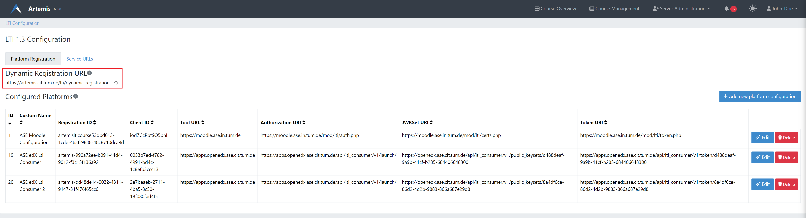
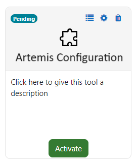
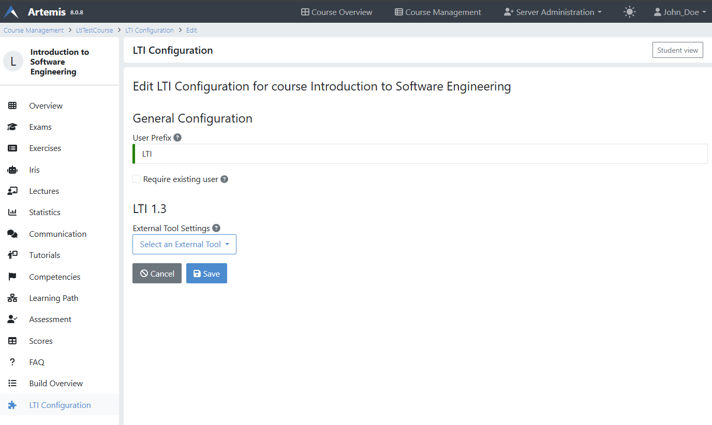
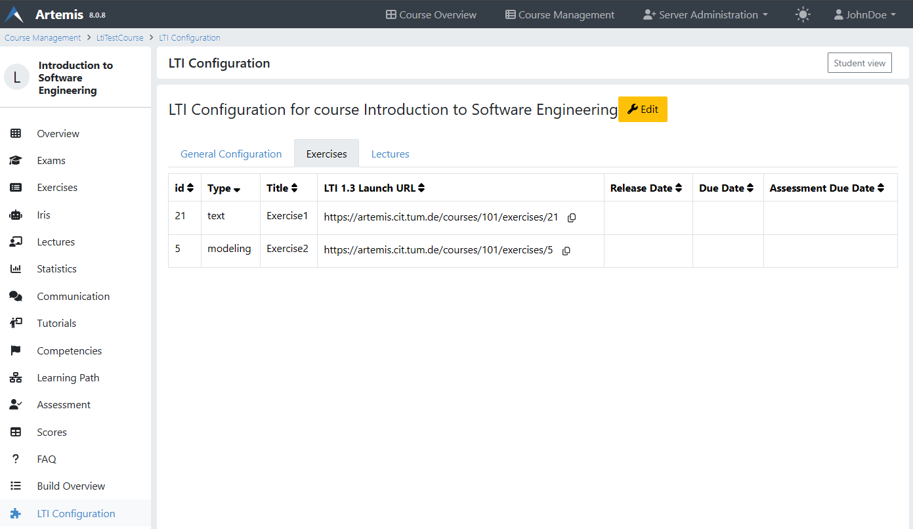
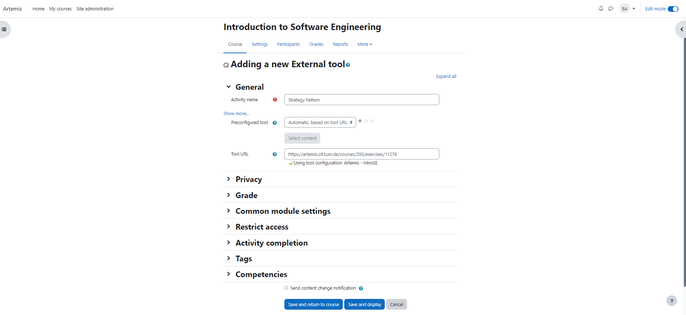
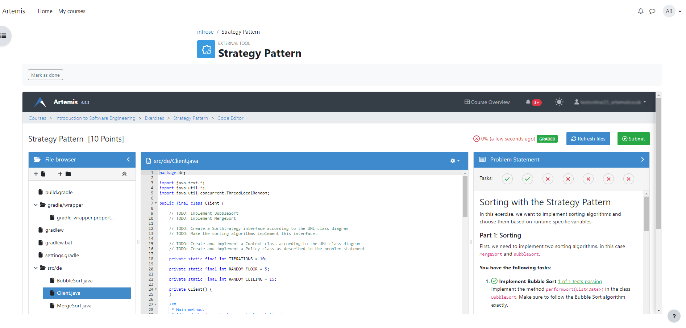
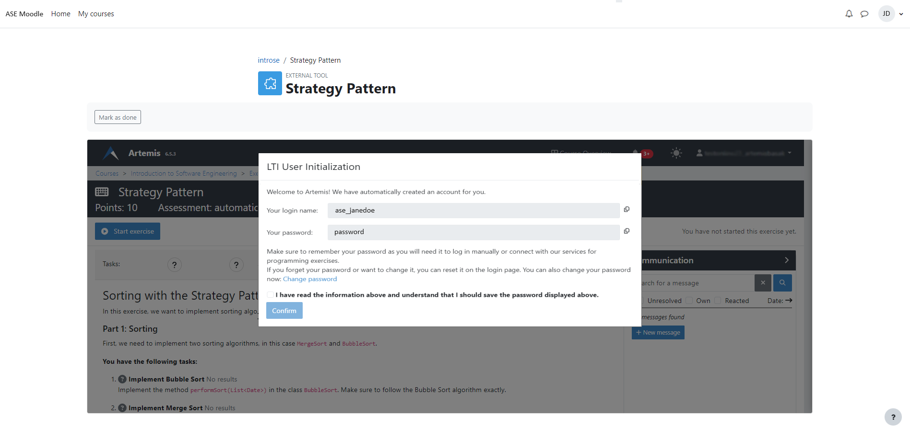

.. _lti:

LTI and Artemis
=====================================

.. contents:: Content of this document
    :local:
    :depth: 2

Overview
--------

LTI (Learning Tools Interoperability) is a standard developed by `1EdTech <https://www.1edtech.org/>`_ that allows different learning platforms and tools to work together seamlessly.
It establishes a standard way of integrating learning applications, called tools (delivered by tool providers i.e. Artemis) with platforms such as learning management systems (i.e. Moodle, edX), called tool consumers. Artemis supports `LTI 1.3. <https://www.imsglobal.org/spec/lti/v1p3>`_
The table below showcases the types of exercises supported by Artemis and their respective functionalities with respective learning management systems.
For each exercise, students can start, check their results, and get feedback on their work. Assessment results provide a quantitative measure of a student's performance on the exercise, represented as a grade or score. Assessment Feedback offers qualitative insights through comments and suggestions.

.. list-table:: Supported Exercise Interactions in Moodle
   :widths: 25 15 15 15
   :header-rows: 1

   * - Exercise Type
     - Start Exercise
     - View Assessment Result
     - View Assessment Feedback
   * - Programming exercise
     - ✔
     - ✔
     - ✔
   * - Quiz exercise
     - ✔
     - ✔
     - ✔
   * - Modeling exercise
     - ✔
     - ✔
     - ✔
   * - Text exercise
     - ✔
     - ✔
     - ✔
   * - File Upload exercise
     - ✔
     - ✔
     - ✔

.. list-table:: Supported Exercise Interactions in edX
   :widths: 25 15 15 15
   :header-rows: 1

   * - Exercise Type
     - Start Exercise
     - View Assessment Result
     - View Assessment Feedback
   * - Programming exercise
     - ✔
     - ✔
     - ✖
   * - Quiz exercise
     - ✔
     - ✔
     - ✖
   * - Modeling exercise
     - ✔
     - ✔
     - ✖
   * - Text exercise
     - ✔
     - ✔
     - ✖
   * - File Upload exercise
     - ✔
     - ✔
     - ✖

Prerequisite for Server Admins
-------------------------------
Before instructors integrate Artemis or students access and start Artemis exercises through Moodle or any other LMS via LTI, server administrators must ensure that LTI is active with the necessary profile on the server. If you are a server admin, please configure this setting to allow instructors and students to utilize the LTI integration.

Enabling Online Course
---------------------------

.. note::
    Who can do this step? Artemis Instructor

//TODO: add some beginner friendly notes for instructors where can they create course etc.

Before diving into the LTI configuration, it is crucial to ensure that the Online Course setting is enables in Artemis. This setting activates the LTI configurability, allowing instructors to link Artemis content with the LMS platforms.
As an instructor to enable the Online Course setting in Artemis, follow the steps below:\

#. Access Course Management: Start by logging into your Artemis account. Locate and click on the |course-management| option.
#. Select the Desired Course: From the list of available courses, navigate to the course you wish to configure for LTI integration.
#. Edit Course Settings: On the course overview page, you will find an |course_edit| button at the top right corner. Clicking this will allow you to modify various course settings.
#. Locate the Online Course Checkbox: As you scroll through the course settings, you will find an Online Course checkbox. This particular setting is essential for enabling LTI configurability.
#. Activate LTI Configuration: To finalize the process, check the Online Course checkbox. By doing so, you are activating the LTI configuration settings for that specific course. Make sure to save any changes made.

.. figure:: lti/enable_onlinecourse.png
    :align: center
    :width: 700
    :alt: Enable Online Course

With the Online Course setting enabled, you can now integrate Artemis with Moodle using the LTI 1.3 standard. The subsequent sections of this guide will provide detailed steps for achieving this integration.

Register Artemis with the platform
----------------------------------

.. note::
    Who can do this step?
    Artemis Administrator, Platform Administrator

LTI 1.3 and LTI Advantage services use OAuth 2.0 and OpenID Connect as their security model.  This means that the Tool and the Platform need to register with each other ahead of time so that the Platform can access Artemis course content.
Based on the platform side implementation, registration may only need to happen once, when the tool and platform are linked. Registration is basically a security agreement between the two systems.

There are a few different ways to register:

#. Dynamic registration: The exchange of relevant URLs and IDs is automatic. The platform initiates this process using the tool's registration URL.
#. Manual registration: A platform administrator must manually exchange URLs and IDs with the tool.

Dynamic registration makes it a lot easier for administrators to set up, so administrators should use it whenever possible, as long as the platform supports it.
It is best to use manual registration when the platform doesn't yet support dynamic registration because it will work on all LTI Advantage-compliant platforms.

//TODO:
screen cast where I explain server lti configuration
- 2 tabs dynamic registration URL
- service urls tab each link meaning
- And the bottom table new configurations will be there.

Dynamic Registration
^^^^^^^^^^^^^^^^^^^^
If the soon to be configured platform supports dynamic registration service, the only URL we need to provide to platform is the Dynamic Registration URL.
To retrieve the Dynamic Registration URL from Artemis, follow the steps outlined below:

#. As an administrator user, go to "Server administration > LTI Configuration"
#. Once inside the LTI 1.3 Configuration of the server, you will be seeing to Platform Registration tab.
#. Within the Platform Registration tab, you will find an option labeled Dynamic Registration URL. Copy this URL and provide it to your platform admin for further configuration.

The exact steps of using a registration URL to register Artemis as a tool is platform-dependent. We provide steps to configure Artemis into Moodle via Dynamic Registration URL in `Dynamically Register Artemis to Moodle`_.

Dynamically Register Artemis to Moodle
""""""""""""""""""""""""""""""""""""""

With the Dynamic Registration URL provided by the Artemis administrator, Moodle Admins can configure the LTI 1.3 integration in Moodle:

#. As an admin user, go to "Site administration > Plugins > Activity modules > External tool > Manage tools". This selection will lead you to the LTI configurations in Moodle.

    .. figure:: lti/moodle_site_administration.png
        :align: center
        :width: 700
        :alt: Moodle - Site Administration

#. In the Manage Tools section, you will find the Tool URL field. Paste the Dynamic Registration URL provided into this field.
#. After entering the URL, click the "Add LTI Advantage" button. This action will begin integrating Artemis with Moodle using the LTI 1.3 standard.

    .. figure:: lti/moodle_add_tool_url.png
        :align: center
        :width: 700
        :alt: Moodle - Site Administration

#. If prompted, choose "Register as a new external tool". The platform will only prompt you if another Artemis tool from the same domain is already configured.
#. After the page reloads and the tool card will be visible. To finalize the integration, click the "Activate" button. This action will complete the LTI 1.3 integration between Artemis and Moodle.

Manual Registration
^^^^^^^^^^^^^^^^^^^

Manually registering an Artemis as a tool on platforms consists of three distinct stages. The first step involves transferring data into the platform from the Artemis. This is a necessary step in the tool's platform configuration.
As second step, copy and paste the configuration information from the platform into the Artemis tool site. After properly saving platform into Artemis, as per the last step, copy and append generated Artemis Registration ID into Initiate Login URL on the platform.

Starting in the Artemis:

#. As an administrator user, go to "Server administration > LTI Configuration"
#. Once inside the LTI 1.3 Configuration of the server, navigate to "Service URLs" tab.
#. Within the Service URLs tab, you will all relevant URLs to a successful configuration. Copy each of the URLs and provide it to your platform admin for further configuration.

The exact setups steps for manually configuring is dependent to platform. This guide provides steps for manually configuring Artemis into Moodle in `Manually Register Artemis to Moodle`_ section and to edX in section `Manually Register Artemis to edX`_.

Manually Register Artemis to Moodle
"""""""""""""""""""""""""""""""""""

Please follow the below steps for manual configuration:

#. As an admin user, navigate to "Site administration > Plugins > Activity modules > External tool > Manage tools".
#. Click "Configure a tool manually" button.
#. Change the field "LTI version" to "LTI 1.3" for the right version.
#. Change "Public key type" to "Keyset URL".
#. Enable "Supports Deep Linking (Content-Item Message)" checkbox for providing Deep Linking URL.
#. Copy the following URLs that are provided from Artemis into the respective form fields on the platform site:
#. Copy "Tool URL" from Artemis into the "Tool URL" field in Moodle.
#. Copy "Redirect URL" into "Redirection URI(s)" field.
#. Copy "Initiate login URL" into the "Initiate login URL" field. After manually saving Moodle into Artemis, admin must append the Artemis Registration ID to the end of the URL.
#. Copy "Keyset URL" into the "Public keyset" field.
#. Copy "Deep linking URL" into the "Content selection URL" field.
#. Set a tool name and save the configuration.
#. On the resulting tool card, click "View configuration details" and provide these details to your Artemis administrator.

Now we are back on the Artemis again. Please follow below steps to manually configure Moodle into Artemis:

#. As an admin user, navigate to "Server Administration > LTI Configuration".
#. Click "Add new platform configuration" button.
#. Copy the following URLs that are provided from Moodle into the respective form fields on the Artemis:
#. Copy "Platform ID" from Moodle into the "Tool URL" field in Artemis.
#. Copy "Client ID" into "Client ID" field.
#. Copy "Access Token URL" into the "Token URI" field.
#. Copy "Public Keyset URL" into the "JWKSet URI" field.
#. Copy "Authentication request URL" into the "Authorization URI" field.
#. Set a platform name and save the configuration.
#. Then you will be directed to the configured platforms list and you will see new configuration details at the end of the list.
#. Get Registration ID information from this table for respective newly configured platform and provide it to your Moodle admin.

.. figure:: lti/artemis_moodle_field_mapping.png
    :align: center
    :width: 700
    :alt: Artemis and Moodle Fields Mapping

The registration process is now complete.

Manually Register Artemis to edX
""""""""""""""""""""""""""""""""
EdX course admins must enable LTI tool in Studio, before an instructor can add LTI components to their course. To enable the LTI tool in Studio, add "lti_consumer" to the Advanced Module List on the Advanced Settings page.
For more information please see official `edX documentation <https://edx.readthedocs.io/projects/edx-partner-course-staff/en/latest/exercises_tools/lti_component.html>`_.

Please follow the below steps to add LTI 1.3 component to edX course unit and configure Artemis:

#. As an instructor of the course, edit the course unit in where you want to add Artemis and select "Advanced" from the "Add New Component" section. Select "LTI Consumer".
#. Navigate "Edit" on the LTI consumer component that appeared.
#. In the "LTI Version" field, select "LTI 1.3".
#. Copy the following URLs that are provided from Artemis into the respective form fields on the platform site:
#. Copy "Redirect URI" into "Registered Redirect URIs" field in edX component.
#. Copy "Initiate Login URL" into "Tool Initiate Login URL" field. After manually saving edX component into Artemis, admin must append the Artemis Registration ID to the end of the URL.
#. Select "Tool Public Key Mode" as "Keyset URL".
#. Copy "Keyset URL" into the "Tool Keyset URL" field.
#. Select Deep linking as True.
#. Copy "Deep linking URL" into the "Deep Linking Launch URL" field.
#. Select "LTI Launch Target" as "Modal".
#. Set a "Button Text" (i.e. Launch Exercise).
#. Select "Scored" field as True and define "Weight" field as 100.
#. Select True for "Request user's username", "Request user's full name", "Request user's email" and "Send extra parameters" fields.
#. Save the component.
#. On the resulting component, you will find configuration details and provide these details to your Artemis administrator.

.. note::
 Each LTI Consumer component in edX acts as an independent LTI consumer, so it means each LTI consumer needs to be defined to Artemis manually.

Now we are back on the Artemis again. Please follow below steps to manually configure edX component into Artemis:

#. As an admin user, navigate to "Server Administration > LTI Configuration".
#. Click "Add new platform configuration" button.
#. Copy the following URLs that are provided from edX into the respective form fields on the Artemis:
#. Copy "Access Token URL" from edX component into the "Tool URL" field in Artemis.
#. Copy "Client ID" into "Client ID" field.
#. Copy "Access Token URL" into the "Token URI" field.
#. Copy "Keyset URL" into the "JWKSet URI" field.
#. Copy "Access Token URL" into the "Authorization URI" field.
#. Set a platform name and save the configuration.
#. Then you will be directed to the configured platforms list and you will see new configuration details at the end of the list.
#. Get Registration ID information from this table for respective newly configured platform and provide it to your edX course instructor.

Sharing access to a course
--------------------------
To unlock the full potential of the LTI configuration and enable the Deep Linking Service for your online course, Artemis administrators must carefully choose an LTI platform and apply the following steps.

#. As admin user, head to the "Course Management" section and select your targeted online course to configure.
#. Within the course management area, locate and click on the "LTI Configuration tab".
#. Find and click the "Edit" button. This action will allow you to modify the LTI configuration settings for your course.
#. In the "External Tool Settings" section, drop down the list to select the appropriate LTI platform configuration for your course.
#. After selecting the desired configuration, make sure to hit Save to apply your changes.

User account provisioning
^^^^^^^^^^^^^^^^^^^^^^^^^

Instructors have the option to specify whether new user accounts should be automatically created for students who do not already have an Artemis account when they first participate in an exercise via an external platform.
By default, Artemis is configured to generate a new account for students the first time they engage with an Artemis exercise through an external LMS.

However, if instructors prefer to restrict exercise participation to only those students who already have an existing Artemis account, they can adjust the settings by following the steps outlined below:

#. As instructor, head to the "Course Management" section and select your targeted online course to configure.
#. Within the course management area, locate and click on the "LTI Configuration tab".
#. Find and click the "Edit" button. This action will allow you to modify the LTI configuration settings for your course.
#. In the "General Configuration" section, enable "Require existing user" checkbox.
#. Hit Save to apply your changes.

On the LTI platform site
------------------------

Artemis supports various methods for integrating LTI platforms, enhancing the platform's versatility in connecting with external learning resources. A preferred method for setting up exercise links in Artemis is through Deep Linking (also known as Content Selection).
This approach streamlines the integration process, allowing for a seamless connection between Artemis and external platforms. For situations where Deep Linking is not enabled, manual configuration of exercise links within externals platforms is also possible.
Below, both methods are explained to assist instructors in choosing the best approach for their needs.

Link creation via Deep Linking
^^^^^^^^^^^^^^^^^^^^^^^^^^^^^^
.. note::
 The following describes the recommended process for instructors and assumes the tool-platform registration process has already been completed.

Deep Linking for Moodle
"""""""""""""""""""""""

Deep Linking for edX
"""""""""""""""""""""

Manual Link Creation
^^^^^^^^^^^^^^^^^^^^

.. warning::
    Prerequisite: Moodle Admin should complete the LTI configuration between Artemis and Moodle. Please ensure that as an instructor or as a Moodle admin, you follow the provided steps correctly.

Once the LTI configuration works between Artemis and Moodle, instructors can link specific Artemis exercises directly to their Moodle courses. This integration provides students access to Artemis exercises from their Moodle courses. The process involves two primary steps:
#. Retrieving the LTI 1.3 Launch URL for the desired Artemis exercise.
#. Linking this URL to the Moodle course.
By following the detailed steps below, instructors can integrate individual Artemis exercises into their Moodle courses, enhancing the learning experience for students.

Retrieve LTI 1.3 Launch URL from Artemis
"""""""""""""""""""""""""""""""""""""""""""""

#. Access Course Management: Select the |course-management| to view all your courses.
#. Choose the Desired Course: From the list of available courses, select the one online course containing the exercise you would like to link to Moodle.
#. Navigate to Course Details: Once inside the course settings, scroll down to the Course Details section.
#. Access LTI Configuration: Within the Course Details section, you will find a link labeled LTI Configuration. Click on this to access the LTI settings specific to the course.
#. Switch to the Exercises Tab: Inside the LTI Configuration, locate and click on the Exercises tab. This tab lists all the exercises available for the course.
#. Retrieve the LTI 1.3 Launch URL: For each exercise listed, there is an associated LTI 1.3 Launch URL. This URL is crucial for linking the exercise to Moodle. Find the exercise you wish to link and copy its LTI 1.3 Launch URL.

Link exercise to Moodle
"""""""""""""""""""""""

With the LTI 1.3 Launch URL copied, you can now link the exercise in Moodle:

#. Access the Desired Course: Log into your Moodle account and navigate to the course where you want to link the Artemis exercise.
#. Enable Edit Mode: Once inside the course, turn on the Edit Mode. This mode allows you to make changes and add resources to the course.

    .. figure:: lti/moodle_editmode.png
        :align: center
        :width: 700
        :alt: Moodle - Edit Course

#. Add an External Tool: Click on the Add an activity or resource button, which includes a list of available activities and resources. From this list, select the External tool option.

    .. figure:: lti/moodle_add_external_tool.png
        :align: center
        :width: 700
        :alt: Moodle - Add External Tool

#. Enter the LTI 1.3 Launch URL: In the settings for the external tool, you will find a field labeled Resource URL. Paste the previously copied LTI 1.3 Launch URL from Artemis into this field.
#. Save and Finalize: After entering the URL, click the Save and Return to course button to finalize the addition. The linked Artemis exercise should now be accessible directly from the Moodle course.

Link exercise to edX
""""""""""""""""""""

Common Issues
-------------

LTI 1.3 Student Guide
---------------------------
For students, integrating Artemis with Moodle via LTI 1.3 offers a streamlined experience to access and participate in Artemis exercises directly from the Moodle platform. The key steps involved are:

#. Starting an Artemis Exercise: Students can easily access Moodle courses and find the linked Artemis exercises. Clicking on these links will open the Artemis exercise page right within Moodle, providing a smooth transition.
#. First-Time Users: If you are accessing an Artemis exercise for the first time, you will receive a unique password. It is essential to note this password as it will be required for future Artemis sessions.
#. Viewing Grades and Feedback: Beyond participating, students can also view their grades and feedback for any evaluated Artemis exercises, all within the Moodle environment. This ensures students have a one-stop platform to engage with exercises and track their performance.

By following this guide, students can make the most of the integrated learning experience offered by Artemis and Moodle.

1. Start Artemis Exercise through Moodle
^^^^^^^^^^^^^^^^^^^^^^^^^^^^^^^^^^^^^^^^

Here is a step-by-step guide on how students can start an Artemis exercise through Moodle:

How to Start an Exercise
""""""""""""""""""""""""

#. Access the Moodle Course: Log into your Moodle account and navigate the specific course containing the linked Artemis exercise.
#. Select the Artemis Exercise: Within the course content, locate and click on the external Artemis exercise you wish to participate in.
#. Launch Artemis from Moodle: Upon selecting the exercise, the Artemis exercise page will open in a frame within Moodle, ensuring a seamless transition between the two platforms.
#. Participate in Artemis Exercise: Students can now participate in the Artemis exercise, submit their responses, and receive real-time feedback.

2. First Time Users
^^^^^^^^^^^^^^^^^^^
If a student is participating in an Artemis exercise for the first time, a pop-up will appear. The pop-up will display a uniquely generated password for the student. Artemis will require this password in future sign-ins. It is crucial to copy this password and store it in a safe and accessible location.

3. Viewing Grades and Feedback
^^^^^^^^^^^^^^^^^^^^^^^^^^^^^^
In addition to participating in exercises, students can view their grades and feedback for evaluated Artemis exercises directly within Moodle.
This integration ensures students have a centralized location to track their performance and receive constructive feedback.

.. |course-management| image:: exercises/general/course-management.png

