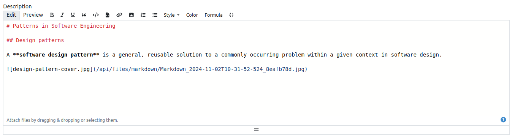
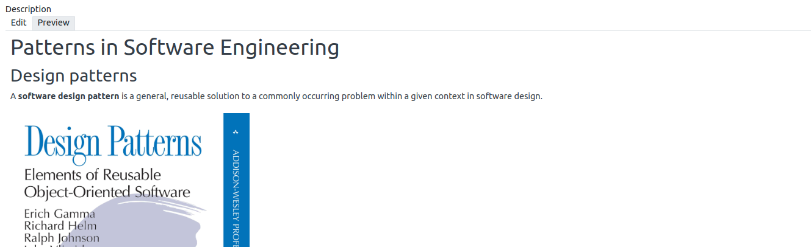
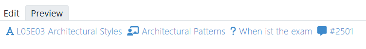

.. _markdown:

Markdown Support
================

.. contents:: Content of this document
    :local:
    :depth: 2

`Markdown <https://daringfireball.net/projects/markdown/>`__ is an easy-to-read, easy-to-write syntax for formatting plain text.

Artemis extends the basic `Markdown <https://daringfireball.net/projects/markdown/>`__ syntax to support Artemis-specific features. This Artemis flavored Markdown is used to format text content across the platform using an integrated markdown editor.

Supported Syntax
^^^^^^^^^^^^^^^^^^^^^^^^^^

The integrated markdown editor uses `Showdown <https://github.com/showdownjs/showdown>`__. A quick description of the supported syntax can be found `here <https://github.com/showdownjs/showdown/wiki/Showdown's-Markdown-syntax>`__. 

The following Showdown extensions are activated:

- `Showdown Katex <https://obedm503.github.io/showdown-katex>`__ to render LaTeX math and AsciiMath using KaTeX.
- `Showdown Highlight <https://github.com/Bloggify/showdown-highlight>`__ for syntax highlighting in code blocks.

Integrated Markdown Editor
^^^^^^^^^^^^^^^^^^^^^^^^^^

The markdown editor contains a formatting toolbar at the top, allowing users to format text without learning Markdown syntax. 

In addition, images can be uploaded and included by either dragging and dropping them into the editor field or by clicking at the footer of the editor, which brings up the file selection dialog.

|markdown-lecture-example|

The user can switch to a preview of the formatted content by clicking on the Preview button.

|markdown-lecture-preview|

Markdown Extensions For Communication
^^^^^^^^^^^^^^^^^^^^^^^^^^^^^^^^^^^^^

Markdown is also supported in the context of :ref:`communicating<communication>` with other users. Here, the Markdown syntax is extended to allow users to reference other posts, lectures or exercises.

|markdown-post-extensions|

|markdown-post-preview|

.. |markdown-post-extensions| image:: markdown-support/markdown-post-extensions.png
    :width: 500

