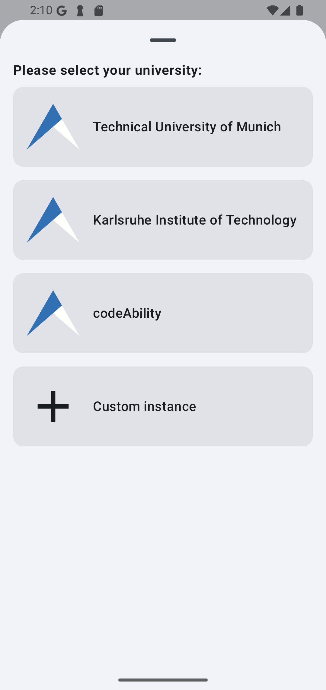
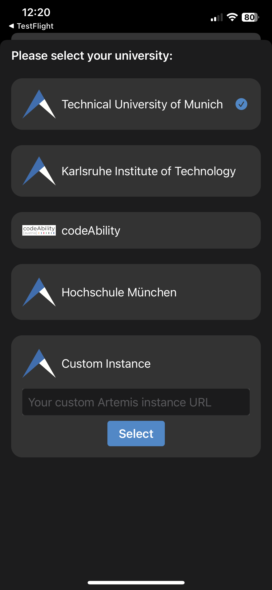

.. _native_applications:

Mobile Applications
===================

.. contents:: Content of this document
    :local:
    :depth: 2

Overview
--------

Artemis supports native mobile applications available for both `Android <https://github.com/ls1intum/artemis-android>`_ and `iOS <https://github.com/ls1intum/artemis-ios>`_. We designed them to be applicable in lecture usage. Users can, for example, participate in quizzes and write questions. Furthermore, they can communicate with each other.

Both apps use native user interface components and are adapted to their associated operating system. Therefore, they can differ in their usage.

The mobile applications have been designed to be compatible with all Artemis instances. Therefore, users of all Artemis instances can use the mobile application provided by us. Nevertheless, it is possible to fork our repositories and release your own versions of the mobile applications.

Below, we only explain the functionalities of the mobile applications that differ or are not present in the web application. For all other features, which are supported by both the mobile applications and the web application, please refer to their associated documentation.

Android Application
-------------------

The Android application supports the following features:

#. Login and register:
    #. Select predefined and custom Artemis servers
    #. New user registration
    #. Login with password + Saml2
#. View your courses:
    #. Register in new courses
    #. View courses you have already registered for
#. View the exercises of your courses:
    #. View exercise details and problem statement
    #. View submission feedback
    #. Participate in text exercises (view, edit and submit submissions)
#. Participate in quizzes:
    #. Participate in live quizzes
    #. Practice quizzes
    #. View quiz results
#. Communicate with course members:
    #. Create new messages
    #. Write replies
    #. Add emoji reactions
#. Receive push notifications:
    #. Optionally opt in and out of push notifications
    #. Choose which notifications you want to receive as push notifications

Installation
^^^^^^^^^^^^

The Android application is currently only available in beta state and can be downloaded over `Firebase App Distribution <https://appdistribution.firebase.dev/i/f5dedbb0fc6dc0da>`_. Make sure to follow the steps described by Firebase App Distribution to install the application.

Server Selection
^^^^^^^^^^^^^^^^

After installation, users have to first decide which Artemis server they want to connect to. Per default, the user can choose between the following instances:

* TUM: https://artemis.cit.tum.de
* CodeAbility: https://artemis.codeability.uibk.ac.at
* KIT: https://artemis.praktomat.cs.kit.edu

Furthermore, users have the option to select a custom instance. To do this, scroll down the list of servers to the bottom. Then, select "custom instance":

|server-selection-overview-android|

Then, enter the URL of the server as you would enter it into the browser:

|custom-server-entered-android|

The "Set custom instance" button will be enabled if the client could connect successfully to Artemis.

Push Notifications
^^^^^^^^^^^^^^^^^^
Users may receive push notifications on their Android clients. When first logging in to an Artemis instance, users will be asked if they want to receive push notifications on that device.

  .. image:: native-applications/android/initial_login_notification_configuration.png
            :width: 300

When logged in, users can navigate to the application settings to change their push notification settings:

  .. image:: native-applications/android/settings_push.png
            :width: 300

In this screen, users can enable/disable push notifications for this device and also choose which notification types they want to receive.

  .. image:: native-applications/android/settings_push_detail.png
            :width: 300

Problems
^^^^^^^^

Please report any issues on the `GitHub repository <https://github.com/ls1intum/artemis-android/issues>`__.

iOS Application
---------------

The iOS application supports the following features:

#. Login:
    #. Select predefined and custom Artemis servers
    #. Login with username + password

.. raw:: html

    <iframe src="https://live.rbg.tum.de/w/artemisintro/35200?video_only=1&t=0" allowfullscreen="1" frameborder="0" width="600" height="350">
        Video tutorial of the Login on TUM-Live.
    </iframe>

#. View your courses:
    #. Register in new courses
    #. View courses you have already registered for

#. View the exercises of your courses:
    #. View exercise details and problem statement
    #. View submission feedback

.. raw:: html

    <iframe src="https://live.rbg.tum.de/w/artemisintro/35217?video_only=1&t=0" allowfullscreen="1" frameborder="0" width="600" height="350">
        Video tutorial of the Exercise features on TUM-Live.
    </iframe>

#. View the lectures of your courses:
    #. View lecture details and learning units
    #. View and open attachments

.. raw:: html

    <iframe src="https://live.rbg.tum.de/w/artemisintro/35218?video_only=1&t=0" allowfullscreen="1" frameborder="0" width="600" height="350">
        Video tutorial of the Lecture features on TUM-Live.
    </iframe>

#. Communicate via Messages:
    #. Create new messages
    #. Write replies
    #. Add emoji reactions
    #. Create new conversations
    #. Edit conversation settings

.. raw:: html

    <iframe src="https://live.rbg.tum.de/w/artemisintro/35219?video_only=1&t=0" allowfullscreen="1" frameborder="0" width="600" height="350">
        Video tutorial of the Messaging features on TUM-Live.
    </iframe>

#. Receive push notifications:
    #. Optionally opt in and out of push notifications
    #. Choose which notifications you want to receive as push notifications
    #. In-App notification center

.. raw:: html

    <iframe src="https://live.rbg.tum.de/w/artemisintro/35216?video_only=1&t=0" allowfullscreen="1" frameborder="0" width="600" height="350">
        Video tutorial of the Push Notification features on TUM-Live.
    </iframe>

Installation
^^^^^^^^^^^^

The iOS application is available in the `App Store <https://apps.apple.com/de/app/artemis-learning/id6478965616>`_ and as a beta via `TestFlight <https://testflight.apple.com/join/WTwsKbjr>`_.
Make sure to follow the steps described by TestFlight to install the application.

Server Selection
^^^^^^^^^^^^^^^^

After installation, users have to first decide which Artemis server they want to connect to. Per default, the user can choose between the following instances:

* TUM: https://artemis.cit.tum.de
* CodeAbility: https://artemis.codeability.uibk.ac.at
* KIT: https://artemis.praktomat.cs.kit.edu
* Hochschule Munich: https://artemis.cs.hm.edu/

Furthermore, users have the option to select a custom instance. To do this, scroll down the list of servers to the bottom. Under "Custom Instance" enter the URL of the server as you would enter it into the browser:

|custom-server-entered-ios|

By pressing the "Select" button the app checks if it can connect successfully to the given Artemis instance.

Push Notifications
^^^^^^^^^^^^^^^^^^

Users may receive push notifications on their iOS devices. When first logging in to an Artemis instance, users will be asked if they want to receive push notifications on that device.

  .. image:: native-applications/iOS/initial_login_notification_configuration.png
            :width: 300

When logged in, users can navigate to the notification settings:

  .. image:: native-applications/iOS/settings_push.png
            :width: 300

In this screen, users can choose which notification types they want to receive.

  .. image:: native-applications/iOS/settings_push_detail.png
            :width: 300

Modeling Exercises
^^^^^^^^^^^^^^^^^^

Users can participate in modeling exercises, view their submissions, and view the feedback they received in the Artemis iOS app.

Participate in Modeling Exercise
""""""""""""""""""""""""""""""""

- Add UML elements to the canvas
- Edit attributes and methods of UML elements
- Draw UML relationships between UML elements
- Edit UML relationship properties
- Submit the diagram

.. raw:: html

    <iframe src="https://live.rbg.tum.de/w/artemisintro/43388?video_only=1&t=0" allowfullscreen="1" frameborder="0" width="600" height="350">
        Video tutorial for participating in a modeling exercise on TUM-Live.
    </iframe>

View Modeling Exercise Submission
"""""""""""""""""""""""""""""""""

- Interact with the submitted diagram (e.g., zooming in/out, moving the diagram for better viewing)
- No modification to the submitted diagram is possible

.. raw:: html

    <iframe src="https://live.rbg.tum.de/w/artemisintro/43389?video_only=1&t=0" allowfullscreen="1" frameborder="0" width="600" height="350">
        Video tutorial for viewing a modeling exercise submission on TUM-Live.
    </iframe>

View Modeling Exercise Result
"""""""""""""""""""""""""""""

- Click on UML elements and UML relationships to view feedback and grading
- See all feedback and grading in a list view

.. raw:: html

    <iframe src="https://live.rbg.tum.de/w/artemisintro/43390?video_only=1&t=0" allowfullscreen="1" frameborder="0" width="600" height="350">
        Video tutorial for viewing modeling exercise results on TUM-Live.
    </iframe>

Problems
^^^^^^^^

Please report any issues on the `GitHub repository <https://github.com/ls1intum/artemis-ios/issues>`__.

.. |custom-server-entered-android| image:: native-applications/android/custom_server_entered.png
    :width: 300

