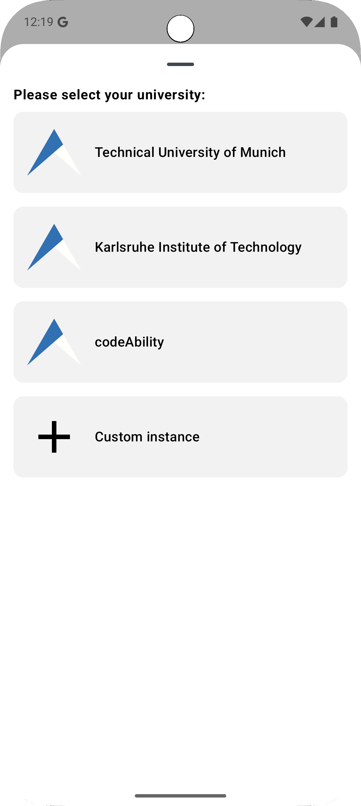
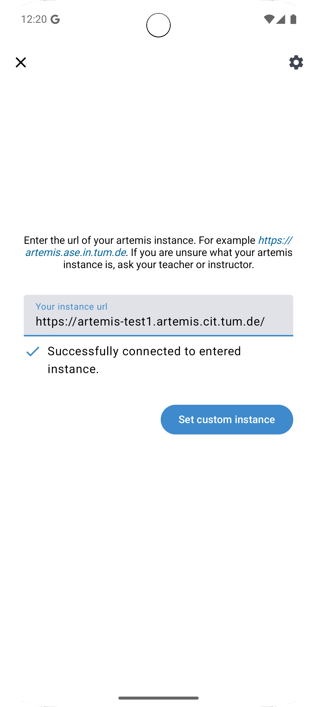

.. _native_applications:

Native Applications
===================

.. contents:: Content of this document
    :local:
    :depth: 2

Overview
--------

Artemis supports native mobile applications available for both `Android <https://github.com/ls1intum/artemis-android>`_ and `iOS <https://github.com/ls1intum/artemis-ios>`_. We designed them to be applicable in lecture usage. Users can, for example, participate in quizzes and write questions. Furthermore, they can communicate with each other. Both use native user interface components and are adapted to their associated operating system. Therefore, they can differ in their usage.

The mobile applications have been designed to be compatible with all Artemis instances. Therefore, users of all Artemis instances can use the mobile application provided by us. Nevertheless, it is possible to fork our repositories and to release your own versions of the native applications.

Below, we only explain the functionalities of the native applications that differ or are not present in the web application. For all other features, which are supported by both the native applications and the web application, please refer to their associated documentation.

Android Application
-------------------

The Android application supports the following features:

#. Login and register:
    #. Select predefined and custom Artemis servers
    #. New user registration
    #. Login with password + Saml2
#. View your courses:
    #. Register in new courses
    #. View courses you have already registered for
#. View the exercises of your courses:
    #. View exercise details and problem state
    #. View submission feedback
    #. Participate in text exercises (view, edit and submit submissions)
#. Participate in quizzes:
    #. Participate in live quizzes
    #. Practice quizzes
    #. View quiz results
#. Communicate in Q&A forum:
    #. Create new posts
    #. Write replies
    #. Add emoji reactions
#. Receive push notifications:
    #. Optionally opt in and out of push notifications
    #. Choose which notifications you want to receive as push notifications

Installation
^^^^^^^^^^^^

The Android application is currently only available in beta state and can be downloaded over `Firebase App Distribution <https://appdistribution.firebase.dev/i/f5dedbb0fc6dc0da>`_. Make sure to follow the steps described by Firebase App Distribution to install the application.

Server Selection
^^^^^^^^^^^^^^^^

After installation, users have to first decide which Artemis server they want to connect to. Per default, the user can choose between the following instances:

* TUM: https://artemis.cit.tum.de
* Codeablity: https://artemis.codeability.uibk.ac.at
* KIT: https://artemis.praktomat.cs.kit.edu

Furthermore, users have the option to select a custom instance. To do this, scroll down the list of servers to the bottom. Then, select "custom instance":

|server-selection-overview|

Then, enter the url of the server as you would enter it into the browser:

|custom-server-entered|

If the client could connect successfully to Artemis, the "Set custom instance" button will be enabled.

Push Notifications
^^^^^^^^^^^^^^^^^^
Users may receive push notifications on their Android clients. When first logging in into an Artemis instance, users will be asked if they want to receive push notifications on that device.

  .. image:: native-applications/android/initial_login_notification_configuration.png
            :width: 400

When logged in, users can navigate to the application settings to change their push notification settings:

  .. image:: native-applications/android/settings_push.png
            :width: 400

In this screen, users can choose which notification types to receive as push notifications, and can enable/disable push notifications for this device.

  .. image:: native-applications/android/settings_push_detail.png
            :width: 400

Problems
^^^^^^^^

Please report any issues on the `GitHub repository <https://github.com/ls1intum/artemis-android>`_.

iOS Application
---------------

Coming soon.
