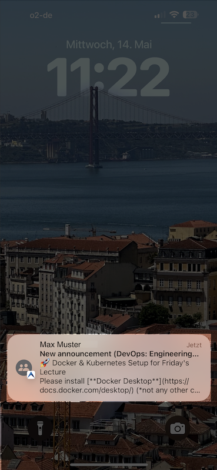

.. _notifications:

Notifications
=============

.. contents:: Content of this document
    :local:
    :depth: 2

Artemis supports customizable web and email notifications. Users can enable and disable different notification types.

Web Notifications
^^^^^^^^^^^^^^^^^

The web notifications can be found on the top right of the page by clicking on the bell icon.
A red indicator shows the number of new messages.

|notification-top-bar|

|notification-side-bar|

Notifications About Incoming Messages and Replies
^^^^^^^^^^^^^^^^^^^^^^^^^^^^^^^^^^^^^^^^^^^^^^^^^

This video shows how web notifications works for incoming messages and replies:

.. raw:: html

    <iframe src="https://live.rbg.tum.de/w/artemisintro/40578?video_only=1&t=0" allowfullscreen="1" frameborder="0" width="600" height="350">
        Watch this video on TUM-Live.
    </iframe>

Email Notifications
^^^^^^^^^^^^^^^^^^^

Artemis can also send out emails for certain notification types.
Additionally, Artemis can send out a weekly summary at Friday 5pm.

|notification-email|

Push Notifications
^^^^^^^^^^^^^^^^^^

Artemis can also send out push notification to the Artemis native iOS and Android apps.
To support push notifications admins have to explicitly activate this in the artemis configuration.

This notifications are e2e encrypted and sent via the TUM hosted Hermes service ( https://hermes.artemis.cit.tum.de/ ).
Users explicitly have to opt-in via their mobile application to receive push notifications and can deactivate them at any time.

|notification-push|

Overview
^^^^^^^^

The following tables gives an overview of all supported notification types:

.. list-table:: Notification Types
   :widths: 20 10 10 10 150
   :header-rows: 1

   * - NotificationType
     - Push
     - Web
     - Email
     - PlaceholderValues

   * - **Course-Wide Discussion Notifications**
     -
     -
     -
     -

   * - NEW_COURSE_POST
     - X
     - X
     -
     - courseTitle(0), postTitle(1), postContent(2), postCreationDate(3), postAuthor(4)

   * - NEW_REPLY_FOR_COURSE_POST
     - X
     - X
     -
     - courseTitle(0), postTitle(1), postContent(2), postCreationDate(3), postAuthor(4), answerPostContent(5), answerPostCreationDate(6), answerPostAuthor(7)

   * - NEW_ANNOUNCEMENT_POST
     - X
     - X
     - X
     - courseTitle(0), postTitle(1), postContent(2), postCreationDate(3), postAuthor(4)

   * - **Exercise Notifications**
     -
     -
     -
     -

   * - EXERCISE_RELEASED
     - X
     - X
     - X
     - courseTitle(0), exerciseTitle(1)

   * - EXERCISE_PRACTICE
     - X
     - X
     - X
     - courseTitle(0), exerciseTitle(1)

   * - EXERCISE_SUBMISSION_ASSESSED
     - X
     - X
     - X
     - courseTitle(0), exerciseType(1), exerciseTitle(2)

   * - FILE_SUBMISSION_SUCCESSFUL
     - X
     - X
     - X
     - courseTitle(0), exerciseTitle(1)

   * - NEW_EXERCISE_POST
     - X
     - X
     -
     - courseTitle(0), postTitle(1), postContent(2), postCreationDate(3), postAuthor(4), exerciseTitle(5)

   * - NEW_REPLY_FOR_EXERCISE_POST
     - X
     - X
     -
     - courseTitle(0), postTitle(1), postContent(2), postCreationDate(3), postAuthor(4), answerPostContent(5), answerPostCreationDate(6), answerPostAuthor(7), exerciseTitle(8)

   * - **Lecture Notifications**
     -
     -
     -
     -

   * - ATTACHMENT_CHANGE
     - X
     - X
     - X
     - courseTitle(0), attachmentName(1), exerciseName/lectureName(2)

   * - NEW_LECTURE_POST
     - X
     - X
     -
     - courseTitle(0), postTitle(1), postContent(2), postCreationDate(3), postAuthor(4), lectureTitle(5)

   * - NEW_REPLY_FOR_LECTURE_POST
     - X
     - X
     -
     - courseTitle(0), postTitle(1), postContent(2), postCreationDate(3), postAuthor(4), answerPostContent(5), answerPostCreationDate(6), answerPostAuthor(7), lectureTitle(8)

   * - **New message/replies Notifications**
     -
     -
     -
     -

   * - CONVERSATION_NEW_MESSAGE
     - X
     - X
     -
     - newMessageChannel: courseTitle(0), messageContent(1), messageCreationDate(2), channelName(3), author(4); newMessageGroupChat: courseTitle(0), messageContent(1), messageCreationDate(2), author(3); newMessageDirect: courseTitle(0), messageContent(1), messageCreationDate(2), author(3)

   * - CONVERSATION_NEW_REPLY_MESSAGE
     - X
     - X
     -
     - courseTitle(0), messageContent(1), messageCreationDate(2), messageAuthor(3), answerMessageContent(4), answerMessageCreationDate(5), answerMessageAuthor(6)

   * - CONVERSATION_CREATE_GROUP_CHAT
     - X
     - X
     -
     - courseTitle(0), responsibleForActionName(1)

   * - CONVERSATION_ADD_USER_CHANNEL
     - X
     - X
     -
     - courseTitle(0), channelName(1), responsibleForActionName(2)

   * - CONVERSATION_ADD_USER_GROUP_CHAT
     -
     - X
     -
     - courseTitle(0), responsibleForActionName(1)

   * - CONVERSATION_REMOVE_USER_GROUP_CHAT
     -
     - X
     -
     - courseTitle(0), responsibleForActionName(1)

   * - CONVERSATION_REMOVE_USER_CHANNEL
     -
     - X
     -
     - courseTitle(0), channelName(1), responsibleForActionName(2)

   * - CONVERSATION_DELETE_CHANNEL
     -
     - X
     -
     - courseTitle(0), channelName(1), responsibleForActionName(2)

   * - **Tutorial Group Notifications**
     -
     -
     -
     -

   * - TUTORIAL_GROUP_REGISTRATION_STUDENT
     - X
     - X
     - X
     - courseTitle(0), tutorialGroupTitle(1), nameUserResponsibleForAction(2)

   * - TUTORIAL_GROUP_DEREGISTRATION_STUDENT
     - X
     - X
     - X
     - courseTitle(0), tutorialGroupTitle(1), nameUserResponsibleForAction(2)

   * - TUTORIAL_GROUP_DELETED
     - X
     - X
     - X
     - courseTitle(0), tutorialGroupTitle(1)

   * - TUTORIAL_GROUP_UPDATED
     - X
     - X
     - X
     - courseTitle(0), tutorialGroupTitle(1)

   * - **Tutor Notifications**
     -
     -
     -
     -

   * - TUTORIAL_GROUP_REGISTRATION_TUTOR
     - X
     - X
     - X
     - courseTitle(0), studentName(1), tutorialGroupTitle(2), nameUserResponsibleForAction(3)

   * - TUTORIAL_GROUP_MULTIPLE_REGISTRATION_TUTOR
     - X
     - X
     - X
     - courseTitle(0), numberOfStudents(1), tutorialGroupTitle(2), nameUserResponsibleForAction(3)

   * - TUTORIAL_GROUP_DEREGISTRATION_TUTOR
     - X
     - X
     - X
     - courseTitle(0), studentName(1), tutorialGroupTitle(2), nameUserResponsibleForAction(3)

   * - TUTORIAL_GROUP_ASSIGNED
     - X
     - X
     - X
     - courseTitle(0), tutorialGroupTitle(1), nameUserResponsibleForAction(2)

   * - TUTORIAL_GROUP_UNASSIGNED
     - X
     - X
     - X
     - courseTitle(0), tutorialGroupTitle(1), nameUserResponsibleForAction(2)

   * - **Editor Notifications**
     -
     -
     -
     -

   * - PROGRAMMING_TEST_CASES_CHANGED
     -
     - X
     -
     - courseTitle(0), exerciseTitle(1)

   * - **Instructor Notifications**
     -
     -
     -
     -

   * - COURSE_ARCHIVE_STARTED
     - X
     -
     -
     - courseTitle(0)

   * - COURSE_ARCHIVE_FINISHED_WITHOUT_ERRORS
     -
     - X
     -
     - courseTitle(0)

   * - COURSE_ARCHIVE_FINISHED_WITH_ERRORS
     -
     - X
     -
     - courseTitle(0), archiveErrors(1)

   * - COURSE_ARCHIVE_FAILED
     -
     - X
     -
     - courseTitle(0), archiveErrors(1)

   * - EXAM_ARCHIVE_STARTED
     -
     - X
     -
     - courseTitle(0), examTitle(1)

   * - EXAM_ARCHIVE_FINISHED_WITHOUT_ERRORS
     -
     - X
     -
     - courseTitle(0), examTitle(1)

   * - EXAM_ARCHIVE_FINISHED_WITH_ERRORS
     -
     - X
     -
     - courseTitle(0), examTitle(1), archiveErrors(2)

   * - EXAM_ARCHIVE_FAILED
     -
     - X
     -
     - courseTitle(0), examTitle(1), archiveErrors(2)

   * - **Unassigned Notifications**
     -
     -
     -
     -

   * - EXERCISE_UPDATED
     -
     - X
     -
     - courseTitle(0), exerciseTitle(1)

   * - QUIZ_EXERCISE_STARTED
     - X
     - X
     -
     - courseTitle(0), exerciseTitle(1)

   * - DUPLICATE_TEST_CASE
     - X
     - X
     - X
     - courseTitle(0)

   * - ILLEGAL_SUBMISSION
     -
     - X
     -
     - courseTitle(0), exerciseTitle(1)

   * - NEW_PLAGIARISM_CASE_STUDENT
     - X
     - X
     - X
     - courseTitle(0), exerciseTitle(1)

   * - NEW_CPC_PLAGIARISM_CASE_STUDENT
     - X
     - X
     - X
     - courseTitle(0), exerciseType(1) exerciseTitle(2)

   * - PLAGIARISM_CASE_VERDICT_STUDENT
     - X
     - X
     - X
     - courseTitle(0), exerciseType(1) exerciseTitle(2)

   * - PLAGIARISM_CASE_REPLY
     - X
     - X
     - X
     - courseTitle(0), exerciseType(1) exerciseTitle(2)

   * - NEW_MANUAL_FEEDBACK_REQUEST
     -
     - X
     -
     - courseTitle(0), exerciseTitle(1)

Settings
^^^^^^^^

The user can change their preference for different types of notifications and decide if they want to receive emails, web notifications, push notifications or no notification.
These settings can be found after opening the web notifications. The gear on the top left of the sidebar then leads to the settings.
The push notification settings can currently only be found in the respective application.

|notification-settings|
|notification-settings-mobile|

.. |notification-top-bar| image:: notifications/top-bar.png
    :width: 500
.. |notification-side-bar| image:: notifications/side-bar.png
    :width: 500
.. |notification-email| image:: notifications/email.png
    :width: 1000
.. |notification-settings| image:: notifications/settings.png
    :width: 1000
.. |notification-settings-mobile| image:: notifications/notification-settings-mobile.jpeg
    :width: 300

.. |supported-notification-types-overview-1| image:: notifications/supported-notification-types-overview-1.png
    :width: 1000
.. |supported-notification-types-overview-2| image:: notifications/supported-notification-types-overview-2.png
    :width: 1000
.. |supported-notification-types-overview-3| image:: notifications/supported-notification-types-overview-3.png
    :width: 1000
