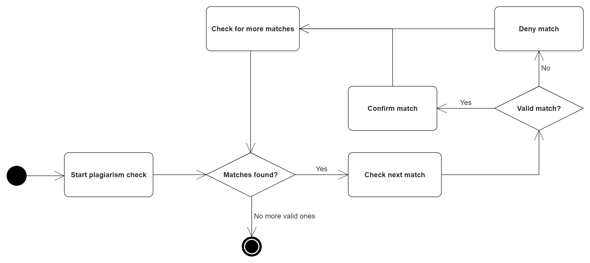
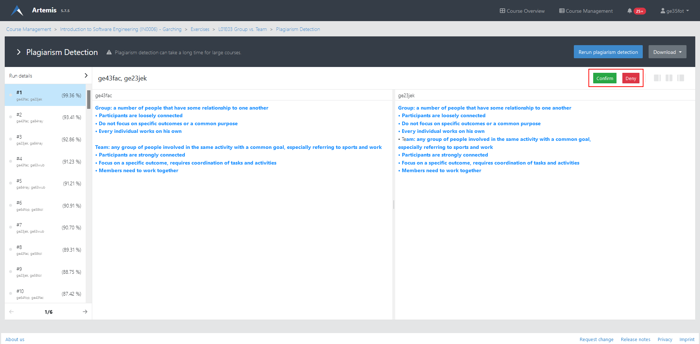

.. _plagiarism-check:

Plagiarism checks
=============

.. contents:: Content of this document
    :local:
    :depth: 2

Overview
--------

Artemis allows tutors and exercise instructors to check assignments submissions from students for plagiarism.
With this feature, different types of assignments can be checked in Artemis, including programming assignments, modeling assignments, and text assignments.
To perform the plagiarism check, the responsible tutors must initiate the checking process for a specific task. Below, we describe the plagiarism check workflows from the perspective of various Artemis users using a UML Activity Diagram.

Features for Tutors
-----------------------
The tutors are responsible for checking the plagiarism attempts of students. They execute the plagiarism checks and mark the potential plagiarism candidates to notify the instructors.
This process is visualized in the following diagram. |tutor-workflow|

 1. Open the Exercise via: Course Management → Course → Exercises → Your Exercise".  |exercise-page|
 2. Access the plagiarism tool as seen in the picture
 3. Run the Plagiarism Check.
  a. You can preadjust the similarity threshhold and other features if deemed necessary (most of the time not, depends on the exercise type)
  |run-settings|

  b. Checking big exercises can take a long time (sometimes multiple hours) and be very resource heavy → Start the checks at times when Artemis is less used
 4. Start checking for plagiarism. |run-results|
  a. Assess if the presented matches are real plagiarism or not
  b. Depending on your assessment either deny or accept the match as plagiarism
  c. Continue until the matches start to get "too different"
 5. Check if the tutors have mentioned any suspicious submissions in the Confluence page and check them for validity

Features for Instructors
------------------------
The following feature is only available for instructors.

Features for Students
------------------
This section captures the most important features that are offered to Artemis students.

.. |exercise-page| image:: plagiarism-check/tutor/exercise-page.png
    :width: 1000

.. |run-settings| image:: plagiarism-check/tutor/running-check-settings.png
    :width: 1000
