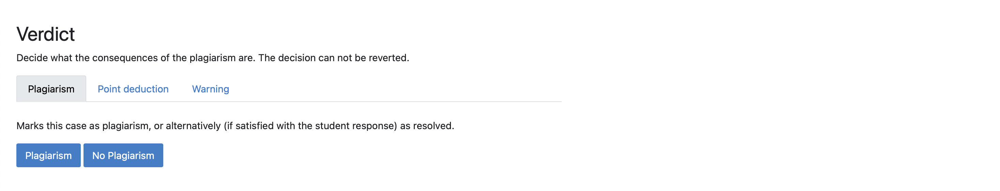
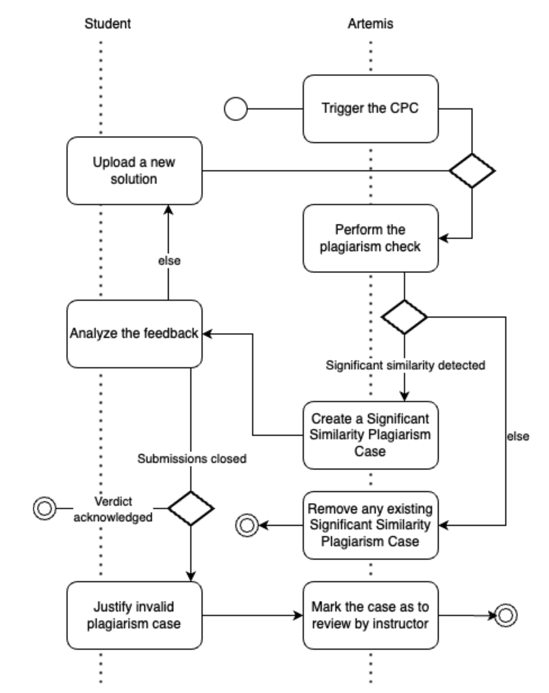
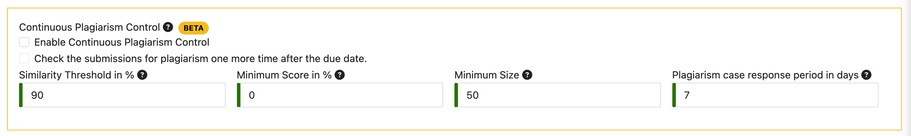
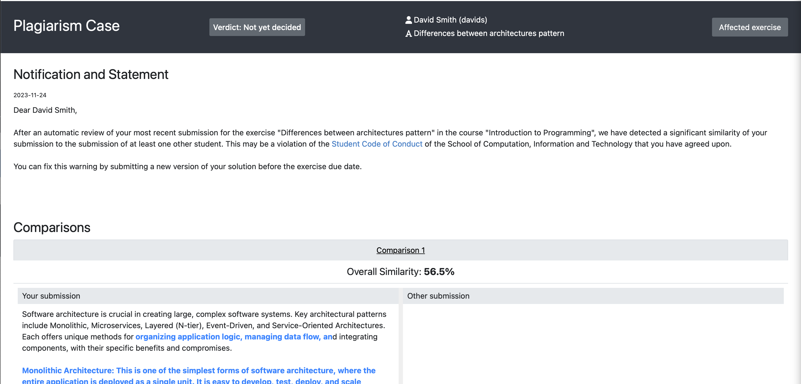
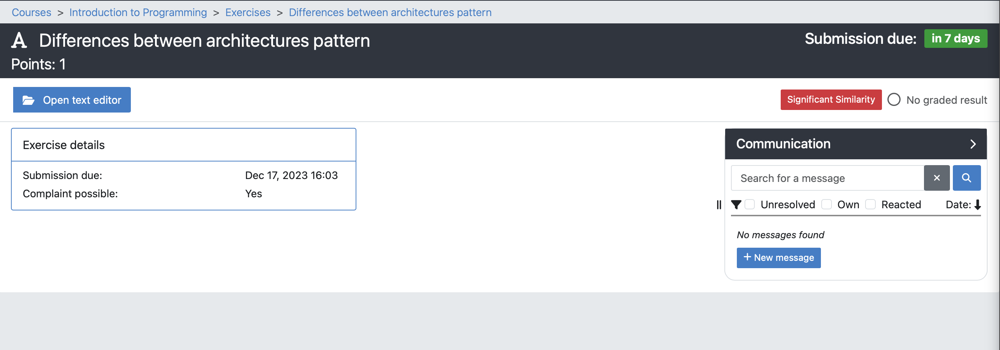

.. _plagiarism-check:

Plagiarism checks
=================

.. contents:: Content of this document
    :local:
    :depth: 2

Introduction
--------------------------

Artemis allows tutors and exercise instructors to check assignment submissions from students for plagiarism.
With this feature, different types of assignments can be checked in Artemis, including programming assignments, modeling assignments, and text assignments.
Plagiarism checks are available for both course and exam exercises.
To conduct a plagiarism check, a tutor or instructor must initiate one of two available procedures: manual plagiarism checks or continuous plagiarism control.
These checks are always specific to a particular exercise.
First, we give an overview of different available features of the plagiarism check.
Next, we explain both plagiarism check workflows from the perspective of various Artemis users, using UML Activity Diagrams to visualize the process.

Plagiarism Check Overview
--------------------------
In this section we give an overview of available features of plagiarism check. We explain different configuration settings, possible user actions and present the plagiarism result views, which are accessible after plagiarism checks run.

.. _settings:

Settings
^^^^^^^^
Before starting the plagiarism check, the user can configure different settings to get the best possible results.

|run-settings|

1. Similarity Threshold in % (minimum value 0, maximum value 100).

  Ignore comparisons whose similarity is below this threshold.
  A similarity of 0% means that there is no overlap between two submissions, a similarity of 50% means that about
  half of two submissions are identical.
  A similarity of 100% means that two submissions are completely identical.

2. Minimum Score in % (minimum value 0, maximum value 100).

  Consider only submissions with a score greater than or equal to this value.

3. Minimum Size.

  a. Programming exercises: Consider only submissions that have at least as many `git diff` lines in comparison to the template as the specified value.
  b. Modeling exercises: Consider only submissions that have at least as many modeling elements as the specified value.
  c. Text exercises: Consider only submissions that have at least as many words as the specified value.

Actions
^^^^^^^
The user can use different actions to run a plagiarism check, inspect the results or improve the performance.

|plagiarism-actions1|

.. note::
        Plagiarism detection can take a long time for large courses and exams.

1. Detect plagiarism: The user can execute the plagiarism check using this action.

2. Rerun plagiarism detection: The user can rerun the plagiarism check by executing this action. It can be helpful to check for plagiarism using the different settings as described in section :ref:`settings`.

3. Clean up: The user can clean up the latest plagiarism check results for the selected exercise. It helps to keep the database slim and safe storage capacity. Moreover, it should improve the overall system performance. To execute the clean-up action, the user must approve it by clicking ok on the dialog, as this action deletes all potentially approved or denied plagiarism cases.

|clean-up-dialog|

4. Download: The user can download the plagiarism results in JSON or CSV format to open them in a selected editor for the further analysis.

Results
^^^^^^^
After the plagiarism check was executed, the results can be inspected in different views.

1. Overview of the similarity distribution. This statistical overview shows the similarity distribution based on the percentage as a histogram chart. Above the chart, additional metrics show various statistics about the latest check. The user can analyze the distribution quickly and adjust the plagiarism check settings accordingly.

 |run-results|

2. Selected submission. When the user selects the submission from the submission list on the left side of the plagiarism run result view, new actions can be selected to initiate the plagiarism check workflow. We will provide further details on the workflow in the next section.

 |run-results-selected-submissions|

Manual Plagiarism Checks
-------------------------

In this section, we explain the process of the manual plagiarism case detection process from different users' perspectives.

Tutors
^^^^^^
Tutors and instructors can execute plagiarism checks. They carefully review the automatically identified cases and provide a first decision whether to accept or deny the found case.
We visualized the process in the following diagram.

|tutor-workflow|

1. Open the Exercise via:

 a. For course exercises: Course Management → Course → Exercises → Your Exercise.
 b. For exam exercises: Course Management → Course → Exams → Exam → Exercise Groups → Your Exercise.

2. Access the plagiarism tool as seen in the picture

 |exercise-page|

3. Run the Plagiarism Check.

 a. Tutors and instructors can adjust the similarity threshold and other settings as described in section :ref:`settings` if deemed necessary (most of the time not, depends on the formulation of the exercise and on the number of possible solution. A similarity of less than 50% typically means that students did not plagiarize).
 b. Checking exercises with many students can take some time (sometimes multiple minutes) and might be resource intensive → We recommend to run plagiarism checks at times when only a few users actively use Artemis in such cases

4. Start checking for plagiarism.

 a. Review if the presented matches are actual plagiarism cases or not.
 b. Depending on your decision, either deny or confirm the match as plagiarism.
 c. Continue until the matches start to get "too different".

.. _plagiarism_instructors:

Instructors
^^^^^^^^^^^
The instructors can execute the same actions as tutors, additionally they are able to make a final decision on the particular confirmed plagiarism case.
We visualized the process in the following diagram.

|instructors-workflow|

1. Open the plagiarism cases via:

 a. For course exercises: Course Management → Course → Assessment → Plagiarism Cases.
 b. For exam exercises: Course Management → Course → Exams → Exam → Plagiarism Cases.

 |plagiarism-cases-navigation|

2. Overview the current status of all confirmed plagiarism cases by inspecting the management overview. The overview provides the following information about each confirmed case:

 |confirmed-plagiarism-cases-management|

 a. In how many comparisons the confirmed case appears.
 b. Student was notified or not.
 c. Student has responded or not.
 d. Final verdict.

3. Export the confirmed cases as CSV file to analyze them in another editor.
4. Select one confirmed case and navigate to the case detail view.

 |selected-confirmed-case|

5. Notify the student about the potential plagiarism case and ask him or her for a statement.

 |student-notification|

6. Make a final verdict by selecting one of 3 available options. The final verdict must be approved by clicking 'Confirm' in the dialog.

 a. No plagiarism. The instructor can deem the accusation invalid and resolve the plagiarism case.
 b. Warning. The instructor can write a warning message to the student and confirm the verdict in the dialog.
 c. Point deduction in % (minimum value 0, maximum 100). Deduct exercise points and confirm  the verdict in the dialog.
 d. Plagiarism. If a grading key exists, the student receives the :doc:`plagiarism special grade <grading>` for the exam or course that the corresponding exercise belongs to. The next steps must be made manually by contacting responsible persons in the university to mark the student's grade as "Unterschleif".

 |verdict-select|

 |verdict-dialog|

Students
^^^^^^^^
After the student got a notification that the instructor asked for the statement, he or she has one week to respond. 
The process is visualized in the following diagram.

|student-workflow|

1. Open the notified plagiarism confirmed case via:

 a. For course exercises: Course Overview → Course → Exercise → Plagiarism Case / Resolved Plagiarism Case.
 b. For exam exercises: Course Overview → Course → Exams → Exam → Plagiarism Case / Resolved Plagiarism Case.

 |student-plagiarism-case-navigation|

2. Reply to the message of the instructor.
3. Wait for the final verdict.

Continuous Plagiarism Control
-----------------------------------------

In this section, we explain the automated flow of the continuous plagiarism control (CPC) and present actions taken by different Artemis users.

Automated Flow
^^^^^^^^^^^^^^

The CPC is an experimental feature designed to shorten the feedback loop for students and reduce the manual work required from tutors and instructors.
Continuous feedback on potential plagiarism aims to encourage students to submit their original work and enhance their learning outcomes.
The continuous plagiarism control **does not accuse students of plagiarism, nor does it affect their scores**.
Instead, it **notifies students of significant similarities** detected between their submissions, allowing them to revise their solutions.

The CPC initiates plagiarism checks every night for all onboarded exercises, processing all the latest submissions for each exercise.
If a significant similarity is detected, the CPC creates or updates a significant similarity plagiarism case for that submission.
It is a special form of plagiarism case, which is marked as a warning and presents a gentle message about detected similarity.
If a submission does not include significant similarity, the CPC removes any associated existing significant similarity plagiarism case.
Subsequently, the student analyzes the feedback received and, if the submission period is still open, can submit a new solution.
If the submission period has ended, the student can either dispute the plagiarism case or choose to take no action.
Eventually, the instructor makes a decision about accusing the student of plagiarism and about any further steps.

The following activity diagram depicts the CPC flow described above.

|cpc-activity-diagram|

Videos below show the full CPC process from student's and instructor's perspective.

Creating a new exercise with the CPC enabled.

.. raw:: html

    <iframe src="https://live.rbg.tum.de/w/artemisintro/42153?video_only=1&t=0" allowfullscreen="1" frameborder="0" width="600" height="350">
        Watch this video on TUM-Live.
    </iframe>

Reviewing check's results by an instructor.

.. raw:: html

    <iframe src="https://live.rbg.tum.de/w/artemisintro/42154?video_only=1&t=0" allowfullscreen="1" frameborder="0" width="600" height="350">
        Watch this video on TUM-Live.
    </iframe>

Reviewing check's results by a student.

.. raw:: html

    <iframe src="https://live.rbg.tum.de/w/artemisintro/42155?video_only=1&t=0" allowfullscreen="1" frameborder="0" width="600" height="350">
        Watch this video on TUM-Live.
    </iframe>

Fixing submissions marked as a significant similarity.

.. raw:: html

    <iframe src="https://live.rbg.tum.de/w/artemisintro/42156?video_only=1&t=0" allowfullscreen="1" frameborder="0" width="600" height="350">
        Watch this video on TUM-Live.
    </iframe>

Responding to a significant similarity plagiarism case that persisted after the exercise due date and adding a verdict to it.

.. raw:: html

    <iframe src="https://live.rbg.tum.de/w/artemisintro/42157?video_only=1&t=0" allowfullscreen="1" frameborder="0" width="600" height="350">
        Watch this video on TUM-Live.
    </iframe>

Instructors
^^^^^^^^^^^

Configuration of the CPC
""""""""""""""""""""""""

Instructors can configure various aspects of the CPC for each exercise. The following list describes all configuration options:

* **Instructors can enable the CPC.** - Instructor can turn the CPC on and off for a particular exercise. Default: `OFF`.
* **Instructors can enable the post-due date checks.** - Instructor can configure the CPC to test the exercise one more time the night after the exercise due date. This allows to test submissions posted shortly before the due date. Default: `OFF`.
* **Instructors can set the response period for the significant similarity plagiarism case.** - Instructor can specify for how long after the exercise due date a student will be able to submit a complaint. Default: `7 days`. Min: `7 days`.
* **Instructors can set the similarity threshold.** - Instructor can specify the similarity threshold for the plagiarism check performed by the CPC. Optimal value for this parameter depends on an individual exercise. Similarity above the threshold does not implicate plagiarism. Default: `90%`.
* **Instructors can set the minimum score.** - Instructor can specify the minimum submission score for the plagiarism check performed by the CPC. Default: `0`.
* **Instructors can set the minimum size.** - Instructor can specify the minimum submission size for the plagiarism check performed by the CPC. Default: `50`.

Instructors can adjust the CPC configuration options on the exercise create and update page:

|cpc-configuration|

Post exercise due date steps and results verification
"""""""""""""""""""""""""""""""""""""""""""""""""""""

After the exercise due date, instructors can manually review all of the significant similarity plagiarism cases and decide on their verdicts. Steps at this point are equivalent to the steps in manual checks flow.

Instructors can check the plagiarism checks results CPC creates during and after the submission period using exactly the same steps and interface like with manual checks.

Students
^^^^^^^^

When a student submits a work for which the CPC identifies significant similarity and creates a plagiarism case, the student receives a notification similar to what is sent when instructors create a classic plagiarism case.
If the exercise due date has not passed, the student can submit updated work again.
The CPC will check the submission the following night and will either remove or update the significant similarity plagiarism case based on the results of the check.
Before the exercise due date, a student cannot see the submissions of other students involved in the significant similarity plagiarism case.

When a significant similarity plagiarism case exists for the latest submission, the student sees a dedicated button redirecting to it:
|significant-similarity-button|

A significant similarity plagiarism case contains a short message and an overview of similarity in the submission:
|significant-similarity-plagiarism-case|

In case the exercise due date has passed and student does not agree with the significant similarity plagiarism case,
the student can dispute the case within the period configured by the instructor.

.. |plagiarism-actions1| image:: plagiarism-check/actions/plagiarism-actions1.png
    :width: 1000
.. |clean-up-dialog| image:: plagiarism-check/actions/clean-up-dialog.png
    :width: 500
.. |plagiarism-cases-navigation| image:: plagiarism-check/instructor/plagiarism-cases-navigation.png
    :width: 1000
.. |confirmed-plagiarism-cases-management| image:: plagiarism-check/instructor/confirmed-plagiarism-cases-management.png
    :width: 1000
.. |selected-confirmed-case| image:: plagiarism-check/instructor/selected-confirmed-case.png
    :width: 1000

.. |verdict-dialog| image:: plagiarism-check/instructor/point-deduction-verdict.png
    :width: 500
.. |student-notification| image:: plagiarism-check/instructor/student-notification.png
    :width: 500
.. Diagram created with the Apollon VSCode extension (https://marketplace.visualstudio.com/items?itemName=TUMAET.apollon-vscode)
   Respective .apollon file is plagiarism-check/instructor/instructors-workflow.apollon
.. |instructors-workflow| image:: plagiarism-check/instructor/instructors-workflow.png
    :width: 700
.. Diagram created with the Apollon VSCode extension (https://marketplace.visualstudio.com/items?itemName=TUMAET.apollon-vscode)
   Respective .apollon file is plagiarism-check/tutor/tutor-workflow.apollon
.. |tutor-workflow| image:: plagiarism-check/tutor/tutor-workflow.png
    :width: 700
.. |run-settings| image:: plagiarism-check/tutor/running-check-settings.png
    :width: 1000
.. |exercise-page| image:: plagiarism-check/tutor/exercise_page.png
    :width: 1000
.. |student-plagiarism-case-navigation| image:: plagiarism-check/student/plagiarism-case-navigation.png
    :width: 1000
.. Diagram created with the Apollon VSCode extension (https://marketplace.visualstudio.com/items?itemName=TUMAET.apollon-vscode)
   Respective .apollon file is plagiarism-check/student/student-workflow.apollon
.. |student-workflow| image:: plagiarism-check/student/student-workflow.png
    :width: 700
.. |run-results| image:: plagiarism-check/results/run-results.png
    :width: 1000
.. |run-results-selected-submissions| image:: plagiarism-check/results/run-results-selected-submission.png
    :width: 1000

