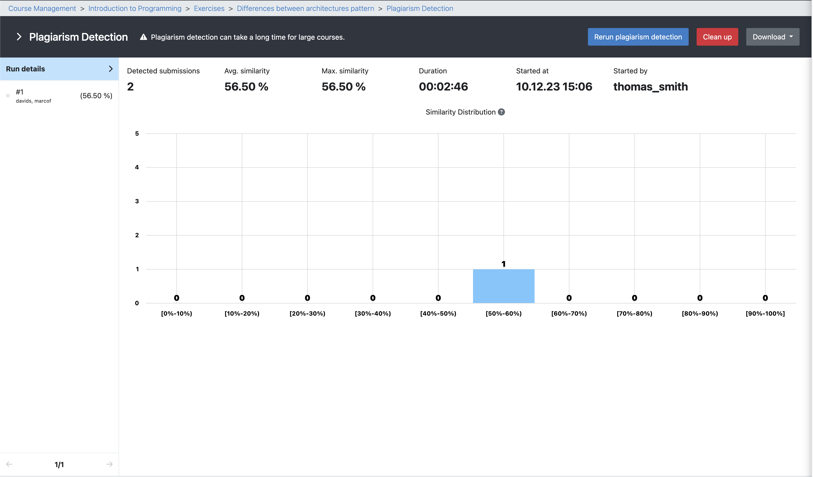
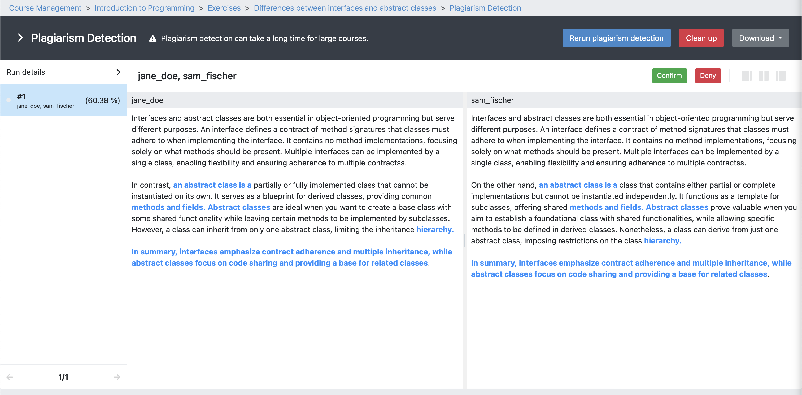

.. _plagiarism-check:

Plagiarism checks
=================

.. contents:: Content of this document
    :local:
    :depth: 2

Plagiarism Check Overview
--------------------------

Artemis allows tutors and exercise instructors to check assignments submissions from students for plagiarism.
With this feature, different types of assignments can be checked in Artemis, including programming assignments, modeling assignments, and text assignments.
To perform the plagiarism check, the responsible tutors must initiate the checking process for a specific task. Below, we describe the plagiarism check workflows from the perspective of various Artemis users using a UML Activity Diagram.

.. _settings:

Settings
^^^^^^^^
|run-settings|

1. Similarity Threshold in % (minimum value 0, maximum value 100).

  Ignore comparisons whose similarity is below this threshold.
  A similarity of 0% means that there is no overlap between two submissions, a similarity of 50% means that about
  half of two submissions are identical.
  A similarity of 100% means that two submissions are completely identical.

2. Minimum Score in % (minimum value 0, maximum value 100).

  Consider only submissions with a score greater than or equal to this value.

3. Minimum Size.

  a. Default value: Consider only submissions whose size is greater or equal to this value.
  b. Modeling exercises: Consider only submissions that have at least as many modeling elements as the specified value.
  c. Text exercises: Consider only submissions that have at least as many words as the specified value.

Actions
^^^^^^^
|plagiarism-actions1|

.. note::
        Plagiarism detection can take a long time for large courses.
1. Detect plagiarism. The user can execute the plagiarism check using this action.

2. Rerun plagiarism detection. The user can rerun the plagiarism check by executing this action. It can be helpful to check the plagiarism with different settings mentioned in section

3. Clean up. The user can clean up the latest plagiarism check results for the selected exercise. It helps to keep the database clean and safe storage capacity. Moreover, it should improve the overall system performance. To execute the clean-up action the user must approve it by clicking ok on the dialog, as this action cleans all potentially approved or denied plagiarism cases.

|clean-up-dialog|

4. Download. The user can download the plagiarism results in JSON or CSV format to open them in a selected editor for the further analysis.

Results
^^^^^^^
After the plagiarism check was executed the results can be expected in different views.

1. Overview of the similarity distribution. This statistical overview shows the similarity distribution based on the percentage as a histogram chart. The user can analyze the distribution quickly and adjust the plagiarism check settings as needed accordingly.
 |run-results|
2. Selected submission. When the user selects the submission from the submission list on the left side of the plagiarism run result view, new actions can be selected to initiate the plagiarism check workflow. We will provide more information to the the workflow in the next sections.
 |run-results-selected-submissions|

Plagiarism Check Workflow
------------------------

Tutors
^^^^^^
The tutors are responsible for checking the plagiarism attempts of students. They execute the plagiarism checks and mark the potential plagiarism candidates to notify the instructors.
This process is visualized in the following diagram.

|tutor-workflow|

 1. Open the Exercise via: Course Management → Course → Exercises → Your Exercise".
 2. Access the plagiarism tool as seen in the picture
  |exercise-page|
 3. Run the Plagiarism Check.
  a. Tutor can adjust the similarity threshold and other settings as described in section :ref:`settings` if deemed necessary (most of the time not, depends on the exercise type).
  b. Checking big exercises can take a long time (sometimes multiple hours) and be very resource heavy → Start the checks at times when Artemis is less used
 4. Start checking for plagiarism.
  a. Assess if the presented matches are real plagiarism or not.
  b. Depending on your assessment either deny or confirm the match as plagiarism.
  c. Continue until the matches start to get "too different".

Instructors
^^^^^^^^^^^
The following feature is only available for instructors.

Students
^^^^^^^^
This section captures the most important features that are offered to Artemis students.

.. |tutor-workflow| image:: plagiarism-check/workflow/tutor-workflow.png
    :width: 700

.. |exercise-page| image:: plagiarism-check/tutor/exercise_page.png
    :width: 1000

.. |run-settings| image:: plagiarism-check/tutor/running-check-settings.png
    :width: 1000
