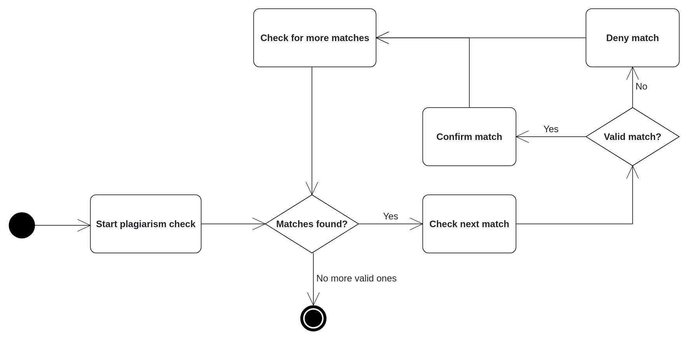

.. _plagiarism-check:

Plagiarism checks
=============

.. contents:: Content of this document
    :local:
    :depth: 2

Overview
--------

Artemis allows tutors and exercise instructors to check assignments submissions from students for plagiarism.
With this feature, different types of assignments can be checked in Artemis, including programming assignments, modeling assignments, and text assignments.
To perform the plagiarism check, the responsible tutors must initiate the checking process for a specific task. Below, we describe the plagiarism check workflows from the perspective of various Artemis users using a UML Activity Diagram.

Features for Tutors
-----------------------
The tutors are responsible for checking the plagiarism attempts of students. They execute the plagiarism checks and mark the potential plagiarism candidates to notify the instructors.
This process is visualized in the following diagram. |tutor-workflow|

Features for Instructors
------------------------
The following feature is only available for instructors.

Features for Students
------------------
This section captures the most important features that are offered to Artemis students.

.. |exercise-posts| image:: communication/exercise-posts.png
    :width: 1000
.. |course-posts| image:: communication/course-posts.png
    :width: 1000
