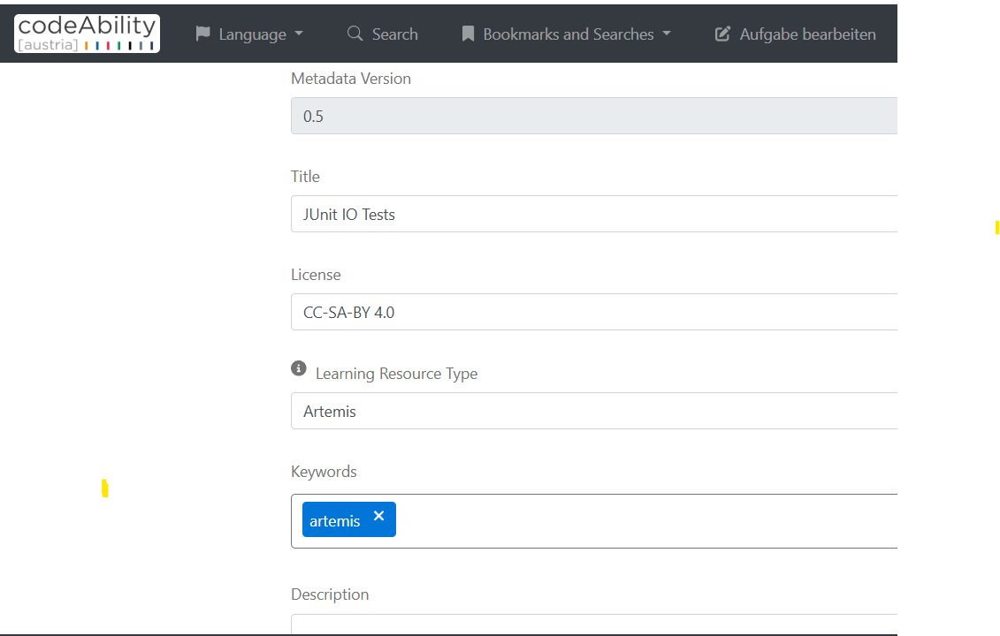
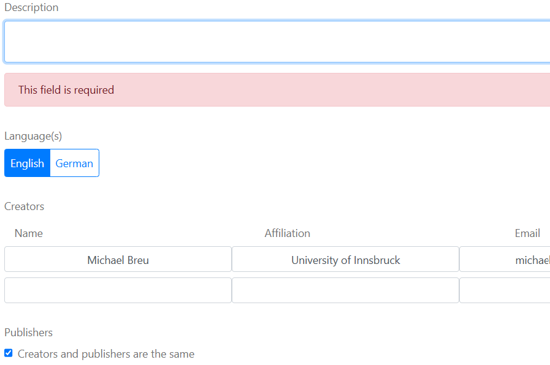
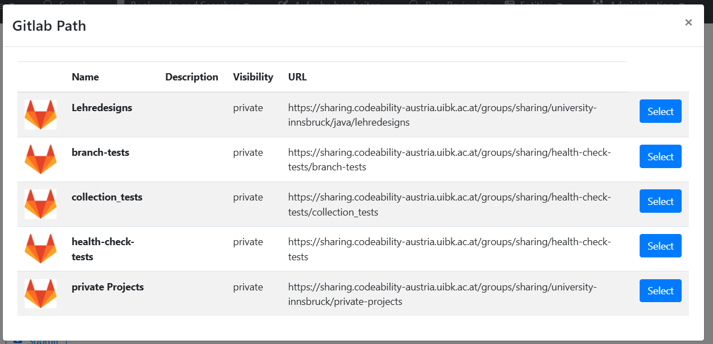
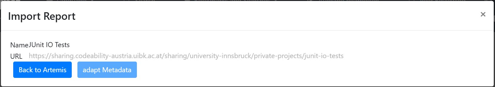
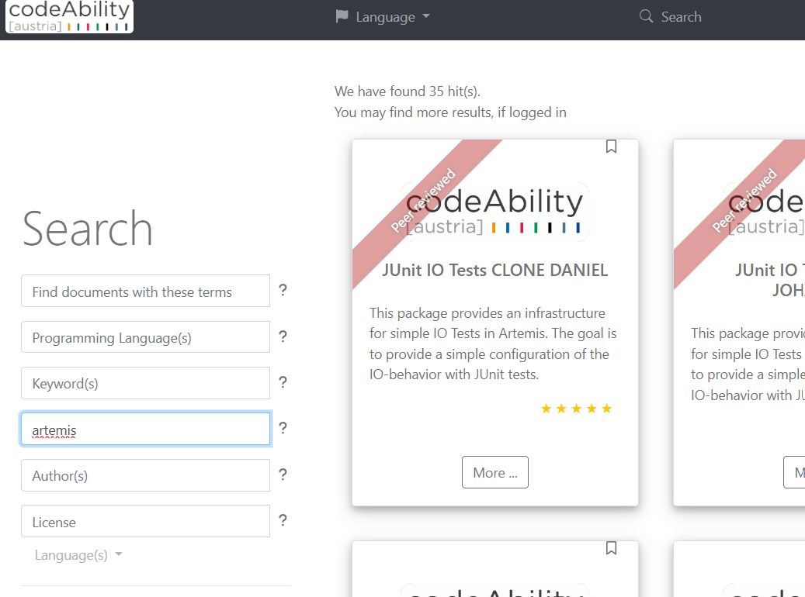
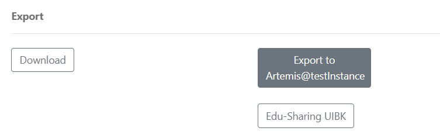
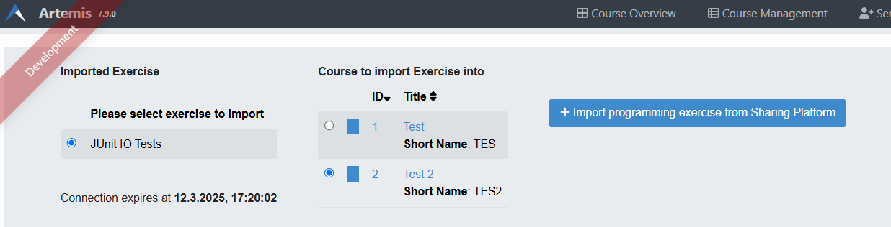
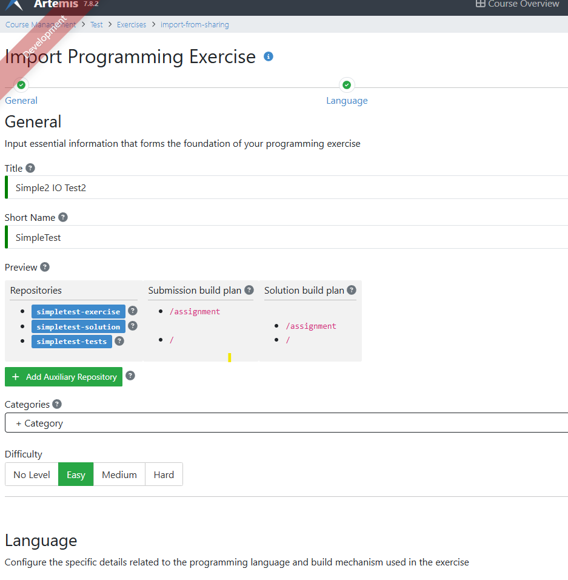

.. |sharing_button1| image:: ../admin/setup/sharing/sharingButtonArtemis.png

.. _sharing:

Sharing
=======

Background
----------

The `Sharing Platform <https://search.sharing-codeability.uibk.ac.at/>`_ is an open sharing platform for teaching material for
teaching programming skills. It is operated by the `University of Innsbruck <https://www.uibk.ac.at/en/>`_. Although mainly an open exchange platform, it
additionally provides various features, like private exchange in a closed user group, or the non disclosure of certain content
like the solution repository of an artemis exercise to the public. Users can easily import and export single programming exercises via the Sharing Platform.

Your Artemis administrator may activate the `sharing`-profile. If this profile is enabled, you see an |sharing_button1|-Button in the exercise detail view.

Preliminaries
-------------

Exporting only possible, if you have also an account on the Sharing Platform. Please contact your administrator, whether you can log in
via `eduID <https://www.aco.net/technologien.html>`_ or use the `self-registration option of the sharing platform <https://sharing-codeability.uibk.ac.at/users/sign_in>`_.

To export an exercise, ensure you are already logged into the Sharing Platform in advance [1]_ .

.. [1] Due to a problem in the sharing platform, you must be logged in in the same tab/window as the artemis application. If you are not logged in, you may be requested to re-login and are forwarded to the main page of the sharing platform. In this case go back to artemis and repeat the export.

Export to the Sharing Platform
------------------------------

In the exercise detail view click on the |sharing_button1|-Button.
You are forwarded to the import functionality of the Sharing Platform. You may be asked to log in again in the current tab.

|sharing_metadata|

Here you should add/correct the relevant metadata. Most important is the description field, which should give other users a hint, what
the programming exercise is about. Also add further keywords as you like.

|sharing_metadata2|

Finally you should add the creators of the exercise. The first row should be prefilled with yourself. You can add additional rows.

The sharing platform distinguishes between creators/authors and publishers. The publishers are those that take care for publishing on the sharing platform, however
may not necessarily coincide with the creators/authors.

The full metadata is listed on `this page <https://search.sharing-codeability.uibk.ac.at/pages/en/publishers/howto>`_. fields than shown on this short page. You are welcome to add further data, however you have to edit it in the metadata.yaml file of your git repository.

If all required meta data is correct, you can import the exercise into the sharing platform by hitting the submit-Button.
Next you can select the GitLab namespace where your exercise should go:

|sharing_namespace|

This list contains GitLab namespaces you can submit to (i.e. where you have at least maintainer access).

After selection the correct namespace you should see:

|sharing_success|

The “Back to Artemis” button should forward you back to the Artemis application.

In case of an error you might see a corresponding message. Please correct the error, or contact the maintainers of the sharing platform.

Import from the Sharing Platform
--------------------------------

The import from the sharing platform starts on the sharing platform.
Please ensure that you are logged in, because exports only work for authorized users.

You can list all exercises by entering "artemis" into the format field. Of course you can also add further search parameters into the other fields:

|sharing_search|

After clicking on "More ..." you should see the details page, with an export option at the bottom:

|sharing_export|.

The click on the export button will forward you to the artemis import page:

|artemis_import|

Here you can select the course into which you want to import the exercise. The “Import …” button will finally forward you to
the exercise details page, where you can adapt the exercise to your needs.

|artemis_import2|

