.. tutorialgroups:

Tutorial Groups
===============

.. contents:: Content of this document
    :local:
    :depth: 2

Overview
--------
Artemis facilitates the coordination of tutorial groups in a course. Tutorial groups are a learning strategy where students teach and learn from each other in small groups (20-30). In this strategy, proficient students act as tutors and lead the groups. The tutor and the group members usually meet weekly either on campus or online. Students present their solutions to homework assignments or other tasks and receive feedback and suggestions from the tutor and their peers.

.. note:: The tutorial group overview page (used by students) displays dates in the student's current time zone. The tutorial group management page (used by instructors and tutors to manage groups and their sessions) displays dates in the course time zone. This is helpful if the instructors or tutors travel and work across multiple time zones. A header at the top of the page shows the current time zone used for dates.

Setting up Tutorial Group Plan as an Instructor
-----------------------------------------------

.. raw:: html

    <iframe src="https://live.rbg.tum.de/w/artemisintro/27045?video_only=1&t=0" allowfullscreen="1" frameborder="0" width="600" height="350">
        Watch this video on TUM-Live.
    </iframe>

Tutorial groups can be managed by instructors by navigating to the course's  ``Tutorial Groups`` page in the course administration section.

|instructors-button|

Initial Configuration
^^^^^^^^^^^^^^^^^^^^^

Before the tutorial group feature can be used, three configurations need to be set up:

* **Time zone information:** This ensures that the tutorial group meeting times are displayed correctly for each student and instructor.

* **Default tutorial group period:** This is the semester period when the groups usually meet. It is used to prefill the meeting period when creating a new tutorial group. The tutorial group period can be changed later on for each group individually.

* **Artemis managed tutorial group channels:** This option allows Artemis to create and manage a dedicated channel for each tutorial group in the 'Communication' section of the course. This feature is only selectable if the course has the ``Communication`` feature enabled in the course settings. If activated, tutorial group channels can still be managed manually but Artemis automatically performs some common tasks, such as:

  * Adding and removing students from the channel when they register or unregister for the tutorial group

  * Making the assigned tutor a moderator of the channel

  * Deleting the channel when the tutorial group is deleted

If not all of these configurations are done, the instructor will see a checklist page with the missing configurations. These configurations can also be changed later in the ``Global Configuration`` section of the tutorial group page. A link to this section is hidden behind the ``More...`` button.

|instructors-checklist|

Creating Tutorial Groups
^^^^^^^^^^^^^^^^^^^^^^^^

Tutorial groups can be created manually or by importing a CSV file. Importing a CSV file is a convenient option if the tutorial groups and student assignments already exist in a campus management system (e.g. TUM-Online). This way, both the groups and the assignments (student to tutorial group) can be created at once.

|instructors-create-groups|

The assigned tutor and the session schedule are the most important settings of a tutorial group. The tutor holds the sessions, tracks the number of attending students, and gives feedback to the students. The tutor can also register or unregister students and edit the sessions by cancelling or rescheduling them. The meeting schedule shows the regular times of the sessions during the semester. It is used to create the individual sessions automatically.

|instructors-tutorial-group-form|
|instructors-csv-import|

Defining Tutorial Group Free Days
^^^^^^^^^^^^^^^^^^^^^^^^^^^^^^^^^

By clicking on the ``Holidays`` button, the instructor can define course-wide days where no tutorial group sessions are held (no matter which tutorial group). If such a day overlaps with a tutorial group session, the session is automatically cancelled and the holiday given as the reason.

|instructors-holidays|

Managing Tutorial Groups as a Tutor
-----------------------------------

.. raw:: html

    <iframe src="https://live.rbg.tum.de/w/artemisintro/27044?video_only=1&t=0" allowfullscreen="1" frameborder="0" width="600" height="350">
        Watch this video on TUM-Live.
    </iframe>

Assigned tutors can manage their tutorial groups by navigating to the course's ``Tutorial Groups`` page in the course administration section. The tutor can view the group's details, register or unregister students, and edit the sessions by cancelling or rescheduling them. The tutor also has moderation rights in the tutorial group's channel in the ``Messages`` section of the course if the ``Artemis managed tutorial group channels`` feature is enabled in the tutorial group settings.

The groups for which the tutor is responsible have a blue background.

.. note::
    The instructor can perform the same actions as the tutor for all tutorial groups in the course. The tutor can only manage the tutorial groups that they are assigned to.

|tutor-overview|

Managing the Registration of a Tutorial Group
^^^^^^^^^^^^^^^^^^^^^^^^^^^^^^^^^^^^^^^^^^^^^

By clicking on the ``Registered Students`` button, the tutor can view the list of students that are registered for the tutorial group. From this list, the tutor can register or unregister students for the tutorial group. Only users that are enrolled in the course can be registered for a tutorial group.

.. note::
    An instructor can also import student registrations from a CSV file and export the list of registered students as a CSV file. Extra buttons for these actions are available in the ``Registered Students`` page of the tutorial group page for instructors.

|tutor-registrations|

Managing the Sessions of a Tutorial Group
^^^^^^^^^^^^^^^^^^^^^^^^^^^^^^^^^^^^^^^^^

By clicking on the ``Sessions`` button, the tutor can view the list of sessions that are scheduled for the tutorial group. From this list, the tutor can cancel or reschedule sessions. The tutor can also create new sessions by clicking on the ``Create New Tutorial Group Session`` button. Furthermore, the tutor can enter the number of attending students for each session. This information is used to calculate the utilization of the tutorial group.

.. note::
    The utilization of a tutorial group is the average attendance divided by capacity (if defined). The average attendance considers the last three sessions. If no attendance is entered, the corresponding session is ignored and the calculation is performed with one or two sessions.

|tutor-sessions|

Viewing Tutorial Groups as a Student
------------------------------------

.. raw:: html

    <iframe src="https://live.rbg.tum.de/w/artemisintro/27043?video_only=1&t=0" allowfullscreen="1" frameborder="0" width="600" height="350">
        Watch this video on TUM-Live.
    </iframe>

Students can access their tutorial groups for a specific course by navigating to the course's ``Tutorial Group`` page.

The view is split into two tabs that can be changed via the toolbar. In the ``Show my tutorial groups`` tab, students can see the groups for which they are registered. Each group is displayed as a card with the date of the next session in the center. At the bottom of the card, a link to the tutorial groups communication channel is shown (if this feature is activated). On the right side of the page, all course-wide holidays are displayed where no tutorial groups meet.

|student-own-groups|

In the ``Show All Tutorial Groups`` tab, students can see the main information for all tutorial groups of the course. This includes the name, utilization and responsible tutor. This page is useful if they want to switch to a less crowded group. Then they can pick one via low utilization and contact the tutor so that they get registered.

|student-all-groups|

To see more details about a tutorial group (including an overview of all sessions), the student can click on the name of the tutorial group. This will open the detail page of the respective group. The session table is shown at the bottom of the page. By default, only the top row is displayed which is the next session. The student can expand the whole table by clicking on the ``Show All Sessions`` button at the bottom.

|student-detail|

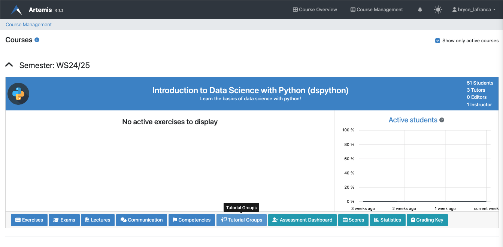
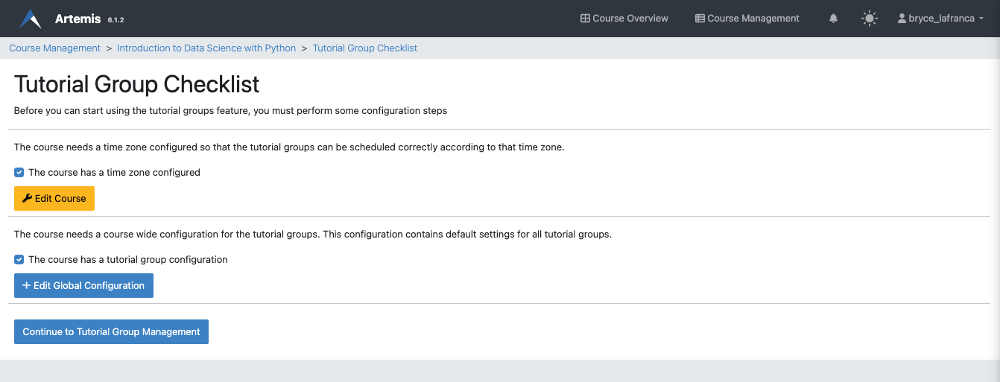
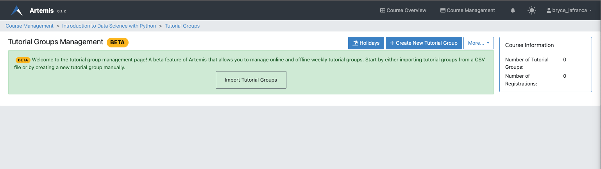
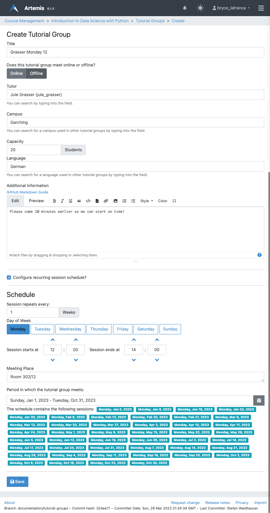
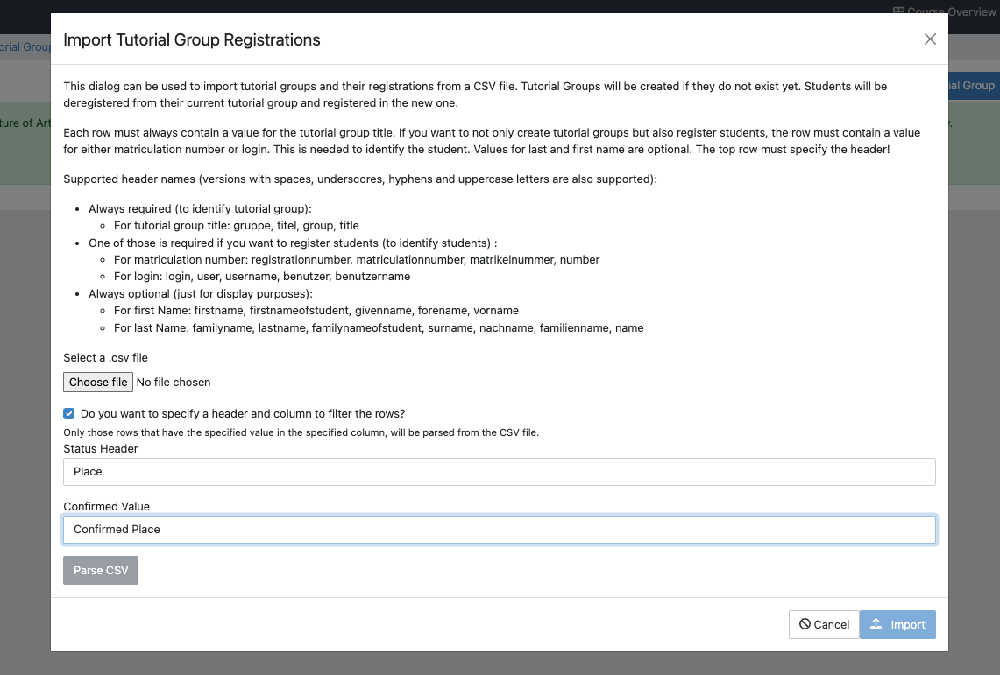
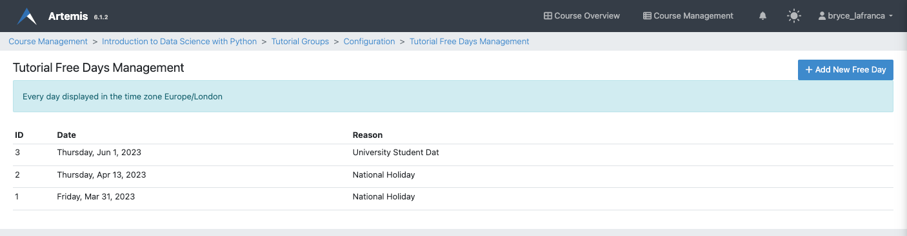

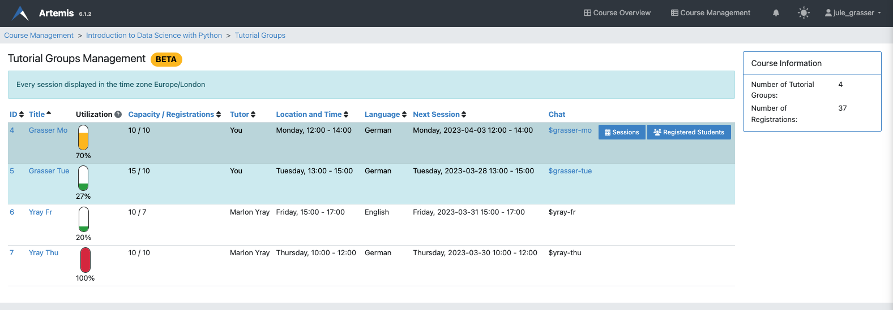
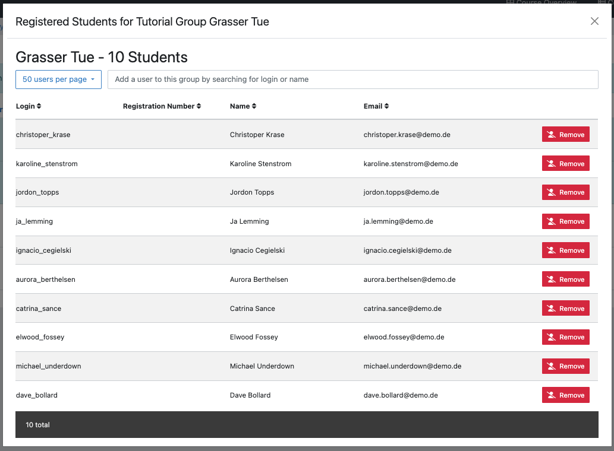
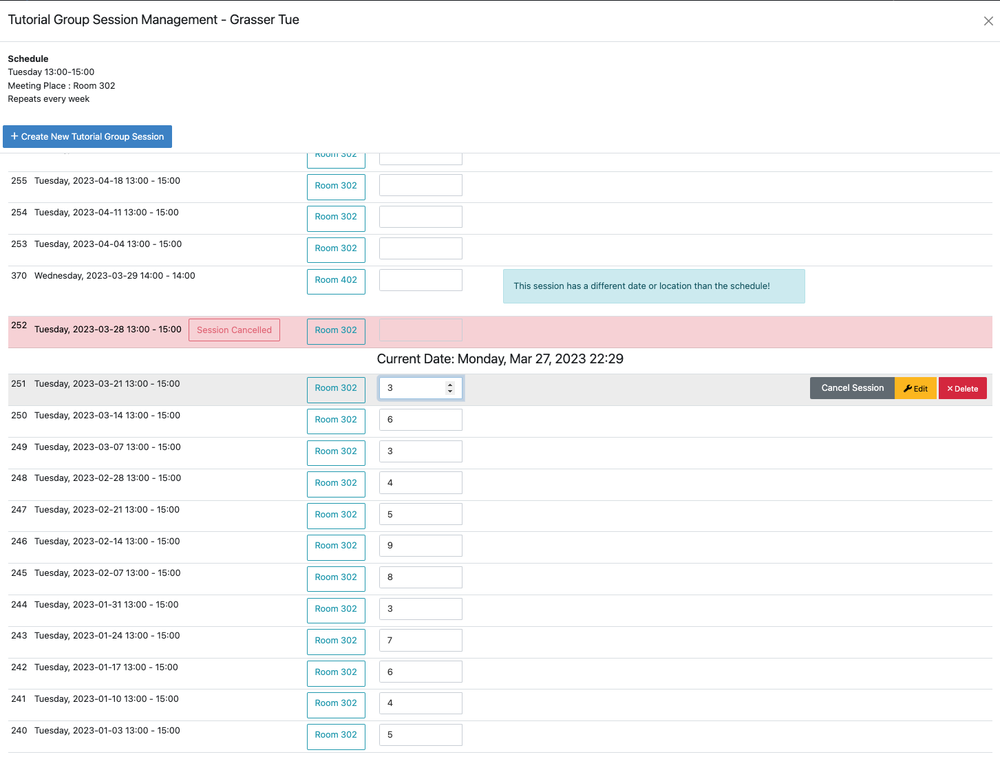

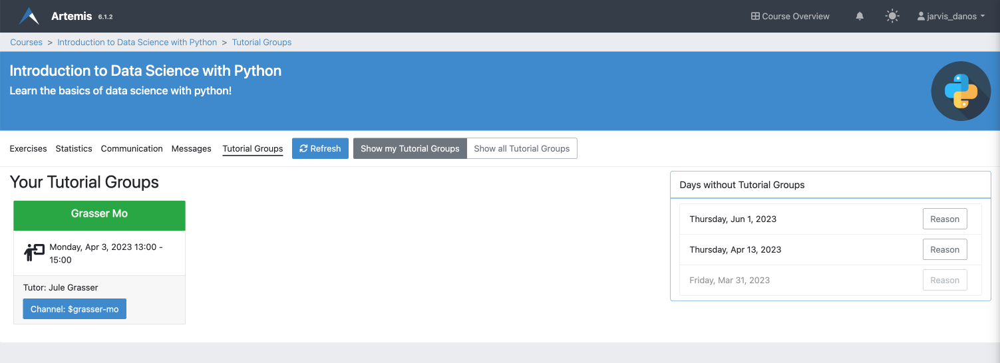
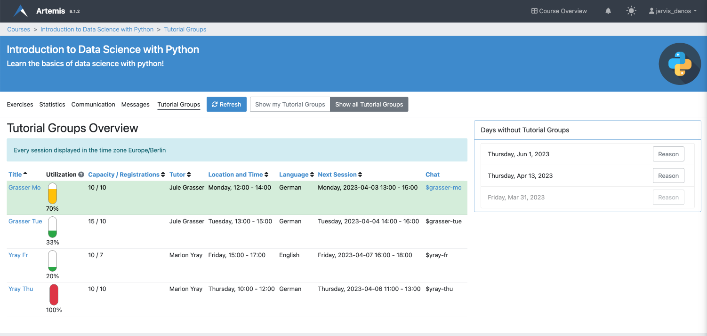
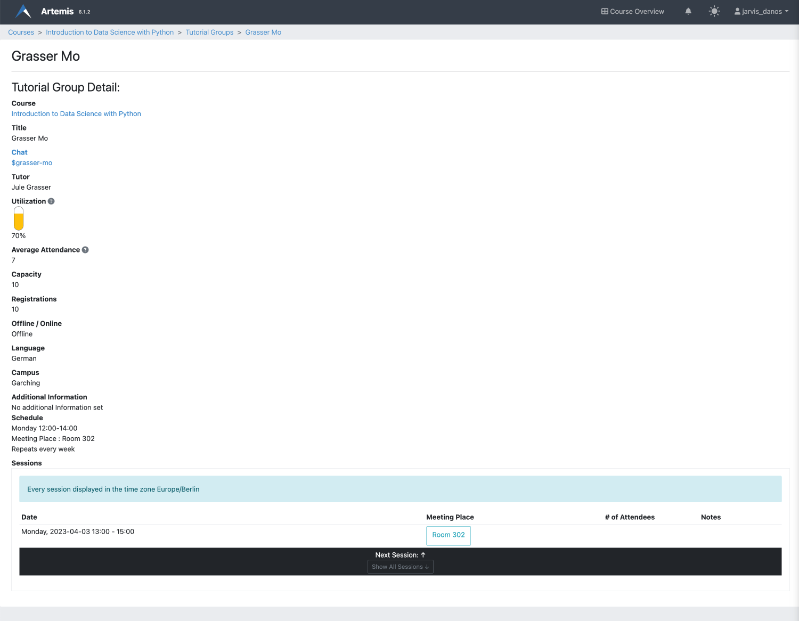
