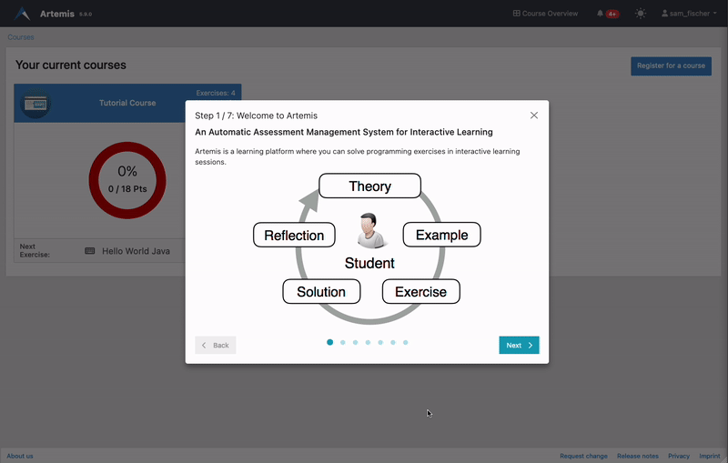
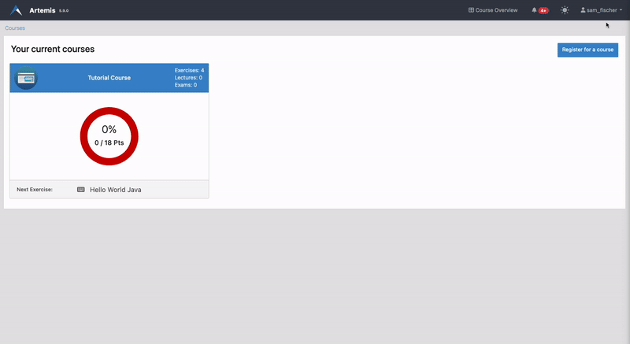

============
Guided Tours
============

.. contents:: Content of this document
    :local:
    :depth: 2

Artemis will lead you through your first steps on the platform so you can learn how to use it quickly.

Control Guided Tours
--------------------

Guided Tours are automatically started as soon as you visit a page with an available tour for the first time.

For example, your courses overview will greet you with a Guided Tour that will introduce you to the most essential
features and controls of Artemis:

| To advance with the tour, click the *Next* button. You can go back to a previous step using the *Back* button.
| Each of the following steps will ask you either to perform a certain step or to watch / read additional information.
| Please follow any instructions presented to you.

You can exit a Guided Tour at any time by clicking the close-icon in the top right of the modal box.

Restart or Resume Guided Tours
------------------------------

In case you have cancelled a previous tour or want to do an already finished tour again, you can start any tour that
is available on your current page by opening your account menu and selecting "Continue Tutorial":

You can run all tours as often as you'd like. Any changes to the tutorial course you performed during your last run
will be reset automatically.

.. note::
    To resume or restart a tour, you need to be on the page where you started it the last time. The menu will
    **not** show resumable tours that are not available on the page you're currently on.

