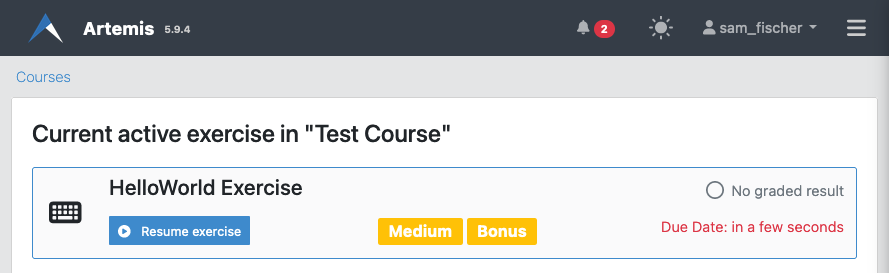
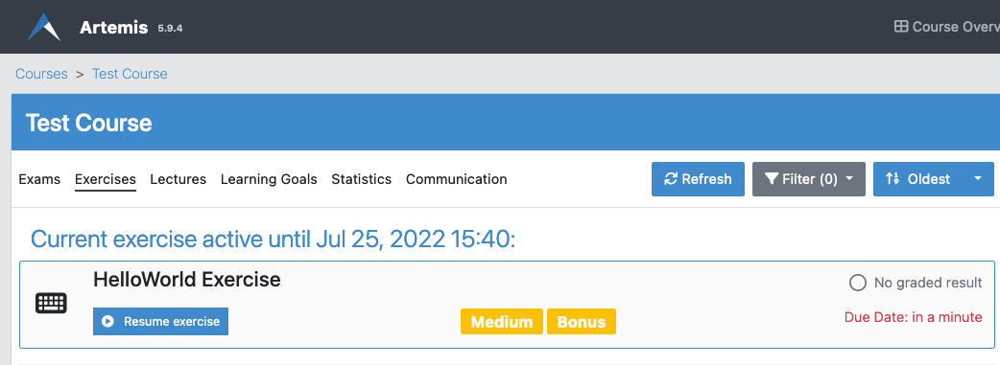
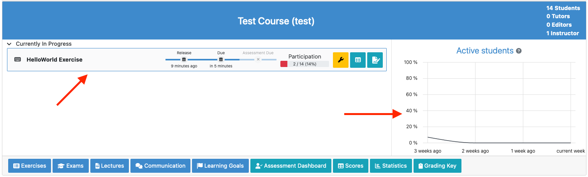
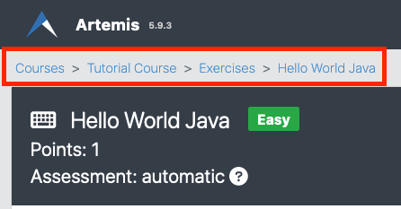

==========
Navigation
==========

.. contents:: Content of this document
    :local:
    :depth: 2

Artemis allows for easy navigation so you can quickly reach your destination in the application.

Level-based Navigation
----------------------

The navigation structure of Artemis is level-based. You can reach more specific pages of a course by going down
that hierarchy of levels step by step. The following graph illustrates this:

.. code::

    Course Overview
    | -- Course
         | -- Exercises
              | -- Exercise Details
                   | -- Editor
         | -- Exams
              | -- Exam Details (Participate, View Results ...)
         | -- Statistics
         | -- Communication
         | -- Lectures
              | -- Lecture Units
         | -- Learning Goals

By that, you can easily reach your target location by just a few clicks.

Focus on Relevant Tasks
-----------------------

To simplify navigation even further, Artemis suggests quick links to your next due exercise, the current lecture,
running live quizzes or upcoming exams so you can quickly reach them without any sort of searching directly from the
courses overview:

Relevant next tasks for a single course are displayed on top of a course exercise overview page, too:

For instructors, currently active exercises and essential statistics such as the participation numbers of exercises and
a student activity graph are displayed on each course card. That way, you can easily reach the details page of currently
important exercises with just one click instead of going through the exercises list of a course:

Breadcrumbs
-----------

Building on top of the level-based navigation structure, breadcrumbs are a series of links on top of the page you're
currently on that allows you to quickly understand where you're currently are and how you got there, and gives you the
opportunity to navigate up to any level with one click.

In the example above, you can just click on the course name to go back to the home page of that course, or even click
on "Courses" to go to your courses overview.