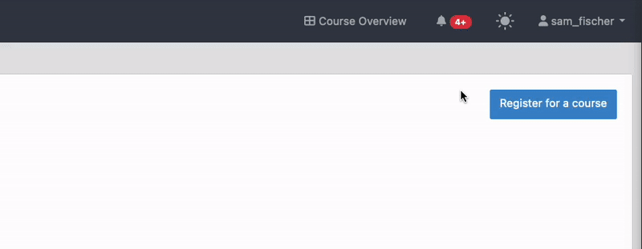

=====================
User Interface Themes
=====================

.. contents:: Content of this document
    :local:
    :depth: 2

Artemis ships both a light and a dark theme to improve your overall experience if you're used to dark themes, e.g. from
your preferred IDE.

Changing the theme
------------------

You can change the theme manually at any time by clicking the theme switcher icon in the navbar:

Synchronize the theme with your operating system
------------------------------------------------

By default, Artemis will choose the preferred theme according to your OS settings.
This is especially useful if you use a mechanism that changes your UI theme system-wide based on your ambient light or
the time of the day.

| This setting will be disabled if you ever change the theme of Artemis manually. To re-enable the synchronized
  behavior, enable this setting in the theme settings popover.
| In the following example, the user has manually set the light theme, but the OS reports a preference of dark
  themes, so the theme changes automatically.

