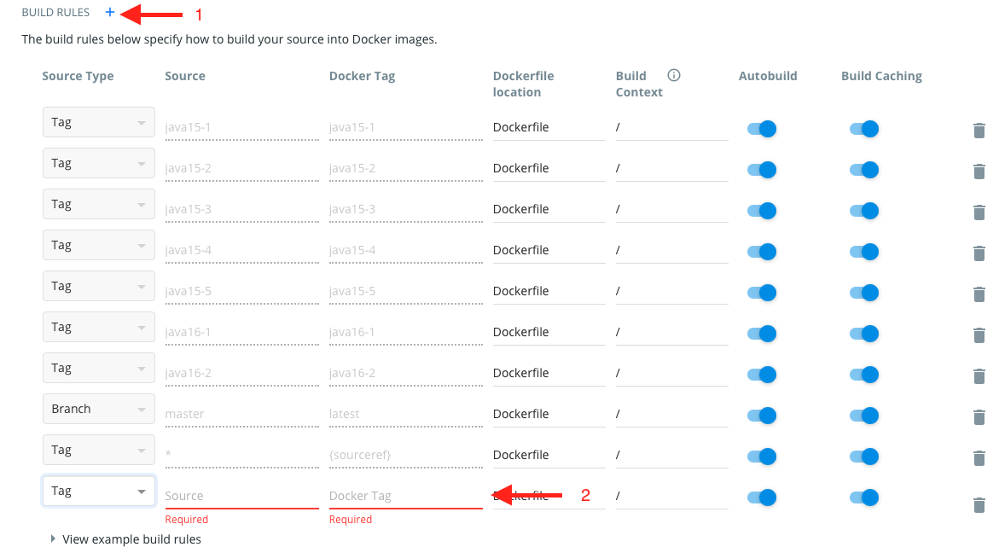

import Callout from "../../src/components/Callout/Callout";
import {CalloutVariant} from "../../src/components/Callout/Callout.types";

## GitHub Actions dependencies

Every external action in workflows and composite actions is pinned to a full commit SHA,
including actions maintained by GitHub. A trailing `# vX.Y.Z` comment records the release
version. Resolve the upstream release tag to its commit when adding an action; a major-version
tag alone is mutable and does not provide the same guarantee. The workflow lint job runs
`python3 supporting_scripts/check_action_pinning.py`, which fails the build for any reference that
is not pinned this way, so you can run it locally before pushing a workflow change.

Renovate uses `helpers:pinGitHubActionDigests` to propose hash updates and pin new references.
Review those pull requests so actions continue receiving security fixes. Local actions and
reusable workflows use relative paths. The
[workflow reference](https://github.com/ls1intum/Artemis/blob/develop/.github/workflows/README.md#action-pinning-policy)
describes the policy, and the [Scorecard report](https://scorecard.dev/viewer/?uri=github.com/ls1intum/Artemis)
shows dependency-pinning findings alongside other repository security checks.

## Installer, container and Python dependencies

The Ubuntu LocalCI installer downloads k3s and Helm installer scripts from immutable upstream commits,
checks their committed SHA-256 hashes before invoking `sudo`, and selects explicit release versions.
When updating an installer, update the version, commit URL and checksum together in
`deployment/kubernetes/install-localci-kubernetes-ubuntu.sh`. Download the script from the reviewed upstream release commit
and compute its hash locally; the installer must never download its expected hash alongside the script.
The upstream installers also verify their release binary checksums.

Docker base images use a tag and a digest. Use the multi-platform manifest digest so the helper image
still builds on both amd64 and arm64. Renovate's `docker:pinDigests` preset keeps these references pinned
when proposing updates.

Python tools keep their direct requirements in `requirements.in` and a generated, complete lock with
SHA-256 hashes in `requirements.txt`. Install into a virtual environment using:

```bash
python -m pip install --require-hashes -r requirements.txt
```

Edit the input file, then regenerate the locks with uv 0.12.23 or newer from the repository root:

```bash
supporting_scripts/update_python_dependency_locks.sh
# To update transitive dependencies as well:
supporting_scripts/update_python_dependency_locks.sh --upgrade
```

Renovate's `pip-compile` manager reads the generated uv command and updates inputs and hashes together;
standalone `pip_requirements` updates are disabled to avoid editing a lock without regenerating hashes.
Review and commit the inputs and generated locks together. Universal resolution retains Python and
platform markers instead of locking only the maintainer's machine. Tool locks resolve for Python 3.10
and newer; individual tools can require a newer version, as described in their READMEs. The deployment
lock in `.github/python-dependencies` targets the workflow's Python 3.14 environment. It records the
Artemis-Ansible requirements snapshot it was based on; update it when changing that environment.
Source distributions such as Whisper still use pip's build isolation, whose build dependencies are
outside pip's requirements hash checking.

## General Structure of Programming Exercise Execution

Artemis uses docker containers to run programming exercises. This ensures that the students' code does not have
direct access to the build agents' hardware.
To reduce the time required for each test run, these docker containers already include commonly used dependencies
such as JUnit.

There are currently docker containers for:

- [Maven (Java and Kotlin)](https://github.com/ls1intum/artemis-maven-docker)
- [OCaml](https://github.com/ls1intum/artemis-ocaml-docker)
- [Python](https://github.com/ls1intum/artemis-python-docker)
- [C](https://github.com/ls1intum/artemis-c-docker)
- [Swift](https://github.com/ls1intum/artemis-swift-swiftlint-docker)
- [Haskell](https://github.com/uni-passau-artemis/artemis-haskell) (external)
- [Assembler](https://hub.docker.com/r/tizianleonhardt/era-artemis-assembler) (external)
- [VHDL](https://hub.docker.com/r/tizianleonhardt/era-artemis-vhdl) (external)

## Steps for Updating the Docker Builds used in Artemis

Updating can only be done with access to the account on Docker Hub. If you need access,
contact Stephan Krusche.

1. Update the dependencies via a pull request in the repository of the docker container.
   Each docker container has its own repository as listed above.
2. After the PR got merged, go to the build overview on Docker Hub:
   - Choose the correct repository on [Docker Hub](https://hub.docker.com/orgs/ls1tum/repositories)
   - Go to the "Builds" tab of that repository
3. Wait for a successful build of "latest"
4. Click "Configure Automated Builds" and create a new build rule for a new tag, following the naming scheme:
   `<programming language><Version of programming language>-<Upwards counting number>`, for example `java25-1`
   - The "Sourcetype" should be "Tag"
   - This tag should be used as "Source Tag" and "Docker Tag"

   

5. Go back to the repository of the docker container in GitHub and create a new Tag
   - Click "Releases" on the right on the front page of that repository
   - Create a new release with the button called "Draft release" and give it the same name as in step 4
6. Wait for the build in Docker Hub of the newly created Tag
7. Change the docker image used in Artemis to the newly created tag:
   [application.yml](https://github.com/ls1intum/Artemis/blob/develop/src/main/resources/config/application.yml)
8. If the used docker container should also be changed for already created exercises you have to change
   the build plan of that exercise
   - Change the docker image used by following this path: Configure Buildplan > Default Job > Docker > Docker Image
