import Callout from "../../src/components/Callout/Callout";
import {CalloutVariant} from "../../src/components/Callout/Callout.types";

# Exams

Artemis includes an online exam mode that allows you to take exams directly in the platform.

## General Information

### Prerequisites

- **Stable internet connection**

  **Recommendation:** Use a LAN connection if possible.

- **Browser**

  **Recommendation:** Chromium (based), e.g. Google Chrome, newest version.

- The following prerequisites are only required if your exam contains Java programming exercises:

  - **Java IDE with JDK 17**

    **Recommendation:** IntelliJ IDEA 2025.2.5 or Eclipse IDE 2025-09.

  - **Git Client**

    **Recommendation:** Use the git client integrated into IntelliJ and Eclipse! (Alternative: SourceTree or GitKraken)

### Offline Mode

- The exam mode in Artemis tolerates issues with the Internet connection.
- If you lose your connection, you can continue working on text-, quiz- and modeling exercises, but you might get warnings that your solutions cannot be saved.
- If your Internet connection recovers, Artemis will save your solution.
- Artemis tries to save your solution every 30 seconds and whenever you navigate between exercises.
- Programming exercises have 2 modes.

  1. **Online code editor:** can only be used when you are online.
        <Callout variant={CalloutVariant.warning}>
            
You have to click on ! Otherwise your solution will <strong>not</strong> be pushed to the VC server and no build will be triggered.

        </Callout>

  2. **Local IDE:** you only need to be online when you clone the repository and when you push your commits (i.e. submit your solution).

- At the end of the online exam, you must be online within a given `grace period` and submit your exam, otherwise it will not be graded.

### Suggestions

1. Do **NOT** reload the browser

   - If you reload the browser, the [Welcome Screen](#welcome-screen) screen opens and you must enter your name and confirm the checkbox again.
   - You should only reload if an error occurs that cannot be recovered otherwise!

2. Participate in **ONE** browser window and only one browser tab!

   - Working in multiple browser windows or tabs at the same time is **not** allowed! Having multiple Artemis windows or tabs open is ok, as long as only one of them accesses the exam.
   - It will lead to synchronization issues and is seen as suspicious behavior that can be flagged as cheating.

   
   *Do not reload, you will receive a warning*

## Participating in the Artemis Online Exam

### Accessing the Exam

- Log in to Artemis with your account credentials.
- The current exam should be displayed at the top of the *Course Overview* screen.
- You can also access the exam by navigating to the course and then to the exams.

  :::note
  The exam will become visible shortly before the working time starts.
  :::

*Access Exam*

### Welcome Screen

- The welcome screen gives you an overview of all the important information you need about the exam.
- Carefully read through the instructions.
- Once you have read them, confirm that you will follow the rules by ticking the corresponding checkbox, sign with your full name and click .

  :::note
  Your full name represents your signature. You can find your full name as registered on Artemis below the input field.
  :::

- After you confirm, if the exam working time has started, the [Exam Conduction](#exam-conduction) screen will automatically appear.
- Otherwise, you must wait until the exam begins. This wont be longer than 5 minutes. A popup will appear which will notify you how much time is left before the planned start.

*Welcome Screen, waiting for exam start*

This video offers a detailed guide on accessing your exams:

<iframe src="https://live.rbg.tum.de/w/artemisintro/52546?video_only=1&t=0" allowFullScreen={true} frameBorder="0" width="600" height="350">
  Watch this video on TUM-Live.
</iframe>

### Exam Conduction

- Once the exam working time starts and you have confirmed your participation, the *Exercise Overview* screen will appear. This screen lists all exercises that are part of your exam with their respective amount of points, title and exercise type. The status column indicates the status of each exercise and whether you have a submission in them or not.

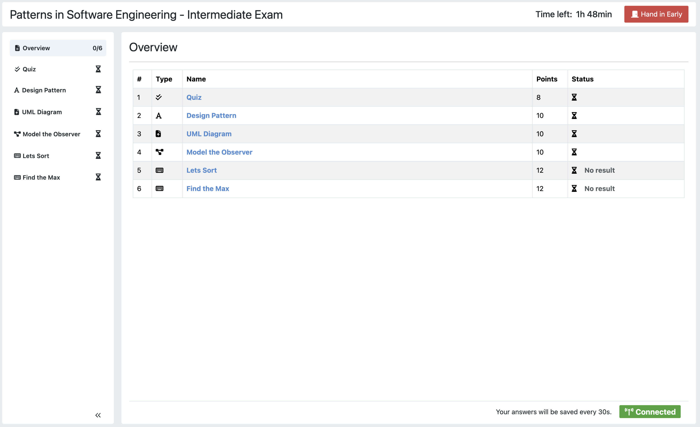

- On the left side of the page, you will find the *Exam Navigation Sidebar*. You can use this sidebar to navigate between different exercises. For each exercise, an icon will display your current status.

  - When there are unsaved **or** unsubmitted changes, the exercise representation in the navigation sidebar becomes .
  - When your changes are saved **and** submitted, the exercise representation in the navigation sidebar becomes .
  -  indicates that you have not started this exercise.
  - 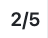 indicates the number of saved **and** submitted exercises out of the total number of exercises. Here, there are 5 exercises in total, and 2 out of the 5 have been saved and submitted.

- Once you click on another exercise in the navigation sidebar, your changes will be saved and submitted automatically.
- You can also collapse the navigation sidebar to maximize the size of the exercises by clicking on 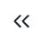. When the sidebar is collapsed, you can still see the exercise type and current status of the exercise.

  :::warning
  For programming exercises, there is no save button. You must manually press  otherwise your solution will **not** be graded!
  :::

*Exam Navigation Sidebar*

- You have two options to save your changes for an exercise:

  1. Click the  button to manually save and submit your changes.
  2. Select an exercise in the navigation sidebar (either the current one or a different exercise), which will automatically save and submit your changes.

     :::warning
     The  button is only available for text, modeling, and quiz exercises. For file upload exercises, you need to manually click the  button, and for programming exercises, you need to manually click the  button to save and submit your changes.
     :::

- On the header, you will find the exam bar that includes the remaining time and the  button. If you click this button, you will be sent to the exam [End Screen](#end-screen).
- The *time left* until the end of the exam is also shown next to the button.

  :::note
  When the time is about to run out, the background of the timer will turn yellow to warn you.
  :::

*Exam Bar*

### Participating in Quiz Exercises

- Various question types can be included in quiz exam exercises. These are:

  1. Multiple choice questions
  2. Short Answer questions
  3. Drag and Drop questions

- All questions are listed on the main screen below one another.
- To navigate between them, you can either scroll or use the `question overview` on the left. When you click on one of the question representations, your view will automatically scroll to the respective question.
- Each question representation in the `question overview` shows whether that question has been answered or not. The blue background indicates that the question is answered, while the yellow background indicates that the question is not answered.
- To submit your solution, click on another exercise in the navigation sidebar.

  :::note
  Your submission will automatically be saved every 30 seconds.
  :::

*Participating in Quiz Exercises*

### Participating in Text Exercises

- The text exercise view is divided into two sections, the text editor, and the problem statement. The problem statement is docked to the right.

  :::note
  On small screens, the problem statement is shown above the text editor.
  :::

- If you want to focus only on the text editor, you can collapse the problem statement by pressing on  in the top right of the image below. This can be reverted by pressing the arrow again.

  :::note
  You can also choose to resize the problem statement by dragging the outline box 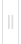.
  :::

- Within the editor you can type out your solution. The editor will automatically track your number of words and number of characters.

*Participating in Text Exercises*

### Participating in Modeling Exercises

- The modeling exercise view is divided into two sections, the modeling editor, and the problem statement. The problem statement is docked to the right.

  :::note
  On small screens, the problem statement is shown above the modeling editor.
  :::

- If you want to focus only on the modeling editor, you can collapse the problem statement by pressing on . This can be reverted by pressing the arrow again.

  :::note
  You can also choose to resize the problem statement by dragging the outline box .
  :::

- Within the editor you can model your solution. Depending on the diagram type, you will find the available elements on the right side of the editor. Simply drag and drop them into the editing field.
- When you click on a dropped element, you can configure it by setting it's `name`, it's `attributes`, `methods` etc.
- To connect elements you can drag an element's edges to another element. The editor will then automatically connect those two.
- If you are unclear about how to use the modeling editor, you can click on 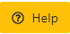. It will provide further information about how to use the modeling editor.

  :::note
  If you need more space, you can work in fullscreen by clicking on 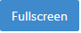. This mode will use your whole screen for the modeling exercise thereby giving you more space to model your solution. To exit the fullscreen mode, click .
  :::

*Participating in Modeling Exercises*

### Participating in Programming Exercises

- Depending on your exam, programming exercises can come in three forms:

  1. Online Code Editor + support for local IDE
  2. Online Code Editor
  3. Support for local IDE

- If your exercise allows the use of the code editor your screen will be divided into three sections, from left to right:

  1. The file browser
  2. The code Editor
  3. The instructions

- The file browser displays the file structure of the assignment. You can access any file within the assignment. Artemis will display the selected file's content in the code editor where you can edit it.

  - You can add new files and directories using the 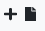 and 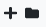 buttons.
  - You also have the ability to rename  and delete  files and folders, therefore **caution** is advised.

- The code editor allows you to edit the content of specific files. It shows the line numbers and will also annotate the appropriate line, if a compilation error occurs.
- The instructions are docked to the right.
- If you want to focus only on the code editor, you can collapse the instructions by pressing on the . This can be reverted by pressing the arrow again. Similarly, if you want to collapse the file browser, you can press the  above the file browser.

  :::note
  You can also choose to resize any of the three sections by dragging the .
  :::

- When you press 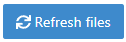 all unsaved changes are overwritten in the online code editor. Your changes are auto-saved every 30 seconds by Artemis in the code editor.

- When you press , your changes are pushed to the version control (VC) server and a build is started on the continuous integration (CI) server. This is indicated by the results changing from 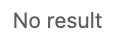 to . You need to first press  to get feedback on your submissions build status.

  :::warning
  There is no auto-submit!
  :::

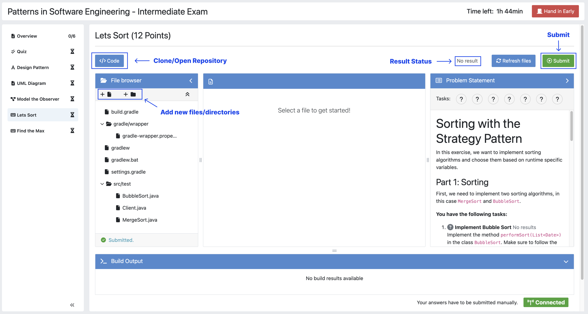
*Participating in Programming Exercises with the online code editor and local IDE enabled*

- If your exercise allows the use of the local IDE, you can clone your repository using the 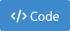 button.
- When you click it you can choose to clone the exercise via `HTTPS` or `SSH`, if you have configured your private key.

  :::note
  You must link a public key to your account in advance if you want to use `SSH`.
  :::

- To work offline follow these steps:

  1. Clone the Exercise
  2. Import the project in your IDE
  3. Work on the code
  4. Commit and push the code. A push is equivalent to pressing the  button.

*Clone the Repository*

:::warning
You are responsible for pushing/submitting your code. Your instructors **cannot** help you if you did not submit.
:::

- Your instructors can decide to limit the real-time feedback in programming exercises during the online exam.
- In that case, you will only see if your code compiles or not:

  1. 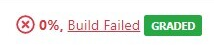 means that your code does **not** compile!
  2.  means that your code compiles but provides no further information about your final score.

  :::warning
  Edit a programming exercise **EITHER** in the online editor **OR** in your local IDE! Otherwise, conflicts can occur that are hard to resolve.
  :::

  If you work in the online code editor and a merge conflict occurs, the file browser will display the conflict state 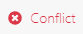.
  You can use the 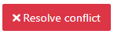 button, which is then displayed instead of the submit button, to resolve the conflict within the online code editor.
  This will reset your changes to the latest commit.

  :::warning
  Manual merging is not possible with the online code editor.
  :::

### Updated Problem Statement during the Exam

If your instructor updates the problem statement for an exercise during the exam, you will receive a notification, as seen in the screenshot below, and can switch between a diff view and the new problem statement, as shown in the second and third screenshot.

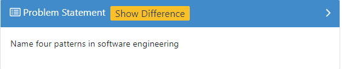

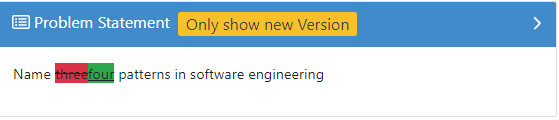

- The instructors can set submission policies, defining the effect of your submissions on your participation. The policies and their effects are as follows:

  - **None** You can submit as many times as you want without any consequences.
  - **Lock Repository** There's a limit on the number of allowed submissions. Once you exceed the limit, your repository will be locked and further submissions will not be allowed.

    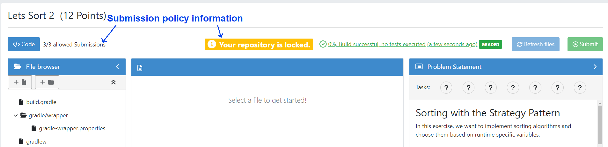

  - **Submission Penalty** There's a limit on the number of allowed submissions. Once you exceed the limit, you will be penalized for each additional submission.

    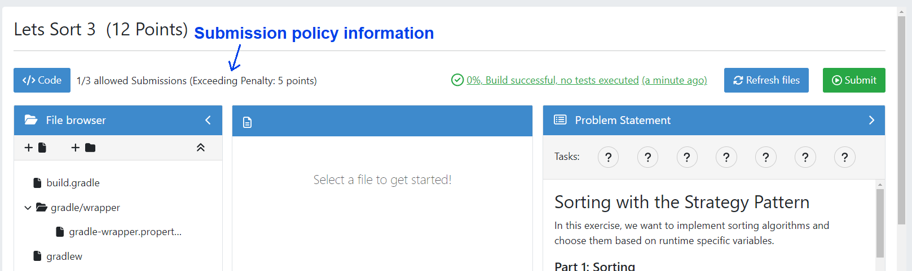

### End Screen

- When you are finished with the exercises, or the time runs out you navigate to the *End Screen*.
- This is done either by clicking on  or automatically when the exam conduction time is over.

  :::note
  If you navigated to this screen via , you have the option to return to the conduction by clicking on 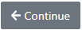.
  :::

- In this screen you should confirm that you followed all the rules and sign with your full name, similar to the [Welcome Screen](#welcome-screen).
- You are given an additional `grace period` to submit the exam after the conduction is over. This additional time is added to the timer shown on the top right.

  :::warning
  Your exam will not be graded, should you fail to submit!
  :::

- Once you submit your exam, no further changes can be made to any exercise.

*End Screen after Early Hand in*

### Summary

- After you hand in, you can view the summary of your exam.
- You always have access to the summary. You can find it by following the steps displayed in: [Accessing the Exam](#accessing-the-exam). After the exam is officially finished, you can navigate to the summary using the sidebar by selecting the respective exam.
- Further you have the opportunity to export the summary as a PDF file by clicking on 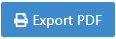.
- The summary contains an aggregated view of all your submissions. For programming exercises, it also contains the latest commit hash and repository URI so you can review your code.

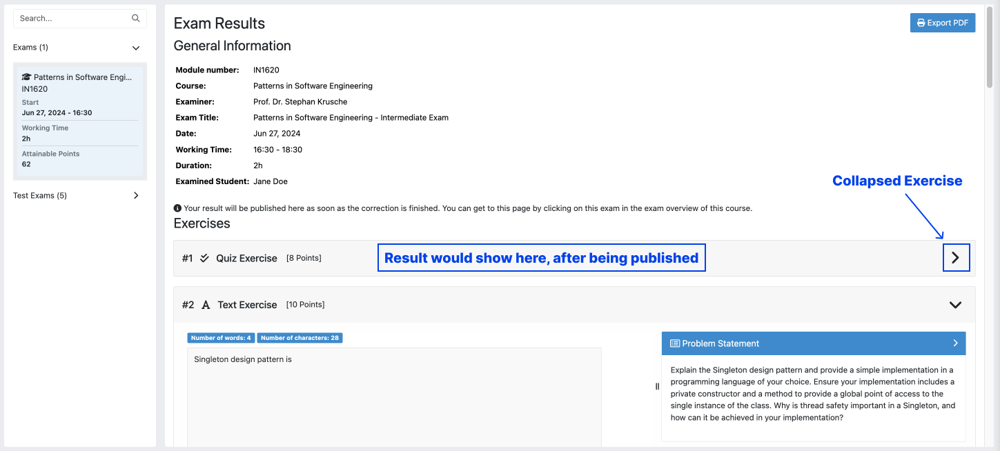
*Summary before the results are published*

- Once the results have been published, you can view your score in the summary.
- Additionally, if within the student review period, you have the option to complain about manual assessments made. To do this, click on 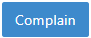 and explain your rationale.
- A second assessor, different from the original one will have the opportunity to review your complaint and respond to it.
- The complaint response will become visible to you as soon as it has been assessed.
- Again, you can export the summary including your score as a PDF file by clicking on . The PDF will also contain any complaints and complaint assessments.

  :::note
  The results will automatically be updated, if your complaint was successful.
  :::

*Complaining about the Assessment of a Text Exercise*

This video offers a detailed guide on participating in your exams:

<iframe src="https://live.rbg.tum.de/w/artemisintro/53405?video_only=1&t=0" allowFullScreen={true} frameBorder="0" width="600" height="350">
  Watch this video on TUM-Live.
</iframe>

### Example Solutions

- If the instructor sets the example solution publication date of the exam, the solutions will be available after that date.
- Text, modeling, file upload and programming exercises can have example solutions.

  :::warning
  You cannot see example solutions if you do not submit your exam!
  :::

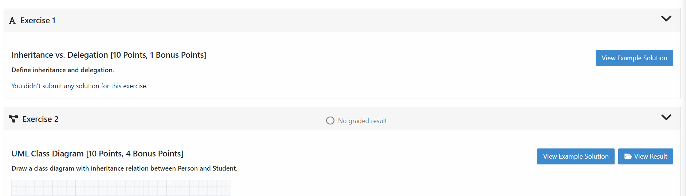
*Example Solutions*

- For programming exercises, clicking `Download Example Solution` button will download the solution repository.

*Example Solution for a Programming Exercise*

- For other exercises, clicking the `View Example Solution` button will navigate you to the corresponding example solution page.

*Example Solution for a Modeling Exercise*

### Grades

- When your exam has been graded, you can view your result on the exam scores page.
- You will see your obtained points along with the maximum achievable points for each individual exercise.
- If the instructor defined a grading key for your exam, you will also see your grade.

*Exam Grade*

:::note
The grades below the `First Passing Grade` are shown in red, and the passing grades are shown in green.
:::

- If the instructor defined a bonus configuration for your exam, you will also see your final grade with the applied bonus below your raw exam grade before bonus.

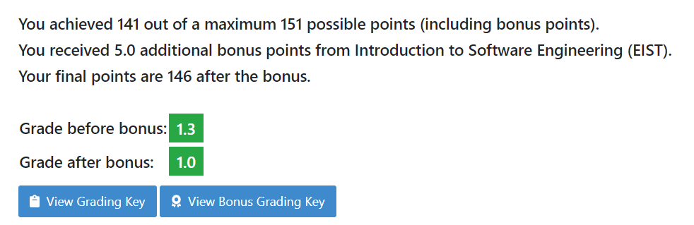
*Exam Grade with Bonus*

- For more information about all the grading intervals, you can click the  button to view all grade step boundaries with their bound inclusivity.
- A square bracket `[` or `]` in the interval of a grade step means the bound is included in the current grade step, and a parenthesis `(` or `)` means it is excluded.
- For example, if the grade step for `2.0` shows the percentage interval as `[80 - 85)` this means that a student achieving `80%` has the grade `2.0`, whereas a student achieving `85%` receives the grade right above `2.0` (i.e. `1.7` if the default grading key is used).

*Exam Grading Key for a student receiving 135 points out of 150*
