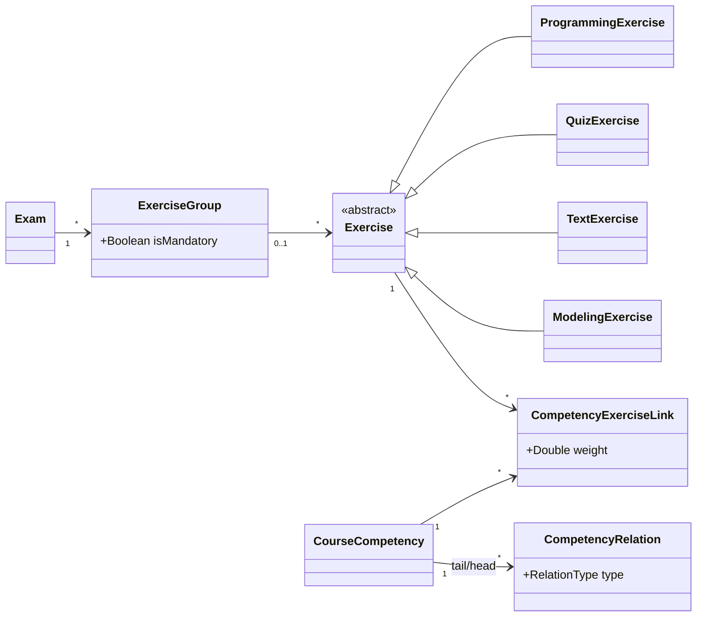
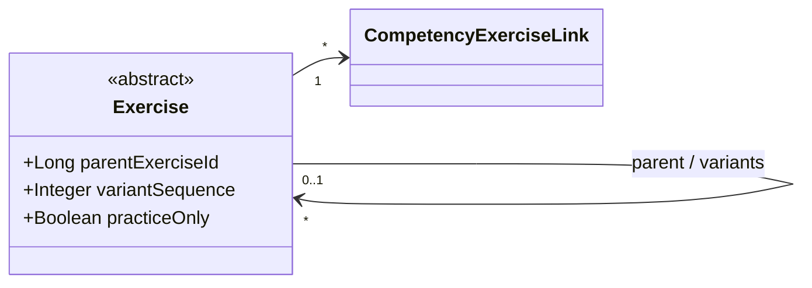
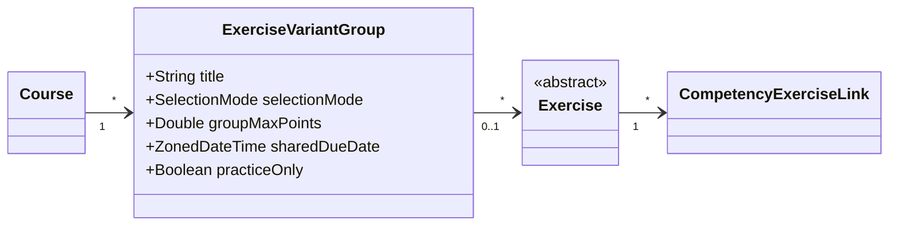
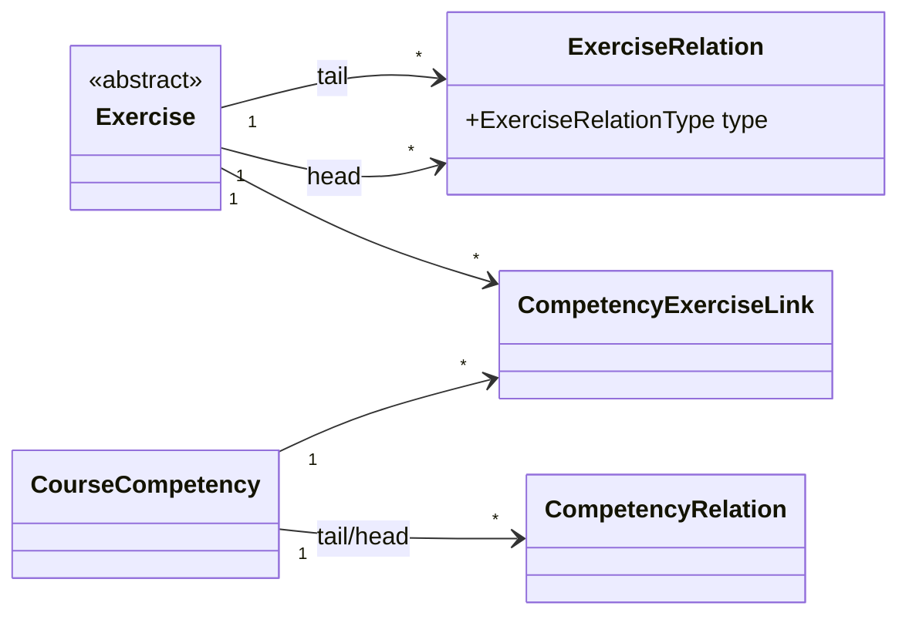
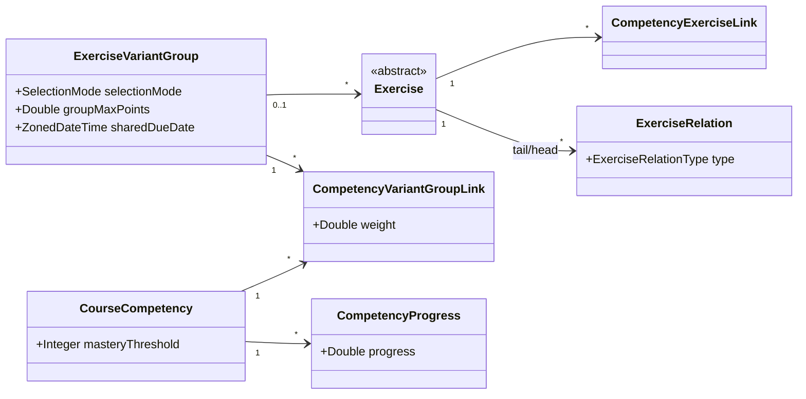
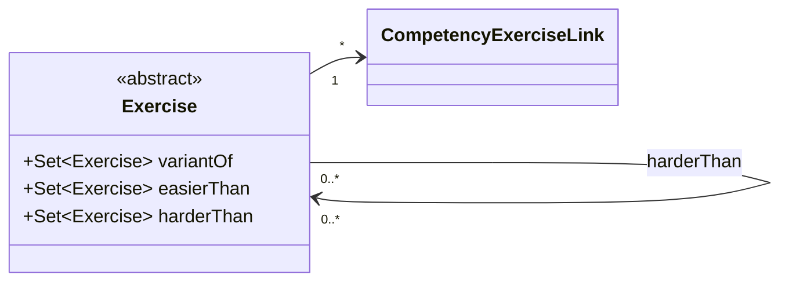

# Exercise Variants — Design Alternatives (Summary)

Practice mode is done. We are now designing adaptive exercise variation. The original proposal extends exam `ExerciseGroup` to course scope; our supervisor wants deeper competency integration and suggested surfacing competency relationships at the exercise level. This document compares six approaches and closes with open questions we would like to align on.

---

## Current State

No variant concept exists. `ExerciseGroup` is exam-only. Exercises link to competencies individually via `CompetencyExerciseLink`.

---

## Approach 1 — Extend `ExerciseGroup` to Course Scope

Add nullable `course_id` to `ExerciseGroup`. Add `selectionMode`, `groupMaxPoints`, `sharedDueDate`, `practiceOnly` columns. Competency integration unchanged (per-exercise links only).

**Pros:** Zero new entities; reuses familiar code; lowest effort.

**Cons:** Dual-purpose entity with two incompatible modes (`exam != null` vs `course != null`); competency integration is UI-only; exam and course concerns become entangled.

---

## Approach 2 — Self-Referencing Exercise

Add `parentExerciseId` FK and `variantSequence` to `Exercise`. No new entity. Group metadata lives on the parent.

**Pros:** Minimal schema; maps naturally onto AI generation ("clone and set parent"); per-variant competency links unchanged.

**Cons:** Group-level settings awkwardly live on parent; querying "all variants of X" is fiddly whether X is parent or child; no way to express exercise-level relationships beyond what competency links already give.

---

## Approach 3 — Dedicated `ExerciseVariantGroup`

New entity in the `exercise` module. Each exercise optionally references a group. `ExerciseGroup` (exam side) is untouched.

**Pros:** Clean separation from exam code; group-level settings have a natural home; straightforward migration (one new table, one nullable FK).

**Cons:** Competency targeting at the group level is still implicit (union of children's links); exercise-level competency relationships remain UI-only.

---

## Approach 4 — Variants as Relations (Mirror `CompetencyRelation`)

New `ExerciseRelation` entity with directed edges between exercises (`VARIANT_OF`, `HARDER_THAN`, `EASIER_THAN`). No container. Variant family = transitive closure in the graph.

**Pros:** Exercise relationships are first-class data; structurally symmetric with `CompetencyRelation`; familiar pattern in the codebase.

**Cons:** Group-level settings have nowhere to live; instructor UX requires graph authoring (much harder than drag-and-drop into a list); adaptive routing needs extra logic layered on top.

---

## Approach 5 — Hybrid: VariantGroup + Group Competency Link + Optional Exercise Relations

`ExerciseVariantGroup` from Approach 3, plus a `CompetencyVariantGroupLink` so a competency attaches to the whole group. Optionally add `ExerciseRelation` for pairwise comparisons (can be scoped as a stretch goal).

**Pros:** Group-level competency targeting is queryable data; adaptive selection has a concrete substrate (compare `CompetencyProgress` vs `masteryThreshold`); `ExerciseRelation` is optional and can be dropped without breaking the core.

**Cons:** Two competency link levels (per-exercise and per-group) can contradict each other — clear precedence rules needed; most implementation effort of approaches 1–5.

---

## Approach 6 — Typed Collections on `Exercise`

Each `Exercise` holds several typed `@ManyToMany` sets referencing other exercises — one set per relation type (e.g. `variantOf`, `easierThan`, `harderThan`). Each set maps to its own join table. No new entity class is introduced; relation types are expressed directly as named associations rather than as a discriminator column on a shared edge table.

Relation types are defined by the set of named associations on the entity. Adding a new type means adding a field and a join table; removing one means dropping both. The relation is bidirectional only if explicitly modelled; a one-directional edge is enough for adaptive selection.

**Pros:** No new entity or discriminator column; each relation type is directly queryable via a single join (e.g. `exercise.variantOf`); no graph traversal needed; familiar JPA pattern; low migration risk (additive only); easy to extend with new types.

**Cons:** Adding a relation type requires a schema migration (new join table) and a code change; group-level settings still have no home (same gap as Approach 4); the set of relation types is closed at compile time, unlike a discriminator-based approach; bidirectionality must be maintained manually or via explicit inverse collections.

---

## Comparison

| | 1. Extend Group | 2. Self-ref | 3. VariantGroup | 4. Relations | 5. Hybrid | 6. Typed Collections |
|---|:---:|:---:|:---:|:---:|:---:|:---:|
| New entities (net) | 0 | 0 | +1 | +1 | +2 (+1 opt.) | 0 |
| Exam code isolation | No | Yes | Yes | Yes | Yes | Yes |
| Group-level settings | Overloaded | On parent | Clean | None | Clean | None |
| Group-level competency target | No | No | No | No | Yes | No |
| Exercise-level relations | UI only | UI only | UI only | Data model | Data model | Data model |
| Adaptive selection | Hard | Hard | Hard | Partial | Built in | Partial |
| Migration risk | Low | Low | Low | Low | Low | Low |
| Sprint fit | Good | Good | Good | Risky | Realistic | Good |

---

## Discussion

We consider Approaches 1 and 2 too limited to meaningfully address the competency feedback and would lean toward one of 3–6. The main open question is how far to go on competency integration: Approaches 3–5 preserve `CompetencyExerciseLink` and add variant grouping on top; Approach 6 represents exercise-level relations without introducing a join entity, keeping the model flat and queryable per relation type at the cost of a closed, compile-time type set. We see Approach 5 as the realistic thesis deliverable and Approach 6 as an attractive alternative if lightweight exercise-level relations (without group-level settings) are sufficient. We would appreciate your guidance on which direction to pursue.
