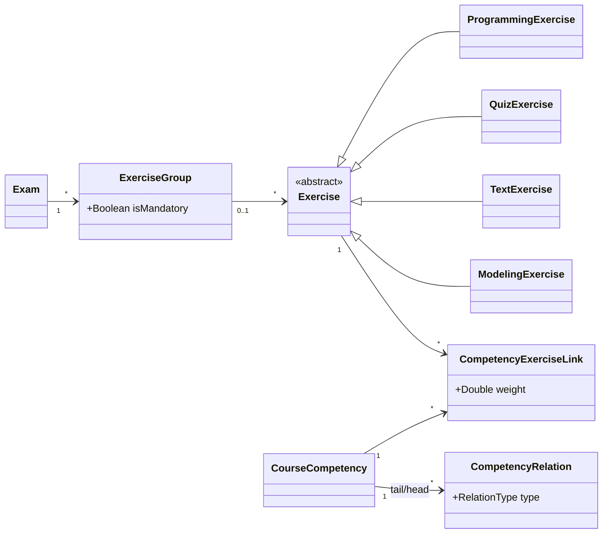
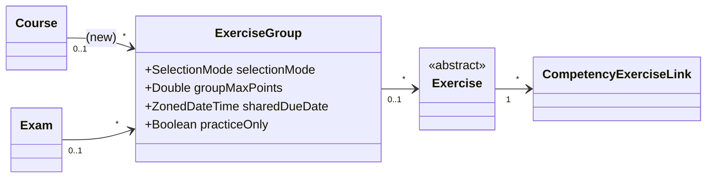
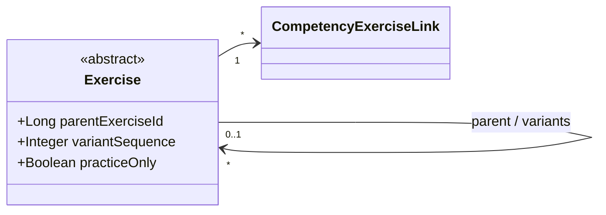
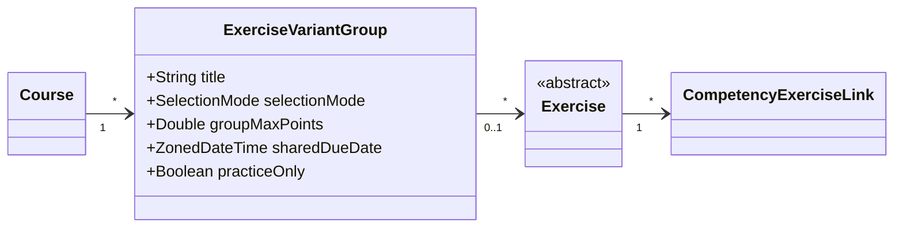
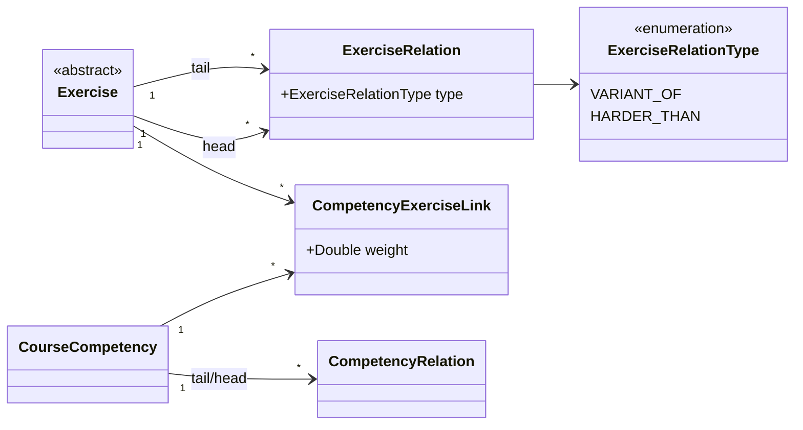
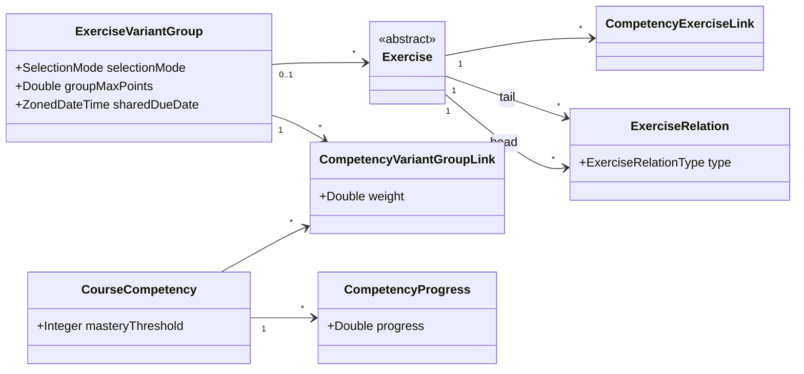
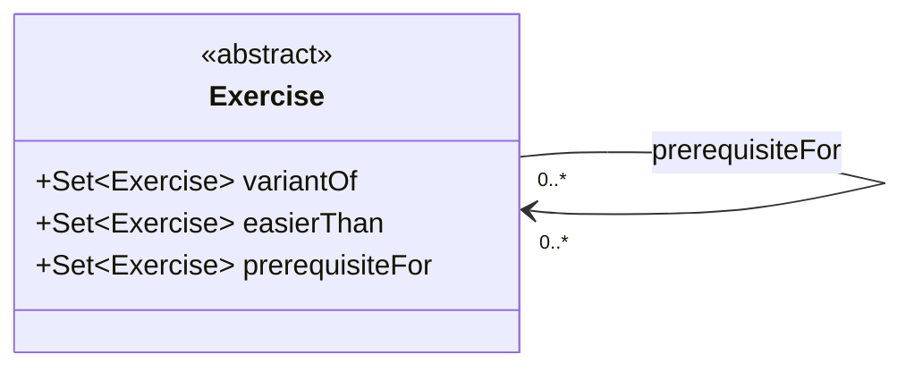

# Exercise Variants — Design Alternatives

Practice mode is done. Next step: adaptive exercise variation.

The original proposal extends the exam `ExerciseGroup` to courses. You asked for deeper competency integration and suggested showing competency relationships at the exercise level. Below are six options, then our take.

---

## Current State

- No variant concept exists.
- `ExerciseGroup` is exam-only.
- Exercises link to competencies one by one.

---

## Approach 1 — Extend `ExerciseGroup` to Courses

Add `course_id` to `ExerciseGroup`, plus `selectionMode`, `groupMaxPoints`, `sharedDueDate`, `practiceOnly`. Competency links stay per-exercise.

- Pro: no new entities, lowest effort.
- Con: one entity doing two unrelated jobs (exam XOR course).
- Con: competency integration stays UI-only.

---

## Approach 2 — Self-Referencing Exercise

Add `parentExerciseId` and `variantSequence` to `Exercise`. Group settings sit on the parent.

- Pro: tiny schema change, fits AI generation ("clone and link to parent").
- Con: group settings on the parent feel wrong.
- Con: querying "all variants of X" is awkward.

---

## Approach 3 — Dedicated `ExerciseVariantGroup`

New entity in the `exercise` module. Exam's `ExerciseGroup` stays untouched.

- Pro: clean separation from exam code.
- Pro: group settings have a proper home.
- Con: competencies still only attach to single exercises, not the group.

---

## Approach 4 — Variants as Relations

New `ExerciseRelation` entity with directed edges. Mirrors `CompetencyRelation`. No container. Variant family = connected exercises in the graph.

- Pro: exercise relationships become real data.
- Pro: matches the existing `CompetencyRelation` pattern.
- Con: no place for group-level settings.
- Con: instructors would need a graph editor, not a list.

---

## Approach 5 — Hybrid (VariantGroup + Group Competency Link + Optional Relations)

Approach 3 plus a `CompetencyVariantGroupLink` so a competency can target the whole group. `ExerciseRelation` optional.

- Pro: group-level competency targeting is real data.
- Pro: adaptive selection has something to work on (`CompetencyProgress` vs `masteryThreshold`).
- Con: two competency link levels — need precedence rules.
- Con: most effort of all options.

---

## Approach 6 — Typed Collections on `Exercise`

Each `Exercise` gets typed `@ManyToMany` sets to other exercises — one per relation type, one join table each. No new entity class.

Three relations:

| Relation | Direction | Meaning |
| --- | --- | --- |
| `variantOf` | symmetric | same goal and difficulty, different wording |
| `easierThan` | A → B: A easier than B | pairwise difficulty |
| `prerequisiteFor` | A → B: do A before B | sequencing |

`CompetencyExerciseLink` is dropped from this feature. Sequencing comes from `prerequisiteFor`, not from competency prerequisites. How an exercise links to a competency becomes a separate redesign — which you flagged as wanted anyway.

- Pro: no new entity, no discriminator column.
- Pro: each relation is a plain join-table query.
- Pro: `prerequisiteFor` makes sequencing explicit data.
- Pro: sets up a clean follow-up for competency linking.
- Con: adding a relation type needs a migration.
- Con: no place for group-level settings.
- Con: competency attribution is left open.

---

## Comparison

| | 1 | 2 | 3 | 4 | 5 | 6 |
|---|:---:|:---:|:---:|:---:|:---:|:---:|
| New entities | 0 | 0 | +1 | +1 | +2 (+1 opt.) | 0 |
| Exam code isolated | no | yes | yes | yes | yes | yes |
| Group settings | overloaded | on parent | clean | none | clean | none |
| Group-level competency target | no | no | no | no | yes | deferred |
| Exercise-to-competency link | kept | kept | kept | kept | kept | removed |
| Exercise-level relations | UI only | UI only | UI only | data | data | data |
| Adaptive selection | hard | hard | hard | partial | built in | partial |
| Migration risk | low | low | low | low | low | low |
| Effort | lowest | low | low | medium | highest | medium |
| Sprint fit | good | good | good | risky | realistic | good |

---

## Our Take

- Approaches 1 and 2 don't address the competency feedback enough.
- Approach 3 is fine but Approach 5 covers it and adds the group-level competency link.
- Approach 4 is a weaker version of Approach 6.
- Approach 5: safer thesis option. Keeps `CompetencyExerciseLink`, adds group-level link on top.
- Approach 6: more ambitious. Drops `CompetencyExerciseLink` for this feature, replaces it with explicit `prerequisiteFor`. Pushes competency attribution into a follow-up redesign.

Which direction would you like us to take?
