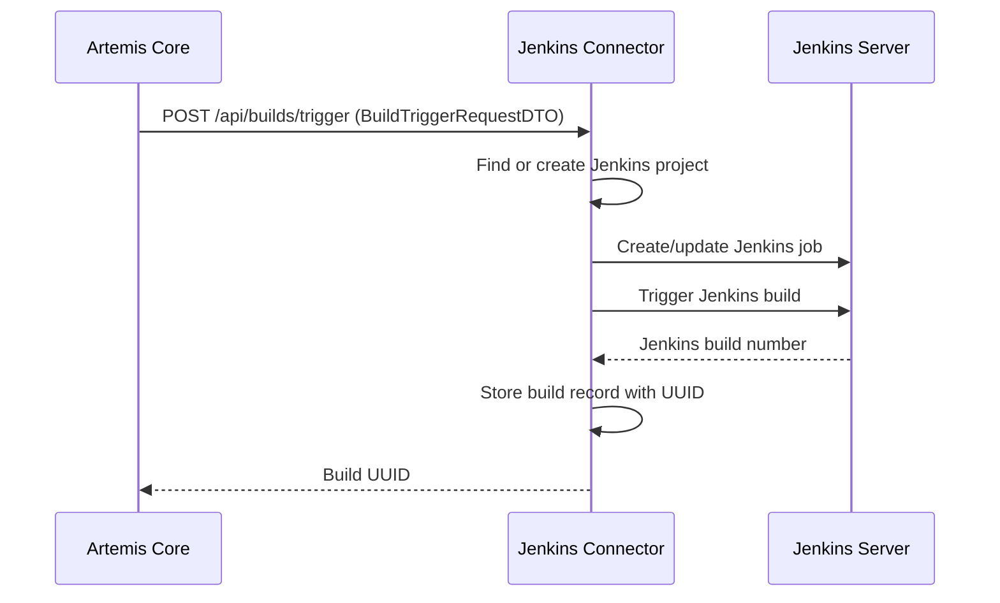
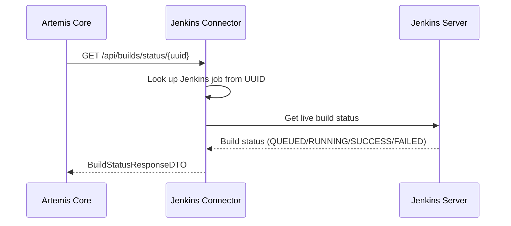

# Jenkins CI Connector Microservice

A stateless microservice that handles Jenkins CI operations for the Artemis learning platform.

## Overview

This microservice decouples Jenkins integration from the main Artemis application, providing:
- **Stateless CI operations** - All Jenkins state managed internally
- **REST API interface** - Clean communication with Artemis core
- **Independent deployment** - Can be scaled and updated separately
- **Future-proof design** - Enables support for other CI systems

## Architecture

```
┌─────────────────┐         HTTP/REST         ┌─────────────────┐
│   Artemis Core  │◄─────────────────────────►│ Jenkins         │
│                 │                           │ Connector       │
│ Templates &     │  BuildTriggerRequestDTO   │                 │
│ Build Scripts   │  RepositoryInfoDTO        │ Stateless       │
│                 │  UUID tracking            │ Operations      │
└─────────────────┘                           └─────────────────┘
                                                        │
                                                        ▼
                                              ┌─────────────────┐
                                              │ Jenkins Server  │
                                              │                 │
                                              │ Jobs & Builds   │
                                              └─────────────────┘
```

## Key Features

### 🚀 **Stateless Design**
- Artemis sends complete build information with each request
- Connector creates Jenkins projects/jobs automatically if needed
- No build state stored in connector database (fetched live from Jenkins)

### 🔄 **Create-If-Not-Exists Logic**
- Projects and jobs created on-demand during build triggers
- Handles repository updates and job configuration transparently
- Supports exercise template and solution builds

### 🗃️ **Internal State Management**
- Maps Artemis exercise/participation IDs to Jenkins job names
- Tracks build UUIDs for status queries
- PostgreSQL database for connector state only

### 🐳 **Docker Ready**
- Multi-stage Dockerfile with distroless runtime
- Environment-based configuration
- Health checks and monitoring

## API Endpoints

### Build Operations
- `POST /api/builds/trigger` - Trigger a build
- `GET /api/builds/status/{buildId}` - Get build status
- `GET /api/builds/template/{language}` - Get build script template

### Health & Monitoring  
- `GET /api/health` - Health check
- Spring Boot Actuator endpoints available

## Data Flow

### 1. Build Trigger Process


### 2. Status Query Process


## Configuration

### Environment Variables
```yaml
# Database
spring.datasource.url: jdbc:postgresql://localhost:5432/jenkins_connector
spring.datasource.username: artemis
spring.datasource.password: artemis

# Jenkins
jenkins.url: http://localhost:8080
jenkins.username: artemis  
jenkins.password: artemis

# Server
server.port: 8081
```

### Artemis Integration
Enable external CI in Artemis:
```yaml
spring.profiles.active: external-ci
artemis.external-ci.url: http://localhost:8081
```

## Quick Start

### 🚀 Start Everything with Docker Compose

```bash
# Clone or navigate to the jenkins-connector directory
cd jenkins-connector

# Start all services (Jenkins + PostgreSQL + Connector)
docker-compose up -d

# View logs (optional)
docker-compose logs -f jenkins-connector
```

**Services will be available at:**
- Jenkins Connector API: http://localhost:8081
- Jenkins Server: http://localhost:8080 (admin/admin)
- PostgreSQL: localhost:5432

### 🧪 Test the API

**Option 1: Use Bruno API Client**
```bash
# Install Bruno (if not already installed)
npm install -g @bruno-lang/cli

# Run the API tests
cd api-tests
bru run --env local
```

**Option 2: Manual Testing with cURL**
```bash
# Health check
curl http://localhost:8081/api/health

# Trigger a Java build
curl -X POST http://localhost:8081/api/builds/trigger \
  -H "Content-Type: application/json" \
  -d '{
    "exerciseId": 1,
    "participationId": 101,
    "exerciseRepository": {
      "url": "https://github.com/example/java-exercise.git",
      "commitHash": "abc123",
      "branch": "main"
    },
    "buildScript": "pipeline { agent any; stages { stage('\''Test'\'') { steps { sh '\''mvn test'\'' } } } }",
    "programmingLanguage": "java"
  }'

# Check build status (use UUID from previous response)
curl http://localhost:8081/api/builds/status/{BUILD-UUID}
```

**Option 3: View OpenAPI Documentation**
- Open `openapi.yml` in any OpenAPI viewer
- Or import into Postman/Insomnia

### 🛑 Stop Services

```bash
# Stop all services
docker-compose down

# Stop and remove volumes (clean reset)
docker-compose down -v
```

## Development

### Prerequisites
- Java 21+
- Gradle 8.8+ (or use included wrapper)
- PostgreSQL 12+
- Docker & Docker Compose
- Bruno CLI (for API testing)

### Running Locally (Development Mode)

```bash
# Option 1: Full Docker setup (recommended for testing)
docker-compose up -d

# Option 2: Local development with external services
docker-compose up -d postgres jenkins  # Start dependencies only
./gradlew bootRun                       # Run connector locally
# Or with dev profile: ./gradlew bootRun -Pdev

# Option 3: Manual setup
# Start database
docker run --name postgres-jenkins \
  -e POSTGRES_DB=jenkins_connector \
  -e POSTGRES_USER=artemis \
  -e POSTGRES_PASSWORD=artemis \
  -p 5432:5432 -d postgres:15

# Start Jenkins manually or use docker
# Then run connector
./gradlew bootRun
```

### Building & Testing

```bash
# Build the project
./gradlew build

# Run unit tests
./gradlew test

# Run integration tests (requires running services)
./gradlew integrationTest

# Build Docker image
docker build -t jenkins-connector .

# Run API tests with Bruno
./gradlew runApiTests
# Or manually: cd api-tests && bru run --env local
```

### Test Environment Details

The `docker-compose.yml` sets up a complete test environment:

**Jenkins Configuration:**
- Pre-configured with Jenkins Configuration as Code (JCasC)
- Admin user: `admin/admin`  
- Required plugins automatically installed
- Sample jobs and folders created

**Database:**
- PostgreSQL 15 with `jenkins_connector` database
- Tables created automatically via Liquibase
- Development data can be inspected at `localhost:5432`

**API Tests:**
- Located in `api-tests/` directory
- Bruno collection with 6 test scenarios
- Environment variables in `api-tests/environments/local.bru`
- Tests both success and error cases

## Database Schema

### jenkins_projects
Maps Artemis exercises to Jenkins folders:
- `exercise_id` - Artemis exercise ID (unique)
- `project_key` - Artemis project key
- `jenkins_folder_name` - Jenkins folder name
- `programming_language` - Exercise language
- `created_at`, `last_accessed_at` - Timestamps

### build_records  
Maps build UUIDs to Jenkins jobs:
- `build_uuid` - Unique build identifier (UUID)
- `exercise_id`, `participation_id` - Artemis identifiers
- `jenkins_job_name` - Full Jenkins job path
- `jenkins_build_number` - Jenkins build number
- `commit_hash` - Git commit hash
- `created_at` - Timestamp

## Migration from Direct Jenkins

### For Administrators

1. **Deploy connector microservice**
   ```bash
   docker-compose up -d jenkins-connector
   ```

2. **Update Artemis configuration**
   ```yaml
   spring.profiles.active: external-ci
   artemis.external-ci.url: http://jenkins-connector:8081
   ```

3. **Restart Artemis**
   - Existing exercises continue working
   - New builds use connector automatically

### For Instructors
- **No changes needed** - All functionality remains the same
- Templates and build scripts managed in Artemis as before
- Build results and logs work identically

## Monitoring & Operations

### Health Checks
- `GET /api/health` - Connector health
- Database connectivity validated
- Jenkins server connectivity checked

### Logging
- Structured JSON logging
- Build trigger/status operations logged
- Jenkins API call tracing available

### Metrics
- Spring Boot Actuator metrics
- Custom metrics for build operations
- Prometheus-compatible format

## Troubleshooting

### Common Issues

**Build triggers fail**
- Check Jenkins connectivity: `curl http://jenkins:8080`
- Verify Jenkins credentials in connector config
- Check connector logs for API errors

**Status queries return 404**
- Build UUID not found - build may be very old
- Check `build_records` table for UUID

**Jobs not created in Jenkins**
- Verify Jenkins folder permissions
- Check Jenkins credentials and API access
- Review connector logs for job creation errors

### Debug Mode
```yaml
logging.level.de.tum.cit.aet.artemis.jenkins.connector: DEBUG
```

## Contributing

This microservice follows the same development practices as Artemis core:
- Java 21 with Spring Boot 3
- Test-driven development
- Docker-first deployment
- Clean architecture principles

## License

Same as Artemis - MIT License