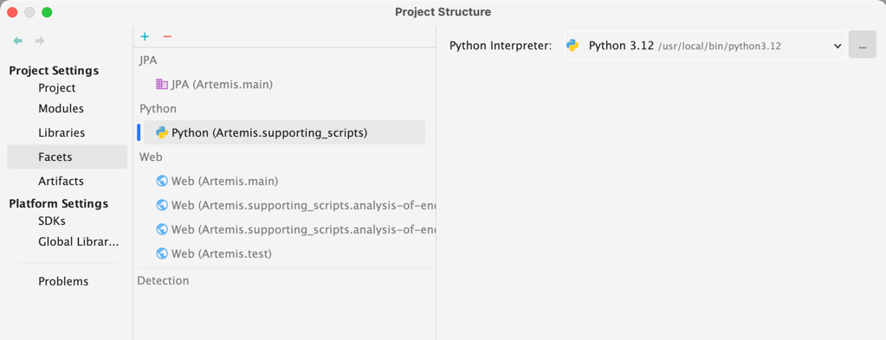
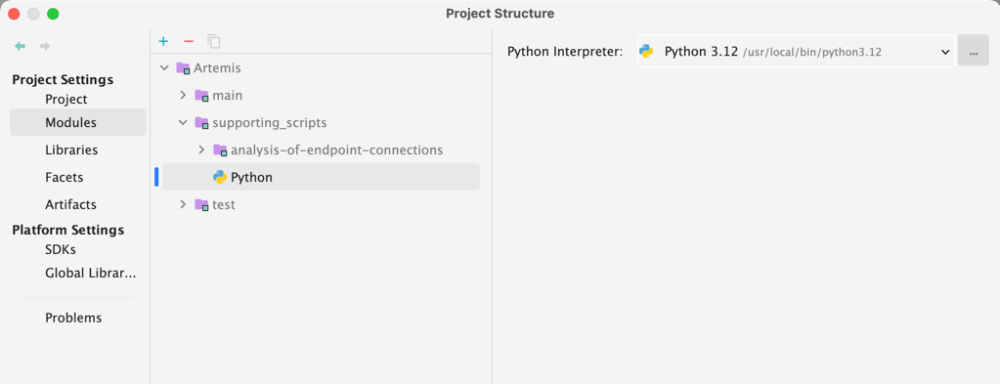

# Artemis Course Setup Scripts

This project contains Python scripts that automate the setup and management of courses and users in an Artemis instance. The scripts help you create a course, generate users, enroll them into courses, and manage programming exercises, including participations and commits. The project is useful for setting up test environments or quickly initializing a course with a large number of students.

# Setup

### 1. Install Python and the Python Plugin for IntelliJ

- Ensure that Python (preferably version 3.12) is installed on your system.
```shell
python3.12 --version
```
- Install the [Python Plugin for IntelliJ](https://plugins.jetbrains.com/plugin/631-python).
- Enable Python support in IntelliJ:
  - Go to `File > Project Structure > Facets > Add - Python`.
  - Add a Python environment by configuring the Python interpreter. 

    
  - Add a module in IntelliJ by navigating to `File > Project Structure > Modules > Add - Python`.

    

### 2. **(Optional)**: Setting Up a Virtual Environment

It is recommended to use a virtual environment to manage dependencies in isolation from the global Python environment. This approach can prevent version conflicts and keep your system environment clean.

- Install `virtualenv` if it's not already installed:
```shell
python3.12 -m pip install virtualenv
```

- Create a virtual environment in your project folder:
```shell
python3.12 -m virtualenv venv
```

- Activate the virtual environment:

- On **Windows**:
```shell
venv\Scripts\activate
```

- On **macOS/Linux**:
```shell
source venv/bin/activate
```

Once the virtual environment is activated, you will see the `(venv)` prefix in your terminal prompt. All dependencies will now be installed locally to this environment.

To install any packages into this virtual environment, proceed with the same steps as described below.
### 3. Configure the Environment

- Start your local Artemis instance.
- Configure the [config.ini](./config.ini) file according to your local or test server setup.
- If packages are missing when running the script, install the necessary Python packages using the following command (replace `<packageName>` with the actual package name and the python version with your used python version):

```shell
python3.12 -m pip install <packageName>
```
# Usage

## Section 1: Create Local Course and Users

These scripts help you configure and set up your first Artemis course quickly.

1. Start your local Artemis instance.

2. Configure the values in [config.ini](./config.ini) according to your setup.

3. Install the missing packages of the Python scripts that you want to execute (if not done already). You can check the [requirements.txt](./requirements.txt) file for the required packages.

4. Run the main script using IntelliJ:

    - Use the play button within IntelliJ (if Python is configured properly).
    - Alternatively, you can run the script directly from the terminal using the commands provided in this README.

### Creating a Course with Standard User Groups

Creates a course for which the users are registered according to their user groups (students, tutors, editors, instructors).

```shell
python3 create_course.py
```

### Create Users

Creates users 1-20 (students, tutors, editors, instructors - 5 for each group).
    
```shell
python3 create_users.py
```

### Authenticate Users

If the users have already been created, they still need to be logged in order to be added to a course (without a first login, Artemis does not know that the users exist).
    
```shell  
python3 authenticate_all_users.py
```

## Test Servers

### To configure the scripts for use with Artemis test servers:

1.	Adjust server_url and client_url according to the test server.
2.  Update admin_user and admin_password to valid values for the test server.
3.  Set is_local_course in [config.ini](./config.ini) to False.

Create a Course and Assign the Default Users

1-5: students
6-10: tutors
11-15: instructors
16-20: editors

Define the name of your course in the config.ini as course_name.

```shell  
python3 create_course.py
```

### Add Users to Existing Course

Define the course_id in the [config.ini](./config.ini).

```shell  
python3 add_users_to_course.py
```

## Notes

1.  Ensure that the config.ini file is correctly configured before running any scripts.
2.  Always test the scripts on a local setup before running them on a production or test server.

## Section 2: Artemis Large Course with Submissions on Programming Exercise Automation

This section details how to use the large_course_main script that orchestrates the entire process, from user creation to course setup, and finally user participation in programming exercises.

### Running the large_course_main Script

The large_course_main script performs all necessary steps to set up a large course with multiple students and submissions.

### Steps to Run:

1. Open the project in IntelliJ. 
2. Locate the large_course_main.py file in the project directory.
3. Update the [config.ini](./config.ini) to your needs
   1. To change the number of students created, modify the students variable in the config.ini file.
   2. To change the number of commits each student should perform in the example exercise, modify the commits variable in the config.ini file.
   3. To change the number of programming exercises created, modify the exercises variable in the config.ini file.
   4. To change the name of programming exercises created, modify the exercise_name variable in the config.ini file.
   5. To use an existing course, modify the create_course variable to False and provide a valid course_id in the config.ini file.
   6. To use an existing programming exercise, modify the create_exercises variable to False and provide a valid exercise_Ids in the config.ini file.
4. You can use the play button within IntelliJ (if Python is configured properly) to run the script.
```shell
python3 large_course_main.py
```

The script will automatically perform all the necessary steps:

1. Authenticate as admin. 
2. Create students.
3. Create a course or use an existing one.
4. Add students to the course. 
5. Create a programming exercise or use an existing one. 
6. Add participation and commit for each student.

### Optional: Deleting All Created Students

If you want to delete all the students created by the script:

1.	Run the main in delete_students.py.
```shell
python3 delete_students.py
```
