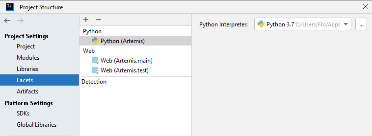
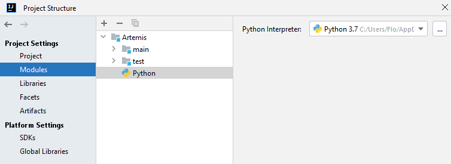

# Create local course and users

Scripts in this folder help to configure and setup your first Artemis course to get started quickly.

## Setup

1. Install the [Python Plugin for IntelliJ](https://plugins.jetbrains.com/plugin/631-python)

2. Enable Python support in your IntelliJ

   `File > Project Structure > Facets > Add - Python` (press the plus and add a Python environment there,
   make sure that you have configured the python interpreter)

   

   If not added automatically by IntelliJ add a Module:
   `File > Project Structure > Modules > Add - Python`

   

_Tested on python 3.7 & 3.9, other versions might work as well._

## Usage

1. Start your local Artemis instance
2. Configure the values in `config.ini` according to your setup
3. Install the packages of the python scripts that you want to execute
4. Either use the play button within IntelliJ _(which should be displayed if Python was configured properly within
   IntelliJ)_ to run the scripts or follow the following descriptions

### Local Setup

#### Create a course with standard user groups

Creates a course for which the users from the previous section [Create users](#create-users) are registered as they have
the same user
groups (students, tutors, editors, instructors)

```shell
python3 create_course.py
```

You can also execute the following scripts on their own (not needed if `create_course.py` was executed)

##### Create users

Creates users 1-20 (students, tutors, editors, instructors - 5 for each group) and users needed for Cypress E2E
testing (100-106)

```shell
python3 create_users.py
```

##### Authenticate users

If the users have already been created they still need to be logged in order to be added to a
course _(without a first login Artemis does not know that the users exist)_

```shell
python3 authenticate_all_users.py
```

### Test Servers

Re-Configure the `config.ini`

1. Adjust `server_url` and `client_url` according to the test server
2. Make sure to upate `admin_user` and `admin_password` to valid values for the test server
3. As we are interacting with the test servers set `is_local_course` in `config.ini` to `False`

#### Create a course and assign the default users

1-5: students
6-10: tutors
11-15: instructors
16-20: editors

Define the name of your course in the `config.ini` as `course_name`

```shell
python3 create_course.py
```

#### Add users to existing course

Define the `course_id` in the `config.ini`

```shell
python3 add_users_to_course.py
```
